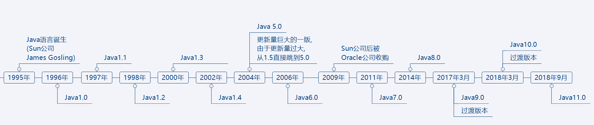
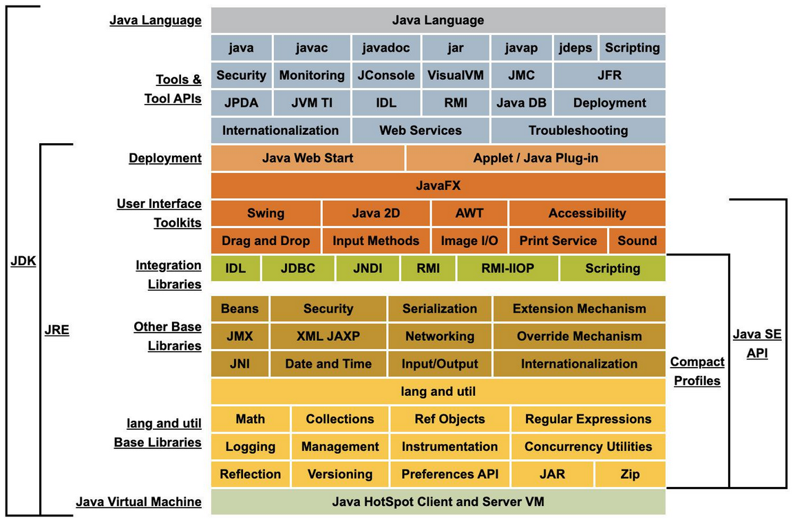
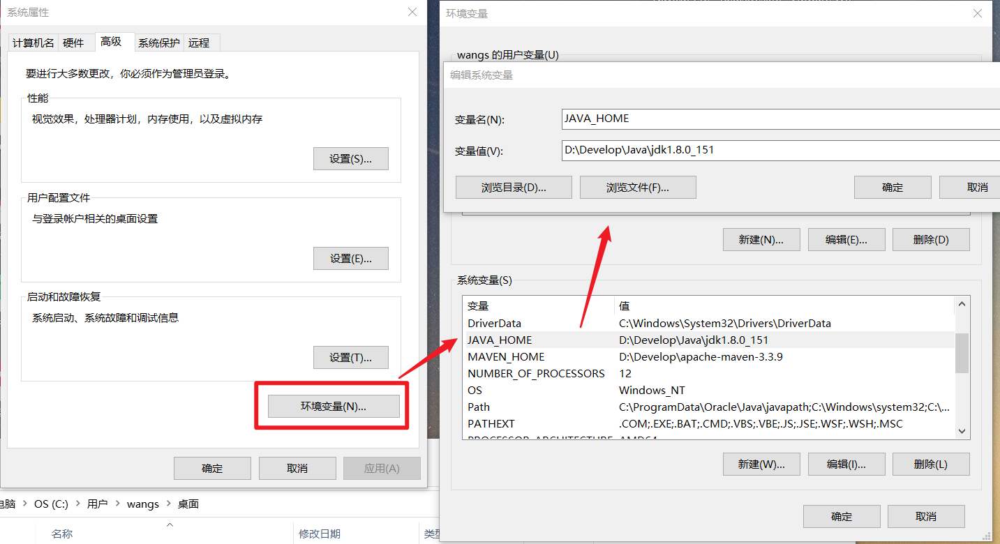
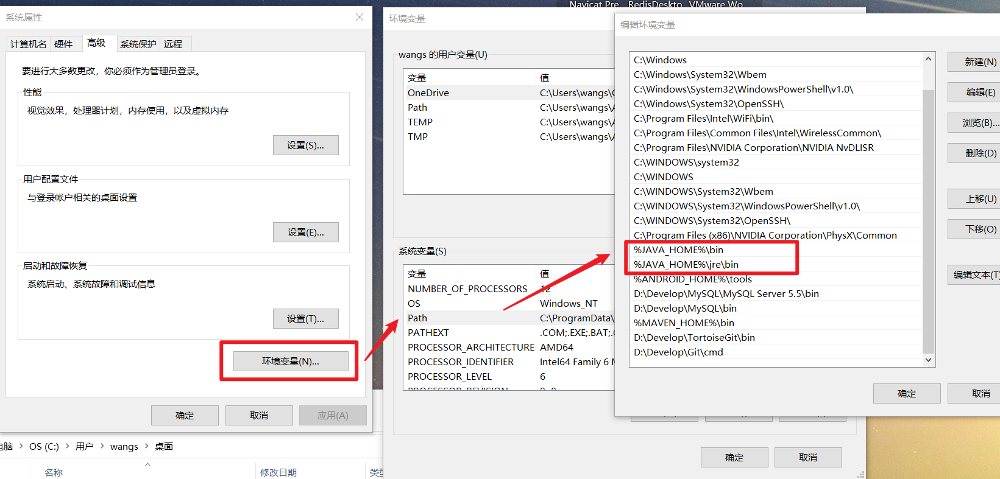
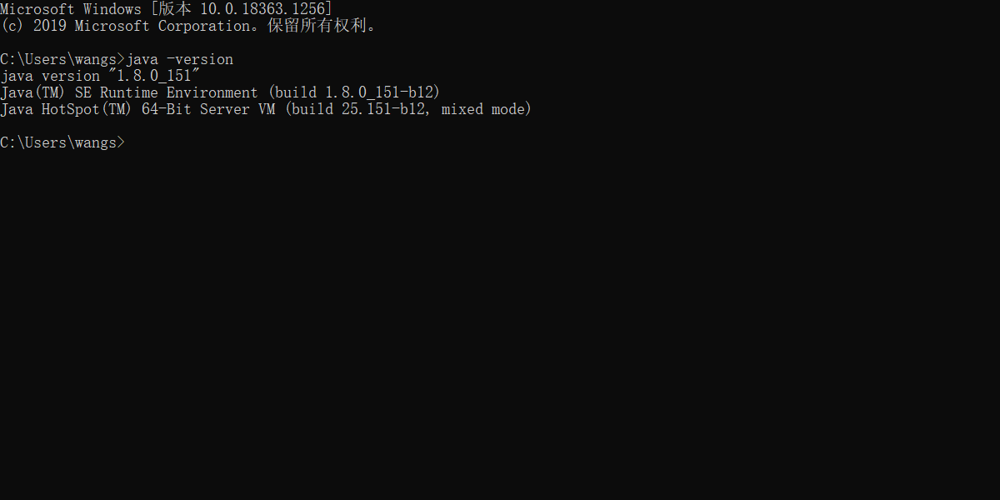

## 1. 什么是Java?

***

Java是一种计算机语言,是一种帮助人与计算机沟通的一种工具

## 2. Java编年史

***

## 3. Java语言的特点

1. 简单易学；

2. 面向对象（封装，继承，多态）；

3. 平台无关性（ Java 虚拟机实现平台无关性）；

4. 支持多线程

5. 可靠性；

6. 安全性；

7. 支持网络编程并且很方便（ Java 语言诞生本身就是为简化网络编程设计的，因此 Java 语言不仅支持网络编程而且很方便）；

8. 编译与解释并存；

   >为什么说 Java是解释和编译并存的
   >
   >高级编程语言按照程序的执行方式分为编译型和解释型两种。简单来说，编译型语言是指编译器针对特定的操作系统将源代码一次性翻译成可被该平台执行的机器码；解释型语言是指解释器对源程序逐行解释成特定平台的机器码并立即执行。比如，你想阅读一本英文名著，你可以找一个英文翻译人员帮助你阅读， 有两种选择方式，你可以先等翻译人员将全本的英文名著（也就是源码）都翻译成汉语，再去阅读，也可以让翻译人员翻译一段，你在旁边阅读一段，慢慢把书读完。
   >
   >Java 语言既具有编译型语言的特征，也具有解释型语言的特征，因为 Java 程序要经过先编译，后解释两个步骤，由 Java 编写的程序需要先经过编译步骤，生成字节码（`\*.class` 文件），这种字节码必须由 Java 解释器来解释执行。因此，我们可以认为 Java 语言编译与解释并存。

## 4. JavaSE的组成

***

### 4.1 JVM

Java Virtual Machine 虚拟机  是运行java字节码的虚拟机,针对不同的平台由不同的实现,目的是保证同样的字节码执行的结果相同

扩展1:

> 什么是字节码?采用字节码的好处是什么?
>
> 在 Java 中，JVM 可以理解的代码就叫做`字节码`（即扩展名为 `.class` 的文件），它不面向任何特定的处理器，只面向虚拟机。Java 语言通过字节码的方式，在一定程度上解决了传统解释型语言执行效率低的问题，同时又保留了解释型语言可移植的特点。所以 Java 程序运行时比较高效，而且，由于字节码并不针对一种特定的机器，因此，Java 程序无须重新编译便可在多种不同操作系统的计算机上运行。

扩展2:

>Java 代码执行流程
>
>

### 4.2 JDK  和 JRE

+ Java Development Kit  包含：JRE的超集，包含编译器和调试器等用于程序开发的文件 

+ Java Runtime Environment  包含：Java虚拟机、库函数、运行Java应用程序和Applet所必须文件 

> JDK 和 JRE 有什么区别？
>
> JDK是Java的开发工具包,包含了Java开发工具和Java运行环境,而JRE只是单纯的运行环境,所以,如果我们需要运行Java程序,只需要安装JRE,但如果需要进行Java开发,就必须要JDK

## 5. JAVA 多维度对比

***

### 5.1  JAVA三大版本对比

+ JavaSE: 它是JAVA的标准版，是整个JAVA的基础和核心，这是我们主要学习的一个部分，也是JAVAEE和JAVAME技术的基础，主要用于开发桌面应用程序。学会后可以做一些简单的桌面应用 如：扫雷，连连看等。 

+ JavaME: 它是JAVA的微缩版，主要应用于嵌入式开发，比如手机程序的开发。目前来说就业范围不是很广，在一些城市可能相对的不好找工作。 

+ JavaEE: 也叫JAVA的企业版，它提供了企业级应用开发的完整解决方案，比如开发网站，还有企业的一些应用系统，是JAVA技术应用最广泛的领域。主要还是偏向于WEB的开发，而JAVA EE的基 础就是JAVA SE

### 5.2  Oracle JDK 和 OpenJDK对比

+ Oracle JDK 大概每 6 个月发一次主要版本，而 OpenJDK 版本大概每三个月发布一次。但这不是固定的，我觉得了解这个没啥用处。详情参见：https://blogs.oracle.com/java-platform-group/update-and-faq-on-the-java-se-release-cadence 。

+ OpenJDK 是一个参考模型并且是完全开源的，而 Oracle JDK 是 OpenJDK 的一个实现，并不是完全开源的；

+ Oracle JDK 比 OpenJDK 更稳定。OpenJDK 和 Oracle JDK 的代码几乎相同，但 Oracle JDK 有更多的类和一些错误修复。因此，如果您想开发企业/商业软件，我建议您选择 Oracle JDK，因为它经过了彻底的测试和稳定。某些情况下，有些人提到在使用 OpenJDK 可能会遇到了许多应用程序崩溃的问题，但是，只需切换到 Oracle JDK 就可以解决问题；

+ 在响应性和 JVM 性能方面，Oracle JDK 与 OpenJDK 相比提供了更好的性能；

+ Oracle JDK 不会为即将发布的版本提供长期支持，用户每次都必须通过更新到最新版本获得支持来获取最新版本；

+ Oracle JDK 使用 BCL/OTN 协议获得许可，而 OpenJDK 根据 GPL v2 许可获得许可。

###   5.3  Java 和 C++ 对比

- 都是面向对象的语言，都支持封装、继承和多态
- Java 不提供指针来直接访问内存，程序内存更加安全
- Java 的类是单继承的，C++ 支持多重继承；虽然 Java 的类不可以多继承，但是接口可以多继承。
- Java 有自动内存管理垃圾回收机制(GC)，不需要程序员手动释放无用内存。
- C ++同时支持方法重载和操作符重载，但是 Java 只支持方法重载（操作符重载增加了复杂性，这与 Java 最初的设计思想不符）。

### 5.4 import java 和 javax 有什么区别？

刚开始的时候 JavaAPI 所必需的包是 java 开头的包，javax 当时只是扩展 API 包来使用。然而随着时间的推移，javax 逐渐地扩展成为 Java API 的组成部分。但是，将扩展从 javax 包移动到 java 包确实太麻烦了，最终会破坏一堆现有的代码。因此，最终决定 javax 包将成为标准 API 的一部分。

所以，实际上 java 和 javax 没有区别。这都是一个名字。

## 5. Java开发环境搭建

***

step1: [下载JDK](https://www.oracle.com/technetwork/java/javase/downloads/jdk8-downloads-2133151.html)

step2:配置环境变量

step3:测试Java环境是否搭建成功

