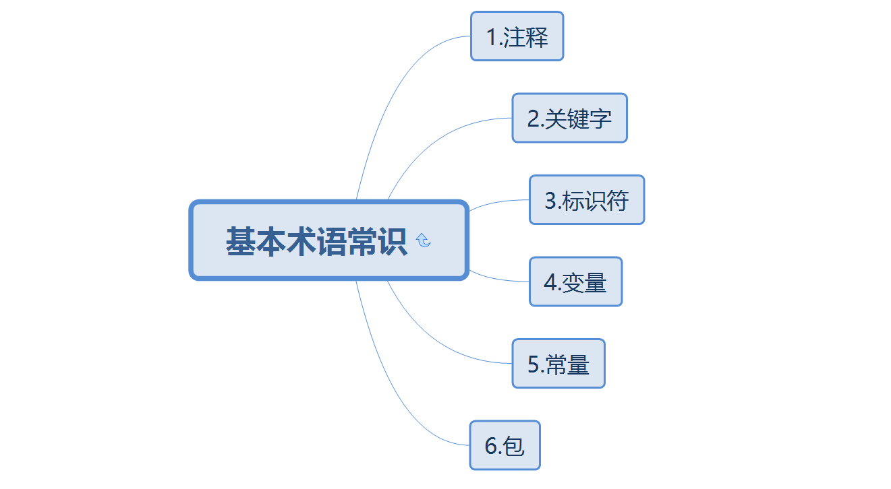

## 1.注释

***

### 1.1什么是注释

给程序员看的解释性文字

### 1.2注释有哪几种


```java
/**
 * 文档注释:用于生产API文档，配合JavaDoc
 * @author wangs
 */
public class Demo1 {
    /*
    多行注释:
    注释一段文字，以/开始， /结束！
     */
    public static void main(String[] args) {
        // 单行注释:只能注释当前行，以//开始，直到行结束
        System.out.println("hello world");
    }
}
```

>平时写代码一定要注意注释的规范性，一个好的程序员，一定是有非常良好的编码习惯的

### 1.3JavaDoc

#### 1.3.1 什么是JavaDoc

JavaDoc是Sun公司提供的一种将注释生成HTML文档的技术,它从程序源代码中抽取类、方法、成员等注释形成一个和源代码配 套的API帮助文档。也就是说，只要在编写程序时以一套特定的标签作注释，在程序编写完成后，通过 Javadoc就可以同时形成程序的开发文档了

#### 1.3.2 JavaDoc有哪些特定标签

```java
/** 
* 这是一个Javadoc测试程序
* 
* @author 作者名
* @version 版本号
* @since 指明需要最早使用的jdk版本
* @param 参数名
* @return 返回值情况
* @throws 异常抛出情况
* */
```

#### 1.3.2 如何使用JavaDoc

命令行: 

```cmd
javadoc -encoding UTF-8 -charset UTF-8 文件名.java
```

idea:

[idea中如何使用JavaDoc](https://www.cnblogs.com/tobiasy/p/9936496.html)

## 2.关键字与标识符

***

### 2.1  关键字 与 标识符 有什么区别

Java中所有的组成部分都需要名字.类名,变量名以及方法名都被称为标识符 ,而关键词就是特殊的标识符

### 2.2 Java中有哪些关键字

|                      |          |            |          |              |            |           |        |
| -------------------- | -------- | ---------- | -------- | ------------ | ---------- | --------- | ------ |
| 访问控制             | private  | protected  | public   |              |            |           |        |
| 类，方法和变量修饰符 | abstract | class      | extends  | final        | implements | interface | native |
|                      | new      | static     | strictfp | synchronized | transient  | volatile  |        |
| 程序控制             | break    | continue   | return   | do           | while      | if        | else   |
|                      | for      | instanceof | switch   | case         | default    |           |        |
| 错误处理             | try      | catch      | throw    | throws       | finally    |           |        |
| 包相关               | import   | package    |          |              |            |           |        |
| 基本类型             | boolean  | byte       | char     | double       | float      | int       | long   |
|                      | short    | null       | true     | false        |            |           |        |
| 变量引用             | super    | this       | void     |              |            |           |        |
| 保留字               | goto     | const      |          |              |            |           |        |

###  2.3 标识符的定义规范是什么

- 首字符只能是字母(A-Z,),下划线(_),美元符号($)
- 首字符之后可以是字母(A-Z,),下划线(_),美元符号($)以及数字(0-9)的任意字符组合
- 标识符大小写敏感
- 推荐类名使用大驼峰命名法,方法名及变量名使用小驼峰命名法,不推荐使用中文,拼音

> JAVA不采用通常语言使用的ASCII字符集，而是采用unicode这样的标准的国际字符集。因此，Java可以使用中文命名

[[各种字符集和编码详解](https://www.cnblogs.com/happyday56/p/4135845.html)](https://www.cnblogs.com/happyday56/p/4135845.html)

## 3.变量

***

### 4.1 什么是变量

变量就是可以变化的量！ 我们通过变量来操纵存储空间中的数据，变量就是指代这个存储空间！空间位置是确定的，但是里面放置什么值不确定！Java是一种强类型语言，每个变量都必须声明其类型。 Java变量是程序中最基本的存储单元，其要素包括变量名，变量类型和作用域。

### 4.2如何定义一个变量

```java
//数据类型 变量名 = 值；可以使用逗号隔开来声明多个同类型变量。
type varName [=value] [{,varName[=value]}] ；

 
/*
注意事项：
每个变量都有类型，类型可以是基本类型，也可以是引用类型。
变量名必须是合法的标识符。
变量声明是一条完整的语句，因此每一个声明都必须以分号结束
*/
```

### 4.3变量的分类(变量的作用域)

变量根据作用域可划分为三种： 

- 类变量（静态变量： static variable）：独立于方法之外的变量，用 static 修饰。 

- 实例变量（成员变量：member variable）：独立于方法之外的变量，不过没有 static 修饰。 

- 局部变量（lacal variable）：类的方法中的变量。

```java
public class Variable{
    
    /*
    类变量:
    1.从属于类，生命周期伴随类始终，从类加载到卸载。
	2.如果不自行初始化，他会自动初始化成该类型的默认初始值
    */
    static int allClicks=0;

     /*
    实例变量:
    1.方法外部、类的内部定义的变量。从属于对象，生命周期伴随对象始终。
    2.如果不自行初始化，他会自动初始化成该类型的默认初始值
    */
    String str="hello world"; 

    public void method(){
            /*
    局部变量:
    1.方法或语句块内部定义的变量。生命周期是从声明位置开始到”}”为止。
    2.局部变量没有默认值，所以局部变量被声明后，必须经过初始化，才可以使用。
    */ 
        int i =0; 
    }  
}
```


## 4.常量

***

### 5.1 什么是常量

常量(Constant)：初始化(initialize)后不能再改变值！不会变动的值。 所谓常量可以理解成一种特殊的变量，它的值被设定后，在程序运行过程中不允许被改变。 

```java
final 常量名=值;
final double PI=3.14;
final String LOVE="hello";

/*
常量名一般使用大写字符。 程序中使用常量可以提高代码的可维护性。例如，在项目开发时，我们需要指定用户的性别，此时可以 定义一个常量 SEX，赋值为 "男"，在需要指定用户性别的地方直接调用此常量即可，避免了由于用户的 不规范赋值导致程序出错的情况。
*/
```

### 5.2 变量和常量的命名规范

1. 类成员变量：首字母小写和驼峰原则 : monthSalary 
2. 局部变量：首字母小写和驼峰原则 
3. 常量：大写字母和下划线：MAX_VALUE 
4. 类名：首字母大写和驼峰原则: Man, GoodMan 
5. 方法名：首字母小写和驼峰原则: run(), runRun()

## 5.包

***

### 6.1.什么是包,包有什么作用

包是Java中一种命名空间,类似于OS中的文件夹的概念.包采用树形存储的机制,将不同的类加以归类和区分,方便管理

### 6.2.包机制语法

```java
package net.java.util; // 包语句必须在第一行

import com.kuang.Hello; //导入其他包 ,lang包不用导

public class Something{
...
}

```

### 6.3.包的注意事项

1.同一个包中类名不可以重复,不同包中的类名可以重复,调用两个包中重复的类时,需要使用全包名加以区分

2.包名一般习惯于使用倒置的公司域名

