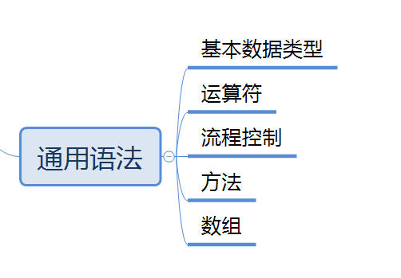
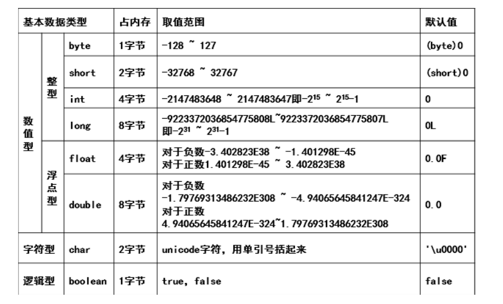
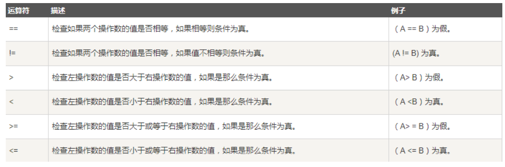
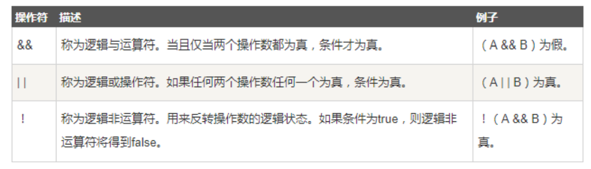
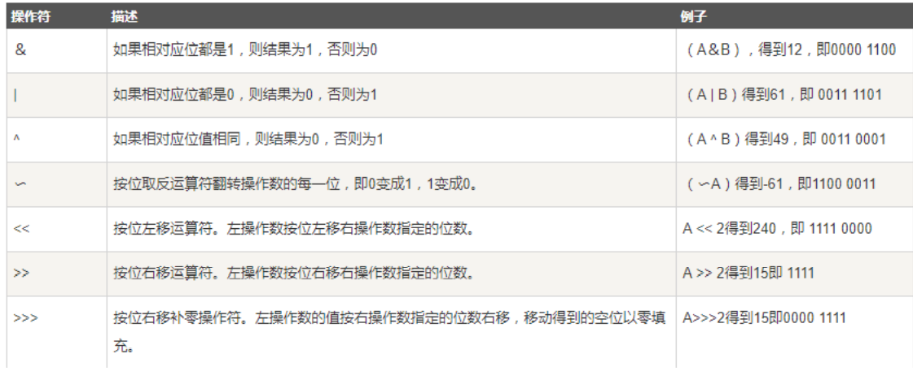
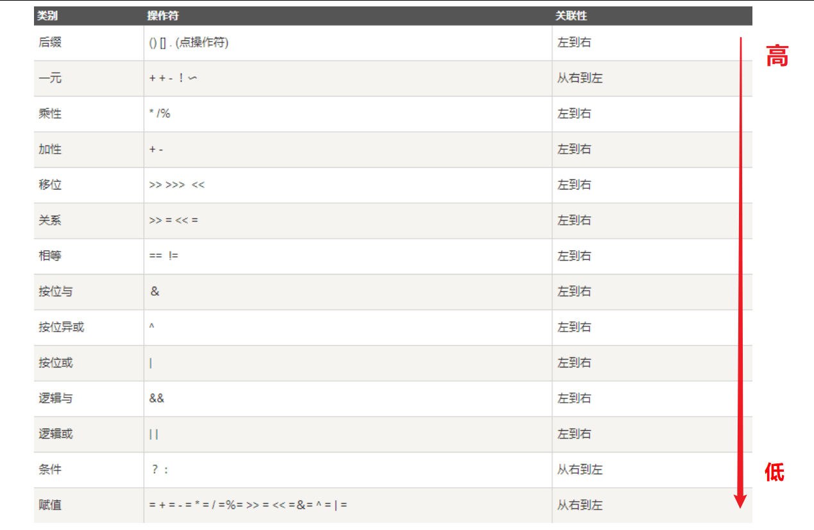

## 1.基本数据类型

***

### 1.1 有哪些基本数据类型(四类八种)



扩展1:整型中,如何表示二进制,十进制，八进制..

```java
int i=10; //十进制
int i1=0b10;//二进制 0b
int i2=010;//八进制 0
int i3=0x10;//十六进制 0x
System.out.println(i); //10
System.out.println(i1); //2
System.out.println(i2); //8
System.out.println(i3); //16
```

扩展2:float,double是不精确的

```java
float f = 0.1f;
double d = 1.0/10;
System.out.println(f==d); //false
float d1 = 2131231231f;
float d2 = d1+1;
System.out.println(d1==d2);//true
```

### 1.2 基本数据类型转换

```java
低 ------------------------------------> 高
byte,short,char—> int —> long—> float —> double
 
 /*
数据类型转换必须满足如下规则：
    1.不能对boolean类型进行类型转换。
    2.不能把对象类型转换成不相关类的对象。
    3.在把容量大的类型转换为容量小的类型时必须使用强制类型转换。
    4.转换过程中可能导致内存溢出或损失精度 
*/
    
// e.g
int i =128;
byte b = (byte)i; //byte最大值为127 ,值128会导致内存溢出 ,最后结果为-128
// e.g
(int)23.7 == 23; 
(int)-45.89f == -45 //浮点数到整数的转换是通过舍弃小数得到，而不是四舍五入
// e.g  
int i = 10_0000_0000;// JDK7新特性 允许以下划线分割数字,方便区分位数
int j = 20;
int sum1 = i * j; //-1474836480 内存溢出 
long sum2 = i * j; //-1474836480 内存溢出 i*j会先被转换为int导致内存溢出
long sum3 = i * (long)j; //20000000000
```


## 2.运算符

***

### 2.1 一元运算符 (自增++ 自减--)

自增（++）自减（--）运算符是一种特殊的算术运算符，在只需要一个操作数即可完成运算，分为前缀和后缀两种。

```java
public static void main(String[] args) {
int a = 3;
int b = a++; //执行完后,b=3。先给b赋值，再自增。
int c = ++a; //执行完后,c=5。先自增,再给b赋值
}
```

### 2.2 二元运算符

#### 2.2.1 算数运算符(+,-,*,/,%)

注意点:

```java
// 整数运算 有long的运算,最后结果为long 无long的运算,最后结果为int(即是没有int参加)
long a = 1231321311231231L;
int b = 1213;
short c = 10;
byte d = 8;
System.out.println((a+b+c+d)); //Long类型
System.out.println((b + c + d));//Int类型
System.out.println((c + d));//Int类型

// 浮点运算 有double的运算,结果为double 无double的运算,结果为float
float a = 3.14565F;
double b = 3.194546464;
float c = 1.3123123F;
System.out.println(a+b); //double类型
System.out.println(b+c); //double类型
System.out.println(a+c); //float类型

// %为取模运算 
5.9%3.9=2.000000004 //取模运算可以为浮点数,但是一般不这么用
9%4=1 		//负数%负数＝负数；
-9%4=-1 	//负数%正数＝负数；
9%-4=1 		//正数%负数＝正数
    
// “+” 运算符两侧的操作数中只要有一个是字符串(String)类型，系统会自动将另一个操作数转换为字符串然后再进行连接。
String s1="Hello 中文!";
String s2=1+""; //转换成String
```

#### 2.2.2 赋值运算符(=,+=,-=,*=,/=,%=)

```java
a = b   // b的值赋给a
a += b // 等同于 a = a + b
a -= b // 等同于 a = a - b
a *= b // 等同于 a = a * b
a /= b // 等同于 a = a / b
a %= b // 等同于 a = a % b
```

>注意:+=,-=,*=,/=,%=同时隐含了数据的强制类型转换

#### 2.2.3 关系运算符(>,<,==,>=,<=,!=)



>面试题:== 和 equals 的区别是什么？
>
>对于基本类型数据,只能用== ,对于引用类型数据,== 比较的是两个引用对象的引用地址,而equals在重写的情况下,比较的某些特征,比如String equals重写后,先会去判断引用类型是否相同,如果不相同的话,还会去比较内容是否一致,如果内容一致,也会返回true

#### 2.2.4 逻辑运算符(&&,||,!,^)



>逻辑与和逻辑或采用短路的方式。从左到右计算，如果确定值则不会再计算下去。在两个操作数都为 true时，结果才为true，但是当得到第一个操作为false时，其结果就必定是false，这时候就不会再判断 第二个操作了。

#### 2.2.5 位运算符



```java
A = 0011 1100
B = 0000 1101
-----------------
A&b = 0000 1100
A | B = 0011 1101
A ^ B = 0011 0001
~A= 1100 0011
```

>面试题: ：int a=2*8怎样运算效率最快？
>
>解析:2 << 3

### 2.3 三目条件运算符

```java
// x为boolean类型表达式，先计算x的值，若为true，则整个三目运算的结果为表达式y的值，否则整个运算结果为表达式z的值。
x ? y : z
```

### 2.4 运算符优先级



>一般不用刻意记忆运算符优先级，在表达式里面优先使用小括号来组织运算顺序


## 3.流程控制

***

### 3.1 顺序结构

JAVA的基本结构就是顺序结构，除非特别指明，否则就按照顺序一句一句执行。

### 3.2 选择结构

#### 3.2.1 if语句

我们很多时候需要去判断一个东西是否可行，然后我们才去执行，这样一个过程在程序中用if语句来表 示

```java
// if单选择结构
if(布尔表达式){
    
}
// if双选择结构
if(布尔表达式){
    
}else{
    
}
// if多条件选择结构
if(布尔表达式 1){
    
}else if(布尔表达式 2){
    
}else if(布尔表达式 3){
    
}else {
    
}

// if 嵌套选择结构 
if(布尔表达式 1){
    if(布尔表达式 2){
        
    }
}

```

>记住一点就好，所有的流程控制语句都可以互相嵌套，互不影响！

#### 3.2.2 switch语句

switch case 语句可以判断一个变量与一系列值中某个值是否相等，每个值称为一个分支

```java
switch(expression){
    case value :
        //语句
        break; //可选
    case value :
        //语句
        break; //可选
        //你可以有任意数量的case语句
    default : //可选
        //语句
}
```

规则：

1. switch 语句中的变量类型可以是： byte、short、int 或者 char。从 Java SE 7 开始，switch 支持
   字符串 String 类型了，同时 case 标签必须为字符串常量或字面量。
2. case 语句中的值的数据类型必须与变量的数据类型相同，而且只能是常量或者字面常量。
3. case 语句一般要包含 break 语句,如果不包含,会产生case穿透现象
4. switch 语句可以包含一个 default 分支，该分支一般是 switch 语句的最后一个分支（可以在任何
   位置，但建议在最后一个）。default 在没有 case 语句的值和变量值相等的时候执行。default 分
   支不需要 break 语句

### 3.3 循环结构

#### 3.3.1 while 循环

while是最基本的循环，只要布尔表达式为 true，循环就会一直执行下去。

```java
while( 布尔表达式) {
//循环内容
}
```

#### 3.3.2 do..while 循环

do..while 是while循环的变体,先执行逻辑,后判断是否继续循环,所以至少会执行一次

```java
do {
//代码语句
}while(布尔表达式);

```

#### 3.3.3 for循环

for循环是java提供的另一种循环结构,相比while循环,更为灵活,可读性更高

```java
for(初始化; 布尔表达式; 更新) {
//代码语句
}

/*
执行流程:
1.初始化  可以声明一种类型，但可初始化一个或多个循环控制变量，也可以是空语句。

2.判断布尔表达式 如果为 true，循环体被执行。如果为false，循环终止
3.执行循环逻辑
4.更新循环控制变量

5.判断布尔表达式 如果为 true，循环体被执行。如果为false，循环终止
6.执行循环逻辑
7.更新循环控制变量

8 . ...
*/

```

#### 3.3.4 增强for

Java5 引入了一种主要用于数组或集合的增强型 for 循环 ,相比for循环,语法更为简化

```java
for(声明语句 : 表达式)
{
//代码句子
}
/*
声明语句：声明新的局部变量，该变量的类型必须和数组元素的类型匹配。其作用域限定在循环语句块，其值与此时数组元素的值相等。 

表达式：表达式是要访问的数组名，或者是返回值为数组的方法。
*/
```

### 3.4 控制结构(break & continue)

#### 3.4.1 break

break 主要用在循环语句或者 switch 语句中，用来跳出整个语句块。

```java
public static void main(String[] args) {
    int i=0;
    while (i<100){
        i++;
        System.out.println(i);
        if (i==30){
            break;
        }
    }
}
```

>break 跳出最里层的循环，并且继续执行该循环下面的语句

#### 3.4.2 continue

continue 适用于任何循环控制结构中。作用是让程序立刻跳转到下一次循环的迭代。

```java
public static void main(String[] args) {
    int i=0;
    while (i<100){
        i++;
        if (i%10==0){
            System.out.println();
            continue;
        }
        System.out.print(i);
    }
}
```

> for 循环中，continue 语句使程序立即跳转到更新语句。 
>
> while 循环中，程序立即跳转到布尔表达式的判断语句。


## 4.方法

***

### 4.1 什么是方法

方法的本意是功能块，就是实现某个功能的语句块的集合。我们设计方法的时候，最好保持方法的原子性，就是一个方法只完成1个功能，这样利于我们后期的扩展

### 4.2 方法定义

```java
修饰符 返回值类型 方法名(参数类型 参数名) throws 异常{
    ...
    方法体
    ...
    return 返回值;
}
```

1. 修饰符：

    修饰符告诉编译器如何调用该方法。定义了该方法的访问类型 ,分为 public protected (default) private  static等等

    - 权限修饰符  public protected (default) private :

    > |           | 类内部 | 本包 | 子包 | 外部包 |
    >| :-------: | :----: | :--: | :--: | :----: |
    > |  public   |   √    |  √   |  √   |   √    |
    > | protected |   √    |  √   |  √   |   ×    |
    > | (default) |   √    |  √   |  ×   |   ×    |
    > |  private  |   √    |  ×   |  ×   |   ×    |

    

    - 状态修饰符 static :

    >static修饰符修饰的方法,就是静态方法. 调用这种方法的时候,推荐使用类进行调用,因为静态方法是属于类的(静态属性也是一的)
    >
    >类中方法中的调用，两个方法都是静态或者非静态都可以互相调用，当一个方法是静态，一个方法是非静态的时候，非静态方法可以调用静态方法，反之不能 ,结合java内存流程记忆

    

2. 返回值类型 ：方法可能会返回值,有些方法可能没有返回值。在这种情况下，返回值类型是关键字void。 
3. 方法名是方法的实际名称,参数列表是指方法的参数类型、顺序和参数的个数.方法名和参数表共同构成方法签名。 

    >重载:
    >一个类的两个方法拥有相同的名字，但是有不同的参数列表 ,即构成重载,Java编译器根据方法签名判断哪个方法应该被用。 
    >方法的重载可以让程序更清晰易读。执行密切相关任务的方法应该使用相同的名字。 

    

4. 参数列表是指方法的参数类型、顺序和参数的个数。参数是可选的，方法可以不包含任何参数。

   ```java
   
   public void test(int a){ // a = x;
   //..
   }
   main:
   int x = 1;
   t.test(x);
   /*
   参数列表中的a是方法test的形参(形式上的参数)
   调用方法时的x是方法test的实参(实际上的参数)
   */
   ```

   >值传递和引用传递:
   >
   >调用方法进行传参时,分为值传递和引用传递两种.
   >
   >如果参数的类型是基本数据类型,那么就是值传递。 如果参数的类型是引用数据类型,那么就是引用传递。
   >
   >值传递是实参把自己变量本身存的简单数值赋值给形参. 引用传递是实参把自己变量本身存的对象内存地址值赋值给形参. 所以值传递和引用传递本质上是一回事,只不过传递的东西的意义不同而已.

4. 异常抛出 :方法中的代码在执行过程中,可能会出现一些异常情况,那么就可以在方法上把这些异常声明并抛出, 也可以同时声明抛出多个异常,使用逗号隔开即可。

### 4.3 可变参数

JDK 1.5 开始，Java支持传递同类型的可变参数给一个方法

```java
public static void main(String args[]) {
    // 调用可变参数的方法
    printMax(34, 3, 3, 2, 56.5);
    printMax(new double[]{1, 2, 3});
}
public static void printMax( double... numbers) {
    if (numbers.length == 0) {
        System.out.println("No argument passed");
        return;
    }
    double result = numbers[0];
    //排序！
    for (int i = 1; i < numbers.length; i++){
        if (numbers[i] > result) {
            result = numbers[i];
        }
    }
    System.out.println("The max value is " + result);
}
```

>注意点:
>
>1. 一个方法中只能指定一个可变参数，它必须是方法的最后一个参数。任何普通的参数必须在它之前声明。
>2. 可变参数本质就是将传进来得参数封装成数组,所以他也可以直接接收数组元素

## 5.数组

***

### 5.1 什么是数组

数组是相同类型数据的有序集合. 数组描述的是相同类型的若干个数据,按照一定的先后次序排列组合而成。 其中,每一个数据称作一个数组元素,每个数组元素可以通过一个下标来访问它们.

> 数组的四个基本特点：
>
> 1. 其长度是确定的。数组一旦被创建，它的大小就是不可以改变的。 
> 2. 其元素必须是相同类型,不允许出现混合类型。 
> 3. 数组中的元素可以是任何数据类型，包括基本类型和引用类型。
> 4. 数组变量属引用类型，数组也可以看成是对象，数组中的每个元素相当于该对象的成员变量。数组 本身就是对象，Java中对象是在堆中的，因此数组无论保存原始类型还是其他对象类型，数组对象 本身是在堆中的。

### 5.2 如何创建一个数组

```java
//静态初始化
dataType[] arrayRefVar =(new dataType[]){元素};
//动态=初始化
dataType[] arrayRefVar = new dataType[arraySize];

/*数组是引用类型，它的元素相当于类的实例变量，因此数组一经分配空间，其中的每个元素也被按照实例变量同样的方式被隐式初始化。*/
```

> 下标的合法区间：[0, length-1]，如果越界就会报 ArrayIndexOutOfBoundsException : 数组下标越界异常！

### 5.3 多维数组

多维数组可以看成是数组的数组，比如二维数组就是一个特殊的一维数组，其每一个元素都是一个一维数组。

```java
// 二维数组 arraylenght1 为行数，arraylenght2 为列数
type[][] typeName = new type[typeLength1][typeLength2];
```

>a.length获取的二维数组第一维数组的长度，a[0].length才是获取第二维第一个数组长度。

### 5.4 扩展 稀疏数组

https://blog.csdn.net/baolingye/article/details/99943083