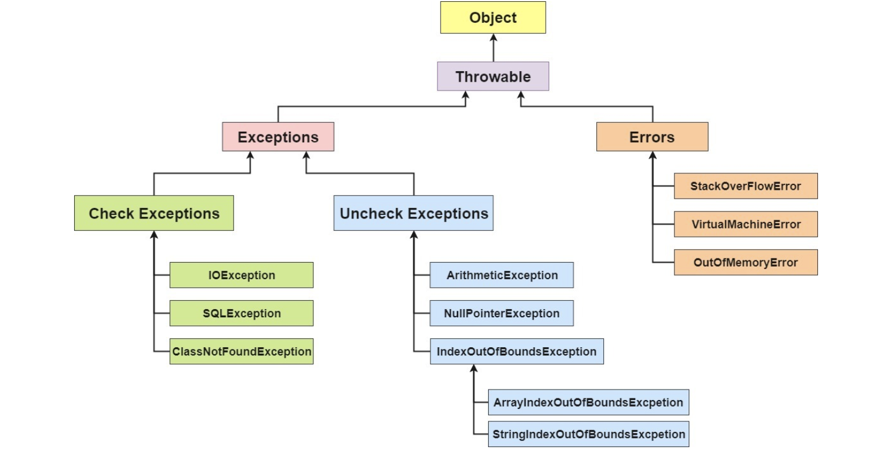

# 一、概述

***

## 1. 什么是异常

在程序中，错误可能产生于程序员没有预料到的各种情况，或者超出程序员可控范围的环境，例如用户的坏数据、试图打开一个不存在的文件等。为了能够及时有效地处理程序中的运行错误，Java 专门引入了异常类。

## 2. 异常的体系架构



在 Java 中，所有的异常都有一个共同的祖先 `java.lang` 包中的 `Throwable` 类。`Throwable` 类有两个重要的子类 `Exception`（异常）和 `Error`（错误）。`Exception` 能被程序本身处理(`try-catch`)， `Error` 是无法处理的(只能尽量避免)。

`Exception` 和 `Error` 二者都是 Java 异常处理的重要子类，各自都包含大量子类。

- **`Exception`** :程序本身可以处理的异常，可以通过 `catch` 来进行捕获。`Exception` 又可以分为 受检查异常(必须处理) 和 不受检查异常(可以不处理)。
- **`Error`** ：`Error` 属于程序无法处理的错误 ，我们没办法通过 `catch` 来进行捕获 。例如，Java 虚拟机运行错误（`Virtual MachineError`）、虚拟机内存不够错误(`OutOfMemoryError`)、类定义错误（`NoClassDefFoundError`）等 。这些异常发生时，Java 虚拟机（JVM）一般会选择线程终止。

扩展1 :

>## 受检异常和非受检异常区分
>
>**受检查异常**
>
>Java 代码在编译过程中，如果受检查异常没有被 `catch`/`throw` 处理的话，就没办法通过编译 。
>
>除了`RuntimeException`及其子类以外，其他的`Exception`类及其子类都属于受检查异常 。常见的受检查异常有： IO 相关的异常、`ClassNotFoundException` 、`SQLException`...。
>
>**不受检查异常**
>
>Java 代码在编译过程中 ，我们即使不处理不受检查异常也可以正常通过编译。
>
>`RuntimeException` 及其子类都统称为非受检查异常，例如：`NullPointerException`、`NumberFormatException`（字符串转换为数字）、`ArrayIndexOutOfBoundsException`（数组越界）、`ClassCastException`（类型转换错误）、`ArithmeticException`（算术错误）等。

扩展2 :

>## Throwable 类常用方法
>
>- **`public string getMessage()`**:返回异常发生时的简要描述
>- **`public string toString()`**:返回异常发生时的详细信息
>- **`public string getLocalizedMessage()`**:返回异常对象的本地化信息。使用 `Throwable` 的子类覆盖这个方法，可以生成本地化信息。如果子类没有覆盖该方法，则该方法返回的信息与 `getMessage（）`返回的结果相同
>- **`public void printStackTrace()`**:在控制台上打印 `Throwable` 对象封装的异常信息

# 二、异常处理

***

## 1. 默认处理(throws)

由方法层一直向上抛出,直到被处理,如果到main方法仍然未被处理,将由JVM虚拟机执行默认的处理方式,即退出虚拟机,打印异常堆栈信息

## 2. try-catch-finally

```java
//读取文本文件的内容
Scanner scanner = null;
try {
    scanner = new Scanner(new File("D://read.txt"));
    while (scanner.hasNext()) {
        System.out.println(scanner.nextLine());
    }
} catch (FileNotFoundException e) {
    e.printStackTrace();
} finally {
    if (scanner != null) {
        scanner.close();
    }
}
```

- **`try`块：** 用于捕获异常。其后可接零个或多个 `catch` 块，如果没有 `catch` 块，则必须跟一个 `finally` 块。
- **`catch`块：** 用于处理 try 捕获到的异常。
- **`finally` 块：** 无论是否捕获或处理异常，`finally` 块里的语句都会被执行。当在 `try` 块或 `catch` 块中遇到 `return` 语句时，`finally` 语句块将在方法返回之前被执行。

扩展1:

>在什么情况下finally 块不会被执行
>
>+ 在异常抛出之前执行了System.exit()
>+ 线程死亡
>+ Cpu关闭

扩展2:

>当 try 语句和 finally 语句中都有 return 语句时，方法如何执行?
>
>​	在方法返回之前，finally 语句的内容将被执行，执行到finally的return将结束方法,原本的方法return值将被覆盖。

## 3. try-with-resources

```java
try (Scanner scanner = new Scanner(new File("test.txt"))) {
    while (scanner.hasNext()) {
        System.out.println(scanner.nextLine());
    }
} catch (FileNotFoundException fnfe) {
    fnfe.printStackTrace();
}
```

+ 适用范围（资源的定义）：任何实现 `java.lang.AutoCloseable`或者 `java.io.Closeable` 的对象

+ 关闭资源和 finally 块的执行顺序：在 `try-with-resources` 语句中，任何 catch 或 finally 块在声明的资源关闭后运行

《Effecitve Java》中明确指出：

> 面对必须要关闭的资源，我们总是应该优先使用 `try-with-resources` 而不是`try-finally`。随之产生的代码更简短，更清晰，产生的异常对我们也更有用。`try-with-resources`语句让我们更容易编写必须要关闭的资源的代码，若采用`try-finally`则几乎做不到这点。