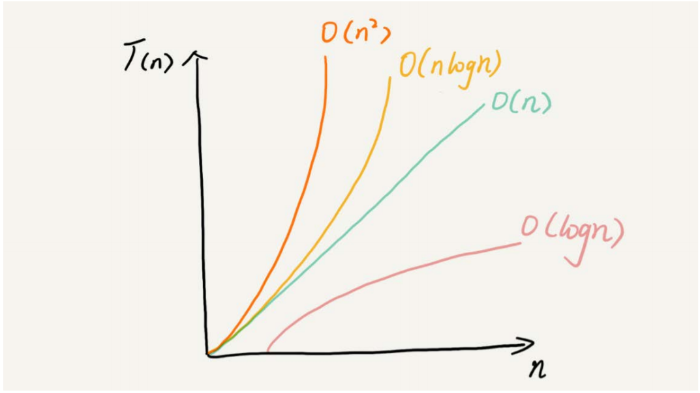
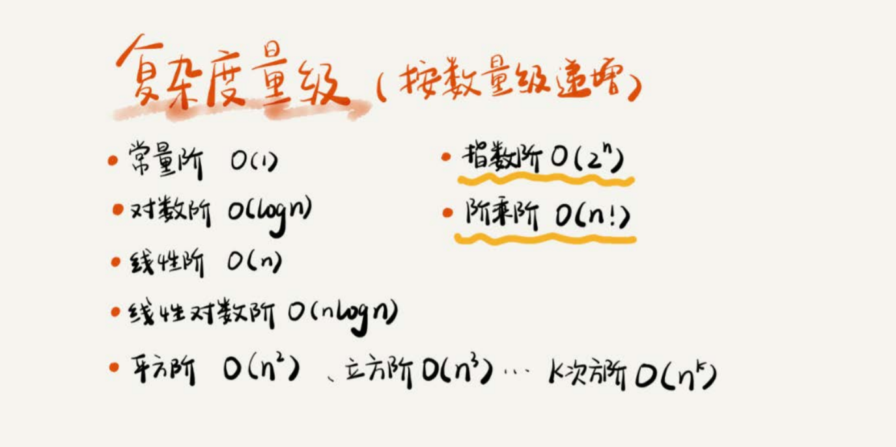

# 一、概述

***

## 1.什么是复杂度

数据结构与算法说到底就是解决程序 '快' 与 '省' 的问题,所以我们需要一个指标来衡量代码的执行效率,即时间复杂度和空间复杂度

## 2.为什么我们需要复杂度

一般来说,我们会使用事后统计法,即在程序运行之后通过统计,监控,得出他的执行效率,但是这种方式存在一定的局限性,同样的代码随着电脑配置的不同,受测数据的规模不同,执行效率会存在较大的差异,无法客观的衡量一段代码的优劣

# 二、复杂度分析

***

## 1 概述

复杂度描述的是算法执行时间（或占用空间）与数据规模的增长关系。,我们一般用大O复杂度表示法,当n 很大时,常数阶,低阶都无法左右时间的增长趋势.所以我们只保留一个最大量级就行,这是一种极限思维,以下均以时间复杂度为例,空间复杂度类似

## 2 基础案例

### 2.1 案例一:

```java
int cal(int n){         
    int sum = 0;     	 // 1 * unit_time
    int i =1;			// 1 * unit_time
    for(;i<=n;++i){		// n * unit_time
        sum =sum + 1	// n * unit_time
    }
    return sum;
}
// T(n) = (2+2n) * unit_time = O(n)
```

### 2.2 案例二:

```java
int cal(int n){         
    int sum = 0;     	 // 1 * unit_time
    int i =1;			// 1 * unit_time
    int j =1;			// 1 * unit_time
    for(;i<=n;++i){		// n * unit_time
        j =1;			// n * unit_time
        for(;j<=n;++j){	// n * n * unit_time
        sum =sum + i*j	// n * n * unit_time
    }
    return sum;
}
// T(n) = (3+2n+2n^2) * unit_time = O(n^2)
```

## 3 分析方法

### 3.1 单段代码 取高频

```java
 int cal(int n) {
 int sum = 0;
 int i = 1;
 for (; i <= n; ++i) { // n * unit_time
 sum = sum + i;     // n * unit_time
 }
 return sum;
 }

T(n) = O(n)
```

### 3.2 多段代码 取最大(加法法则)

```java
int cal ( int n){
    int sum_1 = 0;           // 1 * unit_time
    int p = 1;            // 1 * unit_time
    for (; p < 100; ++p) {  // 100 * unit_time
        sum_1 = sum_1 + p;        // 100 * unit_time
    }
    // -----------------------  T1(n) = 202* unit_time = O(1)

    int sum_2 = 0;        // 1 * unit_time
    int q = 1;                // 1 * unit_time
    for (; q < n; ++q) {    // n * unit_time
        sum_2 = sum_2 + q;        // n * unit_time
    }
    // -----------------------  T2(n) = (2n+2)* unit_time = O(n)

    int sum_3 = 0;            // 1 * unit_time
    int i = 1;                // 1 * unit_time
    int j = 1;                // 1 * unit_time
    for (; i <= n; ++i) {    // n * unit_time
        j = 1;                    // n * unit_time
        for (; j <= n; ++j) {    // n * n * unit_time
            sum_3 = sum_3 + i * j;    // n * n * unit_time
        }
    }
    // -----------------------  T3(n) = (2n^2+2n+3)* unit_time = O(n^2)
    return sum_1 + sum_2 + sum_3; // 1 * unit_time
}

// T(n) = T1(n)+T2(n)+T3(n) = O(max(o1,02,03)) = O(n^2)
```

### 3.3 嵌套代码求乘积(乘法法则)

```java
int f ( int n){
    int sum = 0;
    int i = 1;
    for (; i < n; ++i) {
        sum = sum + i;
    }
    return sum;
}
// T1(n) = O(n)


int cal ( int n){
    int ret = 0;
    int i = 1;
    for (; i < n; ++i) {
        ret = ret + f(i);
    }
}
// T2(n) = O(n) * T1(n) = O(n) * O(n) = O(n^2)
```

### 3.4 多个规模求加法 (O(m+n))

```java
int cal ( int m, int n){
    int sum_1 = 0;
    int i = 1;
    for (; i < m; ++i) {
        sum_1 = sum_1 + i;
    }
    //  T1(n) =  O(m)
    int sum_2 = 0;
    int j = 1;
    for (; j < n; ++j) {
        sum_2 = sum_2 + j;
    }
    //  T1(n) =  O(n)
    return sum_1 + sum_2;
}

// T(n) = O(m+n)
// 由于我们无法评估 m 和 n 哪个数据量级大,所以无法随意省略 这种时候,加法法则不再适用,乘法法则依然有效
```


## 4.几种常见时间复杂度实例





### 4.1  非多项式

>随着数据规模的增长，算法的执行时间和空间占用暴增，这类算法性能极差。包括， O(2^n)（指数阶）、O(n!)（阶乘阶）

### 4.2 多项式

>随着数据规模的增长，算法的执行时间和空间占用，按照多项式的比例增长。包括， O(1)（常数阶）、O(logn)（对数阶）、O(n)（线性阶）、O(nlogn)（线性对数阶）、O(n^2)（平方阶）、O(n^3)（立方阶）

#### 4.2.1 O(1)  常数阶

```java
 int i = 8;
 int j = 6;
 int sum = i + j;
```

>只要代码的执行时间不随n的增大而增长，这样代码的时间复杂度我们都记作O(1)。或者说，一般情况下，只要算法中不存在循环语句、递归语 句，即使有成千上万行的代码，其时间复杂度也是Ο(1)。

#### 4.2.2 O(logn)、O(nlogn) 对数阶

```java
i = 1;
while (i <= n) {
    i = i * 2;
}
//  T1(n) = logn = O(logn)

i = 1;
while (i <= n) {
    i = i * 3;
}
//  T2(n) = log3n = O(logn)


int i = 1;
for (int j = 0; j < n; j++) {
    while (i <= n) {
        i = i * 3;
    }
}
//  T3(n) = nlog3n = O(nlogn)

// 为什么可以把所有对数阶的时间复杂度都记为O(logn) ?
/*
我们知道，对数之间是可以互相转换的，log3n就等于log32 * log2n，所以O(log3n) = O(C * log2n)，其中C=log32是一个常量。基于我们前面的一个理论：在采用
大O标记复杂度的时候，可以忽略系数，即O(Cf(n)) = O(f(n))。所以，O(log2n) 就等于O(log3n)。因此，在对数阶时间复杂度的表示方法里，我们忽略对数的“底”，
统一表示为O(logn)。
*/
```

#### 4.2.3.O(m+n)、O(m*n)

```java
int cal ( int m, int n){
    int sum_1 = 0;
    int i = 1;
    for (; i < m; ++i) {
        sum_1 = sum_1 + i;
    }
    //  T1(n) =  O(m)
    int sum_2 = 0;
    int j = 1;
    for (; j < n; ++j) {
        sum_2 = sum_2 + j;
    }
    //  T1(n) =  O(n)
    return sum_1 + sum_2;
}

// T(n) = O(m+n)
// 由于我们无法评估 m 和 n 哪个数据量级大,所以无法随意省略 这种时候,加法法则不再适用,乘法法则依然有效
```

# 三、复杂度进阶

***

## 1.最好、最坏、平均时间复杂度

>在大多数情况下，我们并不需要区分最好、最坏、平均情况时间复杂度三种情 况。很多时候，我们使用一个复杂度就可以满足需求了。只有同一块代码在不同的情况下，时间复杂度有量级的差距，我们 才会使用这三种复杂度表示法来区分。

```java
// 在一个无序的数组（array）中，查找变量x出现的位置 
int find ( int[] array, int n, int x){
    int i = 0;
    int pos = -1;
    for (; i < n; ++i) {
        if (array[i] == x){
            pos = i;
            break;
        }
    }
    return pos;
}

//最好情况时间复杂度
要查找的变量x正好是数组的第一个元素， T(n) = O(1)
//最坏情况时间复杂度
要查找的变量x正好是数组的最后一个元素， T(n) = O(n)
//平均情况时间复杂度
T(n) = O(n)
```

## 2.均摊时间复杂度

>大部分情况下，我们并不需要区分最好、 最坏、平均三种复杂度。平均复杂度只在某些特殊情况下才会用到，而均摊时间复杂度应用的场景比它更加特殊、更加有限。均摊时间复杂度可以理解为一种特殊的平均复杂度

```java
/*
这段代码实现了一个往数组中插入数据的功能。当数组满了之后，也就是代码中的count == array.length时，我们用for循环遍历数组求
和，并清空数组，将求和之后的sum值放到数组的第一个位置，然后再将新的数据插入。但如果数组一开始就有空闲空间，则直接将数据插入数组
*/

int[] array = new int[n];
int count = 0;
void insert ( int val){
    if (count == array.length) {
        int sum = 0;
        for (int i = 0; i < array.length; ++i) {
            sum = sum + array[i];
        }
        array[0] = sum;
        count = 1;
    }
    array[count] = val;
    ++count;
}

//最好情况时间复杂度
T(n) = O(1)
//最坏情况时间复杂度
T(n) = O(n)
//平均情况时间复杂度
T(n) = O(1)
```

...