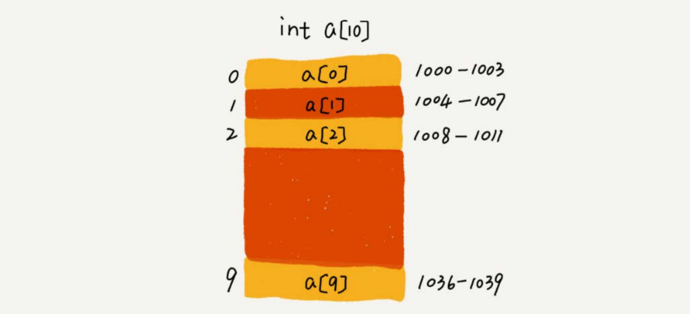
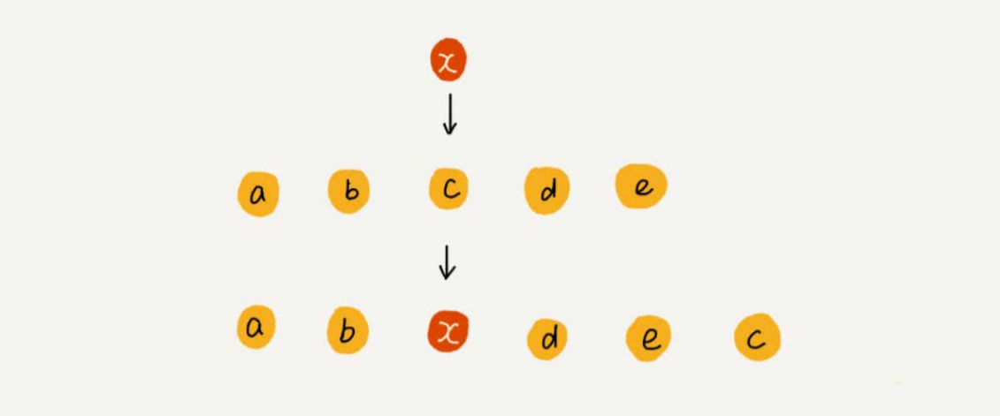
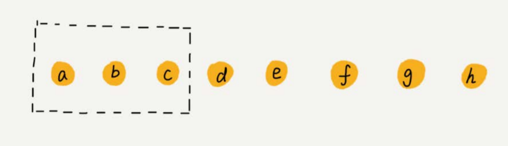

# 一、概述

***

## 1.什么是数组

数组（Array）是一种线性表数据结构。它用一组连续的内存空间，来存储一组具有相同类型的数据。

## 2.数组有什么特性

特性1:  数组属于线性表 , 数据排成像一条线一样的结构。每个线性表上的数据最多只有前和后两个方向

特性2: 数组拥有连续的内存空间和相同类型的数据 ,所以数组支持高效率的随机访问,但这也使得数组的增删效率比较低

# 二、特性分析

***

## 1.数组随机访问

### 1.1 原理分析



我们知道，计算机会给每个内存单元分配一个地址，计算机通过地址来访问内存中的数据。当计算机需要随机访问数组中的某个元素时，它会首先通过下面的寻址公式，计算出该元素存储的内存地址：

> a[i]_address  = base_address(首地址) + i * data_type_size(每个元素的大小)

### 1.2 思考:为什么大多数编程语言中，数组要从0开始编号，而不是从1开始呢？

```java
// a[k]_address = base_address + k * type_size   (从0开始计数)
// a[k]_address = base_address + (k-1)*type_size (从1开始计数)

1.从偏移角度理解a[0] 0为偏移量，如果从1计数，会多出K-1。增加cpu负担。
	所以我们循环要写成 for(int i = 0;i<3;i++) 而不是 for(int i = 0 ;i<=2;i++)。
	第一个直接就可以算出3-0 = 3 有三个数据，而后者 2-0+1个数据数据，多出1个加法运算，很恼火。
2.也有一定的历史原因 c语言以0开始计数,后续语言为了方便学习也沿用这一设定
```


## 2.如何优化低效的插入操作

### 2.1 低效分析

假设数组的长度为n，现在，如果我们需要将一个数据插入到数组中的第k个位置。为了把第k个位置腾出来，给新来的数据，我们需要将第k～n这部分的元素都顺 序地往后挪一位。**插入操作的最小时间复杂度是O(1),最大时间复杂度是O(n),平均时间复杂度是O(n)**

### **2.2 优化分析**

**如果数组中存储的数据并没有任何规律(无序数组)**，要将某个数组插入到第k个位置，为了避免大规模的数据搬移，我们还有一个简单的办法就是，直接将 第k位的数据搬移到数组元素的最后，把新的元素直接放入第k个位置。**这样时间复杂度就被降低为O(1)**



## 3.如何优化低效的删除操作

### 3.1 低效分析

跟插入数据类似，如果我们要删除第k个位置的数据，为了内存的连续性，也需要搬移数据，不然中间就会出现空洞，内存就不连续了。 和插入类似，如果删除数组末尾的数据，则**最好情况时间复杂度为O(1)**；如果删除开头的数据，则**最坏情况时间复杂度为O(n)**；**平均情况时间复杂度也为O(n)**

### **3.2 优化分析**

**如果我们不追求数组中数据的连续性**。我们就可以把多次删除操作集中在一起执行，从而提高效率.



例: 数组a[10]中存储了8个元素：a，b，c，d，e，f，g，h。现在，我们要依次删除a，b，c三个元素。为了避免d，e，f，g，h这几个数据会被搬移三次，我们可以先记录下已经删除的数据。每次的删除操作并不是真正地搬移数据，只是记录数据已经被删除。当数组没有更多空间存储数据时，我们再触发执行一次真正的删除操作，这样就大大减少了删除操作导致的数据搬移

# 三、数组的访问越界问题

```c
int main(int argc, char* argv[]){
 int i = 0;
 int arr[3] = {0};
 for(; i<=3; i++){
 arr[i] = 0;
 printf("hello world\n");
 }
 return 0;
}

/*
 C语言中,数组之外的内存空间也允许访问 , a[3]虽然越界了但是不会报错,如果a[3]的内存地址是i的话,那么就会导致
a[3] = 0 => i =0 ,最终导致程序无限循环
Java 中程序会进行做越界检查，会抛出java.lang.ArrayIndexOutOfBoundsException。
*/
```

# 四、容器与数组

***

针对数组类型，很多语言都提供了容器类，比如Java中的ArrayList、C++ STL中的vector。与数组相比，ArrayList最大的优势就是可以将很多数组操作的细节封装起来。比如前面提到的数组插入、删除数据时需要搬移其他数据等。另外，它还有一个优势，就是支持动态扩容。 数组本身在定义的时候需要预先指定大小，因为需要分配连续的内存空间。如果我们申请了大小为10的数组，当第11个数据需要存储到数组中时，我们就需要重新分配一块更大的空间，将原来的数据复制过去，然后再将新的数据插入。 如果使用ArrayList，我们就完全不需要关心底层的扩容逻辑，ArrayList已经帮我们实现好了。每次存储空间不够的时候，它都会将空间自动扩容为1.5倍大小。 不过，这里需要注意一点，因为扩容操作涉及内存申请和数据搬移，是比较耗时的。所以，如果事先能确定需要存储的数据大小，最好在创建ArrayList的时候事 先指定数据大小

总结:

>1.Java ArrayList无法存储基本类型，比如int、long，需要封装为Integer、Long类，而Autoboxing、Unboxing则有一定的性能消耗，所以如果特别关注性能，或者希望使用基本类型，就可以选用数组。
>
>2.如果数据大小事先已知，并且对数据的操作非常简单，用不到ArrayList提供的大部分方法，也可以直接使用数组。 
>
>3.当要表示多维数组时，用数组往往会更加直观。
>
>4.业务开发容器即可，底层开发，如网络框架，性能优化。选择数组。

