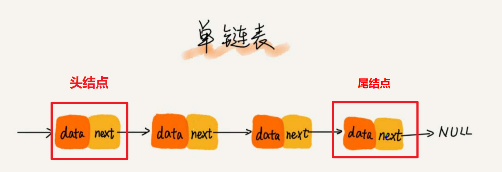
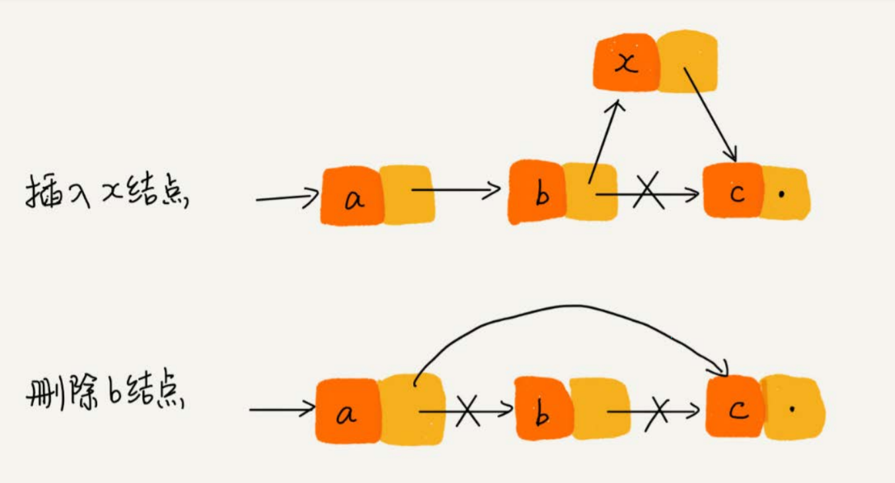
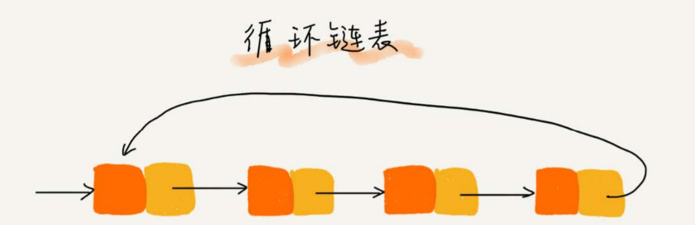
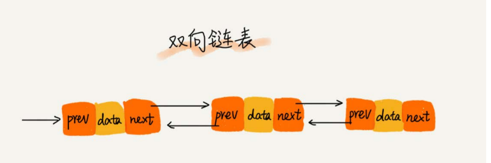

# 一、概述

***

## 1.什么是链表

链表是一种线性表数据结构。它用一组非连续的内存空间，来存储一组具有相同类型的数据。

## 2.链表有什么特性

特性1:  链表属于线性表 , 数据排成像一条线一样的结构。每个线性表上的数据最多只有前和后两个方向

特性2: 链表拥有非连续的内存空间 ,相比数组,它更能有效使用零碎内存空间,这使得数组的增删效率高,查询效率比较低

# 二、链表结构

## 1.单链表

### 1.1 基本结构

单链表中有两个结点是比较特殊的，它们分别是第一个结点和最后一个结点。我们习惯性地把第一个结点叫作头结点，把最 后一个结点叫作尾结点。其中，**头结点用来记录链表的基地址。有了它，我们就可以遍历得到整条链表**。**而尾结点特殊的地方是：指针不是指向下一个结点，而是指向一个空地址NULL，表示这是链表上最后一个结点**。

### 1.2 增删操作复杂度分析

我们知道，在进行数组的插入、删除操作时，为了保持内存数据的连续性，需要做大量的数据搬移，所以时间复杂度是O(n)。而在链表中插入或者删除一个数 据，我们并不需要为了保持内存的连续性而搬移结点，因为链表的存储空间本身就不是连续的。所以，在链表中插入和删除一个数据是非常快速的。 **针对链表的插入和删除操作，我们只需要考虑相邻结点的指针改变，所以对应的时间复杂度是O(1)**。

### 1.3 查询操作复杂度分析

链表要想随机访问第k个元素，就没有数组那么高效了。因为链表中的数据并非连续存储的，所以无法像数组那样，根据首地址和下标，通过 寻址公式就能直接计算出对应的内存地址，而是需要根据指针一个结点一个结点地依次遍历，直到找到相应的结点。 **链表随机访问的时间复杂度是O(n)。。**

## 2.循环链表

### 2.1 基本结构

循环链表是一种特殊的单链表。相比单链表唯一的区别就在尾结点。而循环链表的尾结点指针是指向链表的头结点。从我画的循环链表图中，你应该可以看出来，它像一个环一样首尾相连，所以叫作“循环”链表。循环链表的优点是从链尾到链头比较方便。当要处理的数据具有环型结构特点时，就特别适合采用循环链表。比如著名的约瑟夫问题。尽管用单链表也可以实现，但是用循环链表实现的话，代码就会简洁很多。

### 2.2 增删操作复杂度分析(同单链表)

### 2.3 查询操作复杂度分析(同单链表)

## 3.双向链表

### 3.1 基本结构

双向链表，顾名思义，它支持两个方向，每个结点不止有一个后继指针next指向后面的结 点，还有一个前驱指针prev指向前面的结点。

从我画的图中可以看出来，双向链表需要额外的两个空间来存储后继结点和前驱结点的地址。所以，如果存储同样多的数据，双向链表要比单链表占用更多的内 存空间。虽然两个指针比较浪费存储空间，但可以支持双向遍历，这样也带来了双向链表操作的灵活性。那相比单链表，双向链表适合解决哪种问题呢？ 从结构上来看，双向链表可以支持O(1)时间复杂度的情况下找到前驱结点，正是这样的特点，也使双向链表在某些情况下的插入、删除等操作都要比单链表简 单、高效。 你可能会说，我刚讲到单链表的插入、删除操作的时间复杂度已经是O(1)了，双向链表还能再怎么高效呢？别着急，刚刚的分析比较偏理论，很多数据结构和算 法书籍中都会这么讲，但是这种说法实际上是不准确的，或者说是有先决条件的。我再来带你分析一下链表的两个操作。

### 3.2 增删操作复杂度分析

### 3.3 查询操作复杂度分析

# 二、特性分析

***

