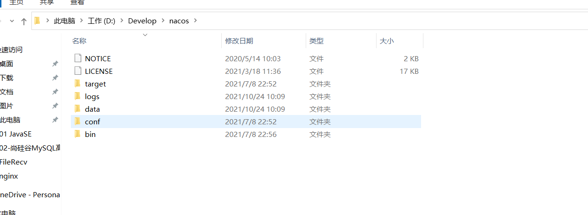
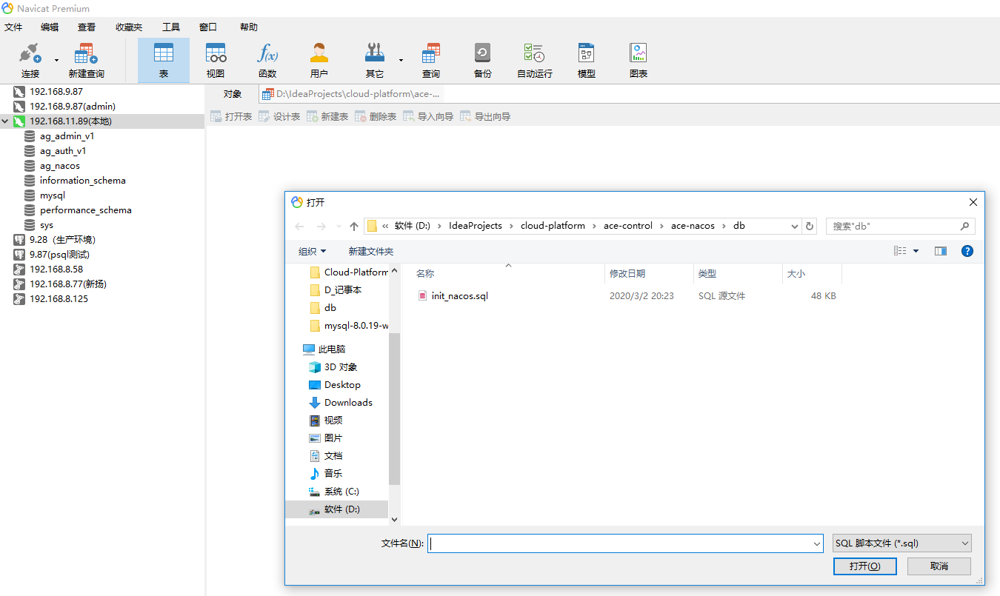
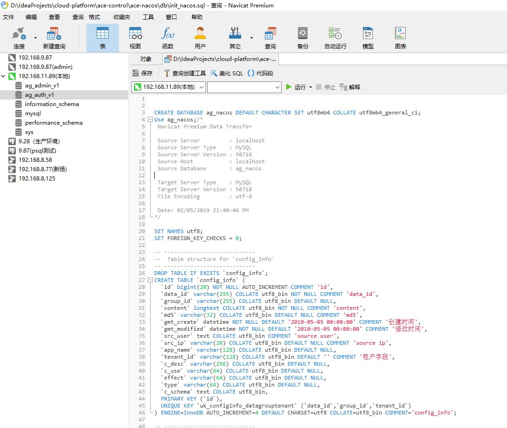
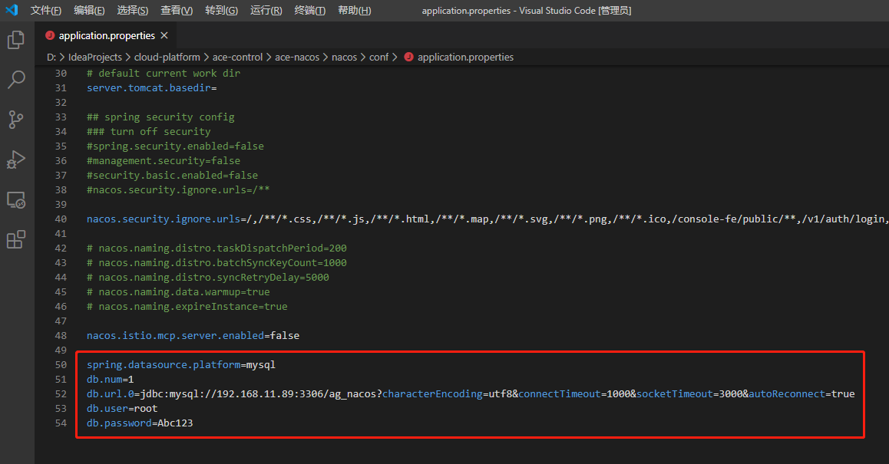
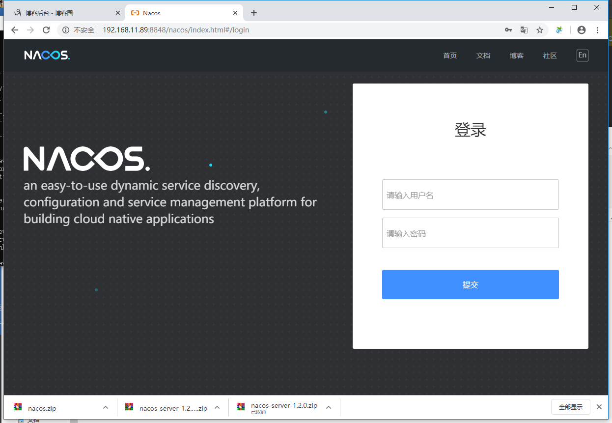
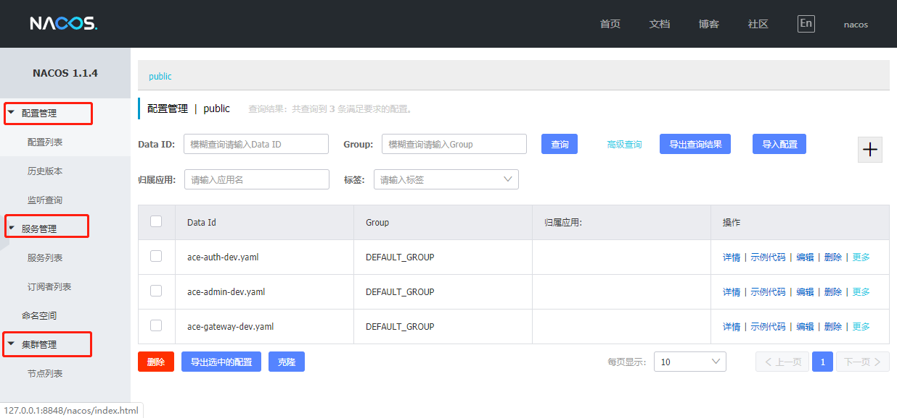

# nacos 的安装与启动方式

转载自（https://www.cnblogs.com/xcj26/p/12575640.html）

## 一、nacos 的下载与安装

***

### 1.下载

到 github下载  nacos-server-1.2.0.zip 文件  ：https://github.com/alibaba/nacos/releases

解压后的目录结构如图：



### 2.安装

在0.7版本之前，在单机模式时nacos使用嵌入式数据库实现数据的存储，不方便观察数据存储的基本情况。0.7版本增加了支持mysql数据源能力。我们此处采用mysql的方式：

 

定位到 D:\Develop\nacos\conf\nacos-mysql.sql 数据库脚本文件。

打开 Navicat Premium 15  

【文件】->【打开外部文件】 -> 【查询】

选中初始化文件：

[](https://img2020.cnblogs.com/blog/48022/202003/48022-20200326172316404-334297830.png)

执行如下文件：

[](https://img2020.cnblogs.com/blog/48022/202003/48022-20200326172134282-351835949.png)

 生成数据库。

 修改nacos的数据库连接：

定位到 D:\Develop\nacos\conf\application.properties  文件。 用vscode 打开，添加如下代码，最后保存文件。

```
spring.datasource.platform=mysql
db.num=1 
db.url.0=jdbc:mysql://192.168.11.89:3306/ag_nacos?characterEncoding=utf8&connectTimeout=1000&socketTimeout=3000&autoReconnect=true 
db.user=root
db.password=Abc123
```

[](javascript:void(0);)

 

[](https://img2020.cnblogs.com/blog/48022/202003/48022-20200326171138047-1863867693.png)

到此： nacos的下载与安装就完成了。

 

## 二、nnacos的启动

启动nacos 服务技巧：

linux环境下：
Linux：sh startup.sh -m standalone 单机启动模式
这种启动方式有弊端，在关闭命令窗口后nacos进程会直接shutdown，导致服务停止。
解决方法：
在nacos 0.6.0版本(包括0.6.0)
用命令 sh startup.sh -m standalone & 启动nacos服务，
nacos版本高于0.6.0，上面命令还是会出现问题，
建议采用下面的命令
nohup sh startup.sh -m standalone &
或者使用
setsid sh startup.sh -m standalone &

 

windows环境下：
Windows：cmd startup.cmd -m standalone 单机启动模式

或  

转到文件： D:\IdeaProjects\cloud-platform\ace-control\ace-nacos\nacos\bin\startup.cmd  双击“startup.cmd”启动nocas服务

*这种启动方式同样有弊端，在关闭命令窗口后nacos进程会直接shutdown，导致服务停止。
解决方法：
新建一个记事本，输入如下代码：*

Set ws = CreateObject("Wscript.Shell")
ws.run "cmd /c startup.cmd",vhhide

把记录本文件命名：***.vbs 如 runbat.vbs，然后双击运行runbat.vbs文

==================================================

nacos1.4以上的版本，默认为集群运行，所以要设置成单机启动

Set ws = CreateObject("Wscript.Shell")
ws.run "cmd /c startup.cmd -m standalone",vhhide

=================================================

 

集群模式
在集群模式下，还需要修改 vim conf/cluster.conf 文件，示例如下：

\#it is ip
\#example
10.10.10.123:10000
10.10.10.124:10000

备注：
在Windows下，这个时候不能再双击startup.cmd启动了，如果这样启动仍然是以单机模式运行。
需要执行如下：startup.cmd -m cluster

nacos 服务启动后，访问如下网址：

 http://192.168.11.89:8848/nacos/index.html#/login   

用户名 nacos 密码 nacos

能够看到如下界面：

[](https://img2020.cnblogs.com/blog/48022/202003/48022-20200326171437108-1625170667.png)

 

 

可以看到【配置管理】，【服务管理】，【集群管理】 三个功能模块。

 

[](https://img2020.cnblogs.com/blog/48022/202003/48022-20200327140732662-1337341711.png)