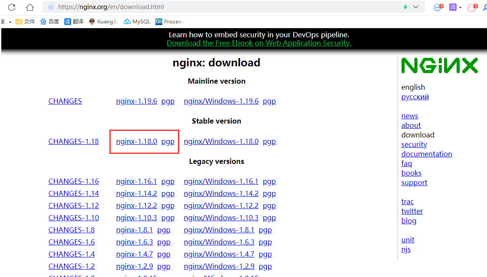
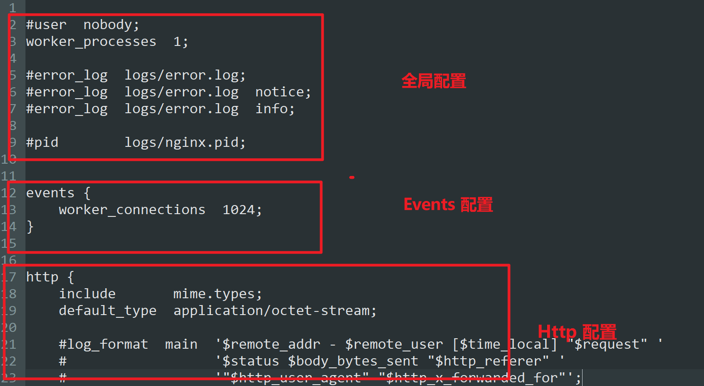

## 1.什么是 Nginx？

***

Nginx (engine x) 是一个高性能的HTTP和反向代理web服务器，同时也提供了IMAP/POP3/SMTP服务。Nginx是由伊戈尔·赛索耶夫为俄罗斯访问量第二的Rambler.ru站点（俄文：Рамблер）开发的，第一个公开版本0.1.0发布于2004年10月4日。2011年6月1日，nginx 1.0.4发布。

其特点是占有内存少，并发能力强，事实上nginx的并发能力在同类型的网页服务器中表现较好，中国大陆使用nginx网站用户有：百度、京东、新浪、网易、腾讯、淘宝等。在全球活跃的网站中有12.18%的使用比率，大约为2220万个网站。

Nginx 是一个安装非常的简单、配置文件非常简洁（还能够支持perl语法）、Bug非常少的服务。Nginx 启动特别容易，并且几乎可以做到7*24不间断运行，即使运行数个月也不需要重新启动。你还能够不间断服务的情况下进行软件版本的升级。

Nginx代码完全用C语言从头写成。官方数据测试表明能够支持高达 50,000 个并发连接数的响应。

## 2.Nginx 作用 (Nginx应用场景)？

***

>随着我们并发量的增加,我们需要更多的服务器来进行横向扩展,但是不同的服务器存在不同的访问域名,为了保障用户体验,让用户进行无感知操作,我们就需要使用Nginx对于这些请求进行转发

### 2.1 功能一 : 反向代理


### 2.2 功能二: 负载均衡

>一般来说,我们的服务器性能可能参差不齐,这时候就需要才采用负载均衡的思想来最大限度的利用我们的服务器
>
>Nginx提供的负载均衡策略有2种：内置策略和扩展策略。内置策略为轮询，加权轮询，Ip hash。扩展策略，就天马行空，只有你想不到的没有他做不到的。

### 2.3 功能三: 动静分离

动静分离，在我们的软件开发中，有些请求是需要后台处理的，有些请求是不需要经过后台处理的（如：css、html、jpg、js等等文件），这些不需要经过后台处理的文件称为静态文件。让动态网站里的动态网页根据一定规则把不变的资源和经常变的资源区分开来，动静资源做好了拆分以后，我们就可以根据静态资源的特点将其做缓存操作。提高资源响应的速度。


## 3.Nginx的安装

***

### 3.1 windows下安装

#### step1: 下载nginx

[http://nginx.org/en/download.html](https://links.jianshu.com/go?to=http%3A%2F%2Fnginx.org%2Fen%2Fdownload.html) 下载稳定版本(以nginx/Windows-1.16.1为例，直接下载 nginx-1.16.1.zip)
下载后解压，解压后如下：


 

#### step2 : 启动nginx

有很多种方法启动nginx

(1)直接双击nginx.exe，双击后一个黑色的弹窗一闪而过

(2)打开cmd命令窗口，切换到nginx解压目录下，输入命令 `nginx.exe` ，回车即可

step3 : 检查nginx是否启动成功

直接在浏览器地址栏输入网址 [http://localhost:80](https://links.jianshu.com/go?to=http%3A%2F%2Flocalhost%3A80) 回车，出现以下页面说明启动成功！


#### step3: 配置监听

nginx的配置文件是conf目录下的nginx.conf，默认配置的nginx监听的端口为80，如果80端口被占用可以修改为未被占用的端口即可。

 


 

当我们修改了nginx的配置文件nginx.conf 时，不需要关闭nginx后重新启动nginx，只需要执行命令 `nginx -s reload` 即可让改动生效

#### step4:  关闭nginx

注意: 如果使用cmd命令窗口启动nginx， 关闭cmd窗口是不能结束nginx进程的，可使用两种方法关闭nginx

(1)输入nginx命令 `nginx -s stop`(快速停止nginx) 或 `nginx -s quit`(完整有序的停止nginx)

(2)使用taskkill `taskkill /f /t /im nginx.exe`

>taskkill是用来终止进程的，
>/f是强制终止 .
>/t终止指定的进程和任何由此启动的子进程。
>/im示指定的进程名称 .

### 3.2 linux下安装

#### step1: 安装gcc

安装 nginx 需要先将官网下载的源码进行编译，编译依赖 gcc 环境，如果没有 gcc 环境，则需要安装：

```swift
yum install gcc-c++
```

#### step2: PCRE pcre-devel 安装

PCRE(Perl Compatible Regular Expressions) 是一个Perl库，包括 perl 兼容的正则表达式库。nginx 的 http 模块使用 pcre 来解析正则表达式，所以需要在 linux 上安装 pcre 库，pcre-devel 是使用 pcre 开发的一个二次开发库。nginx也需要此库。命令：

```undefined
yum install -y pcre pcre-devel
```

#### step3:  zlib 安装

zlib 库提供了很多种压缩和解压缩的方式， nginx 使用 zlib 对 http 包的内容进行 gzip ，所以需要在 Centos 上安装 zlib 库。

```undefined
yum install -y zlib zlib-devel
```

#### step4:  OpenSSL 安装

OpenSSL 是一个强大的安全套接字层密码库，囊括主要的密码算法、常用的密钥和证书封装管理功能及 SSL 协议，并提供丰富的应用程序供测试或其它目的使用。
nginx 不仅支持 http 协议，还支持 https（即在ssl协议上传输http），所以需要在 Centos 安装 OpenSSL 库。

```undefined
yum install -y openssl openssl-devel
```

#### step5: 下载安装包

手动下载.tar.gz安装包，地址：[https://nginx.org/en/download.html](https://links.jianshu.com/go?to=https%3A%2F%2Fnginx.org%2Fen%2Fdownload.html)



下载完毕上传到服务器上 /root

#### step6: 解压

```css
tar -zxvf nginx-1.18.0.tar.gz
cd nginx-1.18.0
```


#### step7: 配置

使用默认配置，在nginx根目录下执行

```go
./configure
make
make install
```

查找安装路径： `whereis nginx`


#### step8: 基本操作

```cmd
# 基础命令
cd /usr/local/nginx/sbin/
./nginx  启动
./nginx -s stop  停止
./nginx -s quit  安全退出
./nginx -s reload  重新加载配置文件
ps aux|grep nginx  查看nginx进程

# 开启防火墙
service firewalld start
# 重启防火墙
service firewalld restart
# 关闭防火墙
service firewalld stop
# 查看防火墙规则
firewall-cmd --list-all
# 查询端口是否开放
firewall-cmd --query-port=8080/tcp
# 开放80端口
firewall-cmd --permanent --add-port=80/tcp
# 移除端口
firewall-cmd --permanent --remove-port=8080/tcp

#重启防火墙(修改配置后要重启防火墙)
firewall-cmd --reload

# 参数解释
1、firwall-cmd：是Linux提供的操作firewall的一个工具；
2、--permanent：表示设置为持久；
3、--add-port：标识添加的端口；
```

启动成功访问 服务器ip:80 (注意：如何连接不上，检查阿里云安全组是否开放端口，或者服务器防火墙是否开放端口！)


## 4.配置详解

***




```
########### 每个指令必须有分号结束。#################
#user administrator administrators;  #配置用户或者组，默认为nobody nobody。
#worker_processes 2;  #允许生成的进程数，默认为1
#pid /nginx/pid/nginx.pid;   #指定nginx进程运行文件存放地址
error_log log/error.log debug;  #制定日志路径，级别。这个设置可以放入全局块，http块，server块，级别以此为：debug|info|notice|warn|error|crit|alert|emerg
events {
    accept_mutex on;   #设置网路连接序列化，防止惊群现象发生，默认为on
    multi_accept on;  #设置一个进程是否同时接受多个网络连接，默认为off
    #use epoll;      #事件驱动模型，select|poll|kqueue|epoll|resig|/dev/poll|eventport
    worker_connections  1024;    #最大连接数，默认为512
}
http {
    include       mime.types;   #文件扩展名与文件类型映射表
    default_type  application/octet-stream; #默认文件类型，默认为text/plain
    #access_log off; #取消服务日志    
    log_format myFormat '$remote_addr–$remote_user [$time_local] $request $status $body_bytes_sent $http_referer $http_user_agent $http_x_forwarded_for'; #自定义格式
    access_log log/access.log myFormat;  #combined为日志格式的默认值
    sendfile on;   #允许sendfile方式传输文件，默认为off，可以在http块，server块，location块。
    sendfile_max_chunk 100k;  #每个进程每次调用传输数量不能大于设定的值，默认为0，即不设上限。
    keepalive_timeout 65;  #连接超时时间，默认为75s，可以在http，server，location块。

    upstream mysvr {   
      server 127.0.0.1:7878;
      server 192.168.10.121:3333 backup;  #热备
    }
    error_page 404 https://www.baidu.com; #错误页
    server {
        keepalive_requests 120; #单连接请求上限次数。
        listen       4545;   #监听端口
        server_name  127.0.0.1;   #监听地址       
        location  ~*^.+$ {       #请求的url过滤，正则匹配，~为区分大小写，~*为不区分大小写。
           #root path;  #根目录
           #index vv.txt;  #设置默认页
           proxy_pass  http://mysvr;  #请求转向mysvr 定义的服务器列表
           deny 127.0.0.1;  #拒绝的ip
           allow 172.18.5.54; #允许的ip           
        } 
    }
}
```

