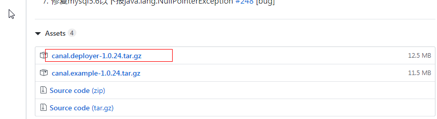
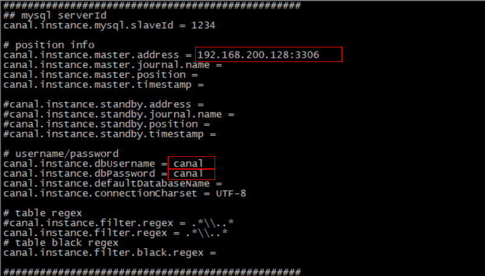

 <center><h1><b><font color='gold'>Canal</font></b></h1></center>

## 1. canal 

### 1.1 canal简介

canal可以用来监控数据库数据的变化，从而获得新增数据，或者修改的数据。

canal是应阿里巴巴存在杭州和美国的双机房部署，存在跨机房同步的业务需求而提出的。

阿里系公司开始逐步的尝试基于数据库的日志解析，获取增量变更进行同步，由此衍生出了增量订阅&消费的业务。


原理相对比较简单：

1. canal模拟mysql slave的交互协议，伪装自己为mysql slave，向mysql master发送dump协议
2. mysql master收到dump请求，开始推送binary log给slave(也就是canal)
3. canal解析binary log对象(原始为byte流)


### 1.2 环境部署

#### 1.2.1 mysql开启binlog模式

（1）查看当前mysql是否开启binlog模式。

```
SHOW VARIABLES LIKE '%log_bin%'
```

如果log_bin的值为OFF是未开启，为ON是已开启。

（2）修改/etc/my.cnf 需要开启binlog模式。

```shell
[mysqld]
log-bin=mysql-bin
binlog-format=ROW
server_id=1
```

修改完成之后，重启mysqld的服务。

  (3) 进入mysql

```sql
mysql -h localhost -u root -p
```

（4）创建账号 用于测试使用

使用root账号创建用户并授予权限

```sql
create user canal@'%' IDENTIFIED by 'canal';
GRANT SELECT, REPLICATION SLAVE, REPLICATION CLIENT,SUPER ON *.* TO 'canal'@'%';
FLUSH PRIVILEGES;
```

#### 1.2.2 canal服务端安装配置

（1）下载地址canal

```url
https://github.com/alibaba/canal/releases/tag/canal-1.0.24
```



（2）下载之后 上传到linux系统中，解压缩到指定的目录/usr/local/canal

解压缩之后的目录结构如下：


（3）修改 exmaple下的实例配置

```shell
vi conf/example/instance.properties
```



修改如图所示的几个参数。

（3）指定读取位置  

进入mysql中执行下面语句查看binlog所在位置

```shell
mysql> show master status;
显示如下:
+------------------+----------+--------------+------------------+-------------------+
| File             | Position | Binlog_Do_DB | Binlog_Ignore_DB | Executed_Gtid_Set |
+------------------+----------+--------------+------------------+-------------------+
| mysql-bin.000001 |      120 |              |                  |                   |
+------------------+----------+--------------+------------------+-------------------+
1 row in set (0.00 sec)
```

如果file中binlog文件不为 mysql-bin.000001 可以重置mysql

```sql
mysql> reset master;
```

查看canal配置文件

```shell
vim /usr/local/canal/conf/example/meta.dat
```

找到对应的binlog信息更改一致即可

```shell
"journalName":"mysql-bin.000001","position":120,"
```

注意：如果不一致，可能导致以下错误

```
2019-06-17 19:35:20.918 [New I/O server worker #1-2] ERROR c.a.otter.canal.server.netty.handler.SessionHandler - something goes wrong with channel:[id: 0x7f2e9be3, /192.168.200.56:52225 => /192.168.200.128:11111], exception=java.io.IOException: Connection reset by peer
```

（4）启动服务：

```shell
[root@localhost canal]# ./bin/startup.sh
```

（5）查看日志：

```
cat /usr/local/canal/logs/canal/canal.log
```


这样就表示启动成功了。

### 1.3 数据监控微服务

当用户执行数据库的操作的时候，binlog 日志会被canal捕获到，并解析出数据。我们就可以将解析出来的数据进行相应的逻辑处理。

我们这里使用的一个开源的项目，它实现了springboot与canal的集成。比原生的canal更加优雅。

https://github.com/chenqian56131/spring-boot-starter-canal  

使用前需要将starter-canal安装到本地仓库。

我们可以参照它提供的canal-test，进行代码实现。

#### 1.3.1 微服务搭建

（1）创建工程模块changgou_canal，pom引入依赖

```xml
<dependency>
	<groupId>com.xpand</groupId>
	<artifactId>starter-canal</artifactId>
	<version>0.0.1-SNAPSHOT</version>
</dependency>
```

（2）创建包com.changgou.canal ，包下创建启动类

```java
@SpringBootApplication
@EnableCanalClient
public class CanalApplication {

	public static void main(String[] args) {
		SpringApplication.run(CanalApplication.class, args);
	}
}
```

（3）添加配置文件application.properties

```
canal.client.instances.example.host=192.168.200.128
canal.client.instances.example.port=11111
canal.client.instances.example.batchSize=1000
```

（4）创建com.changgou.canal.listener包，包下创建类

```java
@CanalEventListener
public class AdListener {

    @ListenPoint(schema = "changgou_business", table = {"tb_ad"})
    public void adUpdate(CanalEntry.EventType eventType, CanalEntry.RowData rowData) {
        System.err.println("广告数据发生变化");
        rowData.getBeforeColumnsList().forEach((c) -> System.out.println("更改前数据: " + c.getName() + " :: " + c.getValue()));
        rowData.getAfterColumnsList().forEach((c) -> System.out.println("更改后数据: " + c.getName() + " :: " + c.getValue()));
    }
}
```

 测试：启动数据监控微服务，修改changgou_business的tb_ad表，观察控制台输出。

#### 1.3.2 工具类

canal给我们提供了rowData.getBeforeColumnsList()和rowData.getAfterColumnsList() ,但有时我们更希望能得到一个map，这样我们就可以很方便的提取某个字段的值

（1）编写工具类，实现列集合转换为 map

```java
/**
 *  工具类
 */
public class CanalUtil {

    /**
     * 列集合转换为 map
     * @param columnsList
     * @return
     */
    public static Map<String,String>  convertToMap(List<CanalEntry.Column> columnsList )  {
        Map<String,String> map=new HashMap( );
        columnsList.forEach( c-> map.put( c.getName(),c.getValue() ) );
        return map;
    }
}
```

（2）AdListener方法调用工具类