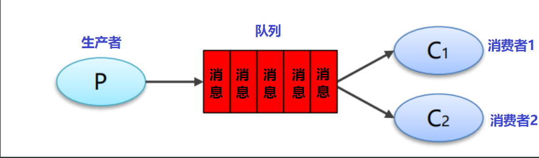
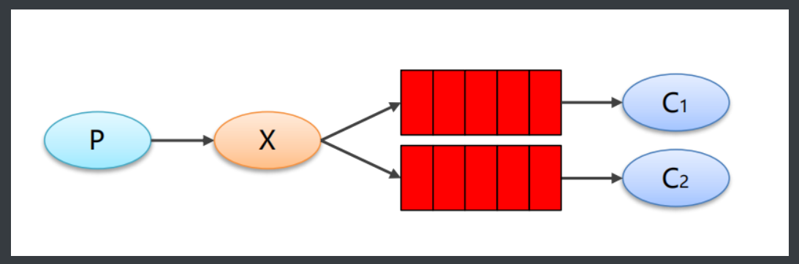
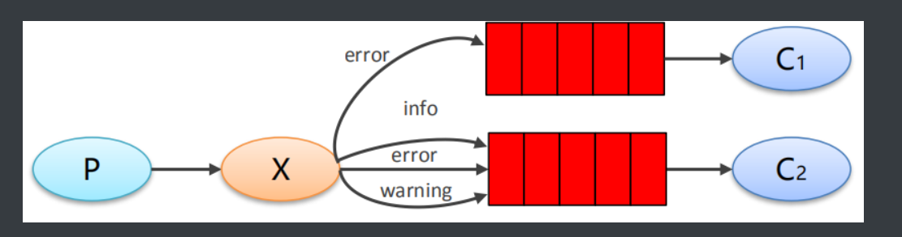
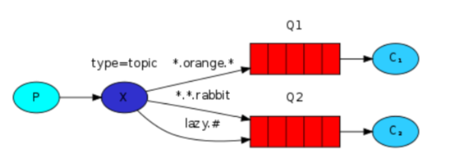

 <center><h1><b><font color='gold'>RabbitMQ-基础篇</font></b></h1></center>

# 业务场景--消息无需分发

## 1.简易模式

>概念图


>体会

**简易模式也称为点对点模式,一般适用与简单的请求发送和接收场景,这种场景下,数据量不是很大,且消息不用分发**

## 2.工作模式

>概念图



>体会

**工作模式的架构和简易模式非常相似,消费者之间存在竞争关系,共同消费一定数量的消息,但是一条消息只能被一个消费者消费,各个消费者消费的数据量会依据服务器性能的不同会有所差别,相比简易模式,他更适合一些数据量较大的场景**

## ☆代码示例:

>注意:以下代码以简易模式为例,工作模式代码与简易模式相同,只不过工作模式需要搭建多个消费者

>step1:构建提供者

```java
import com.rabbitmq.client.Channel;
import com.rabbitmq.client.Connection;
import com.rabbitmq.client.ConnectionFactory;

public class HelloWorldProvider {
    public static void main(String[] args) throws Exception {
        //1.连接主机,获取Channel
        ConnectionFactory factory = new ConnectionFactory();
        factory.setHost("127.0.0.1"); 
        factory.setPort(5672);
        factory.setVirtualHost("/"); 
        factory.setUsername("guest");
        factory.setPassword("guest");     
        Connection connection = factory.newConnection();
        Channel channel = connection.createChannel();

        
        /*
        2.声明队列
        * queue:队列名
        * durable:是否持久化
        * exclusive:是否独占一般为false
        * autoDelete:自动删除
        * arguments:参数
        * */
       channel.queueDeclare("helloWorld_queue", true, false, false, null);


        /*3. 发送消息
        * exchange:交换机名称,没有就写默认的""
        * routingKey:路由名称,简单模式中默认以队列名为路由名称
        * props:配置信息
        * body：发送消息数据
        * */

        for (int i = 0; i < 5; i++) {
            String body = i+"hello rabbitmq";
            channel.basicPublish("","helloWorld_queue",null,body.getBytes());
        }
        
        //4.释放资源
        channel.close();
        connection.close();

    }
}

```

>step2:搭建消费者

```java
import com.rabbitmq.client.*;

import java.io.IOException;

public class HelloWorldConsumer {
    public static void main(String[] args) throws Exception {
        //1.连接主机,获取Channel
        ConnectionFactory factory = new ConnectionFactory();
        factory.setHost("127.0.0.1"); 
        factory.setPort(5672); 
        factory.setVirtualHost("/"); 
        factory.setUsername("guest");
        factory.setPassword("guest");
        Connection connection = factory.newConnection();
        Channel channel = connection.createChannel();

        //2.编写回调函数
        Consumer consumer = new DefaultConsumer(channel){
            /*
                回调方法，当收到消息后，会自动执行该方法
                1. consumerTag：标识
                2. envelope：获取一些信息，交换机，路由key...
                3. properties:配置信息
                4. body：数据
             */
            @Override
            public void handleDelivery(String consumerTag, Envelope envelope, AMQP.BasicProperties properties, 				byte[] body) throws IOException {
                System.out.println("body："+new String(body));
            }
        };
     /*
       3.监听队列
        参数：
        1. queue：队列名称
        2. autoAck：是否自动确认
        3. callback：回调对象
     */
        channel.basicConsume("helloWorld_queue",true,consumer);
        
        //无需释放资源,消费端需要时时监听
    }
}
```

>step3:启动rabbitmq,测试


## ☆扩展

>**1.以上架构中没有定义交换机,并不是没有用,而是用了默认的交换机,名称为" "**

>**2.以上模式中,路由键默认是队列名称**

# 业务场景--消息需要分发

## 1.订阅模式

>概念图



>体会:

订阅模式中,生产者会将数据分发给每一个消费者,该模式下,需要手动定义交换机,路由键的值为" ",代表任何数据都会被分发,类似广播


## 2.路由模式

>概念图



>体会

路由模式相比订阅模式,也是将一条信息分发给多个消费者,但是其路由key必须是一个确定的值,对于消息的传递做出了限制

## 3.主题模式

>概念图



>体会

`Topic`类型与`Direct`相比，都是可以根据`RoutingKey`把消息路由到不同的队列。只不过`Topic`类型`Exchange`可以让队列在绑定`Routing key` 的时候使用通配符！

## ☆代码示例

>以下代码以主题模式为例,其余模式基本类似,区别就在于交换机的类型不同和路由key的命名规则不同

>step1:生产者搭建

```java
package cn.wangshijia;

import com.rabbitmq.client.BuiltinExchangeType;
import com.rabbitmq.client.Channel;
import com.rabbitmq.client.Connection;
import com.rabbitmq.client.ConnectionFactory;

import java.io.IOException;
import java.util.concurrent.TimeoutException;

public class TopicProvider {

    public static void main(String[] args) throws IOException, TimeoutException {
        //1.创建连接 ,获取Channel
        ConnectionFactory factory = new ConnectionFactory();
        factory.setHost("127.0.0.1");
        factory.setPort(5672);
        factory.setVirtualHost("/");
        factory.setUsername("guest");
        factory.setPassword("guest");
        Connection connection = factory.newConnection();
        Channel channel = connection.createChannel();
        
        /*
        2.声明交换机
            exchange:交换机名称
            type:交换机类型  TOPIC:主题模式  FANOUT:订阅模式 DIRECT:路由模式
            durable:是否持久化
            autoDelete:自动删除
            internal:内部使用,一般为false
            arguments:参数
        */
        channel.exchangeDeclare("test_topic", BuiltinExchangeType.TOPIC, true, false, false, null);

        //3.声明队列
        channel.queueDeclare("topic_queue1", true, false, false, null);
        channel.queueDeclare("topic_queue2", true, false, false, null);

        /*
            4.绑定交换机与队列
             TOPIC:routeKey 可以使用通配符 * 是一个单词 # 多个单词 以.分隔
             FANOUT:routeKey 使用固定的单词
             DIRECT:routeKey 使用""
        */

        channel.queueBind("topic_queue1", "test_topic", "#.error");
        channel.queueBind("topic_queue1", "test_topic", "test.*");
        channel.queueBind("topic_queue2", "test_topic", "#");
        
        
        
        //5. 发送消息
        String body = "xxx.error.test";
        channel.basicPublish("test_topic","xxx.error.test",null,body.getBytes());

        //6. 释放资源
        channel.close();
        connection.close();
    }
}
```

>step2:消费者搭建,注意,不同模式的消费者搭建流程是一样的


```java
package wangshijia;

import com.rabbitmq.client.*;

import java.io.IOException;
import java.util.concurrent.TimeoutException;

public class TopicProvider1 {

    public static void main(String[] args) throws IOException, TimeoutException {
        //1.创建连接工厂
        ConnectionFactory factory = new ConnectionFactory();
        //2.设置参数
        factory.setHost("127.0.0.1"); //主机名:默认localhost
        factory.setPort(5672); //端口号:默认5672
        factory.setVirtualHost("/"); //虚拟机 默认"/"
        factory.setUsername("guest");//用户名, 默认guest
        factory.setPassword("guest");//密码, 默认guest
        //3.创建连接Connection
        Connection connection = factory.newConnection();
        //4.创建Channel
        Channel channel = connection.createChannel();

        //5.编写回调函数
        Consumer consumer = new DefaultConsumer(channel){
            /*
                回调方法，当收到消息后，会自动执行该方法
                1. consumerTag：标识
                2. envelope：获取一些信息，交换机，路由key...
                3. properties:配置信息
                4. body：数据
             */
            @Override
            public void handleDelivery(String consumerTag, Envelope envelope, AMQP.BasicProperties properties, byte[] body) throws IOException {
                System.out.println("body："+new String(body));
            }
        };
     /*
       6.接收消息
        参数：
        1. queue：队列名称
        2. autoAck：是否自动确认
        3. callback：回调对象
     */
        channel.basicConsume("topic_queue1",true,consumer);
    }
}

```
>step3:测试

# Spring整合

## 1.前期准备

>构建基本的spring项目,创建Provider和Consumer模块

## 2.搭建生产者

>step1:导入生产者相关依赖

```xml
  <dependencies>
      <!-- spring 基本依赖-->
        <dependency>
            <groupId>org.springframework</groupId>
            <artifactId>spring-context</artifactId>
            <version>5.1.7.RELEASE</version>
        </dependency>
 	<!-- spring-rabbit 依赖-->
        <dependency>
            <groupId>org.springframework.amqp</groupId>
            <artifactId>spring-rabbit</artifactId>
            <version>2.1.8.RELEASE</version>
        </dependency>
	<!-- 测试 依赖-->
        <dependency>
            <groupId>junit</groupId>
            <artifactId>junit</artifactId>
            <version>4.12</version>
        </dependency>
	<!-- 测试 依赖-->
        <dependency>
            <groupId>org.springframework</groupId>
            <artifactId>spring-test</artifactId>
            <version>5.1.7.RELEASE</version>
        </dependency>
    </dependencies>
```

>step2:编写properties文件

```properties
rabbitmq.host=172.16.98.128
rabbitmq.port=5672
rabbitmq.username=heima
rabbitmq.password=heima
rabbitmq.virtual-host=/itcast
```

>step3:编写application-rabbitmq.xml

```xml
<?xml version="1.0" encoding="UTF-8"?>
<beans xmlns="http://www.springframework.org/schema/beans"
       xmlns:xsi="http://www.w3.org/2001/XMLSchema-instance"
       xmlns:context="http://www.springframework.org/schema/context"
       xmlns:rabbit="http://www.springframework.org/schema/rabbit"
       xsi:schemaLocation="http://www.springframework.org/schema/beans
       http://www.springframework.org/schema/beans/spring-beans.xsd
       http://www.springframework.org/schema/context
       https://www.springframework.org/schema/context/spring-context.xsd
       http://www.springframework.org/schema/rabbit
       http://www.springframework.org/schema/rabbit/spring-rabbit.xsd">
    <!-- ~~~~~~~~~~~~~~~~~~~~~~~~~~~~基本配置~~~~~~~~~~~~~~~~~~~~~~~~~~~~ -->
    <!--加载配置文件-->
    <context:property-placeholder location="classpath:rabbitmq.properties"/>
    <!-- 定义rabbitmq connectionFactory -->
    <rabbit:connection-factory id="connectionFactory" host="${rabbitmq.host}" port="${rabbitmq.port}"
                               username="${rabbitmq.username}" password="${rabbitmq.password}" virtual-host="${rabbitmq.virtual-host}"/>
    <!--定义管理交换机、队列-->
    <rabbit:admin connection-factory="connectionFactory"/>
    <!--定义rabbitTemplate对象操作可以在代码中方便发送消息-->
    <rabbit:template id="rabbitTemplate" connection-factory="connectionFactory"/>


    <!-- ~~~~~~~~~~~~~~~~~~~~~~~~~~~~queue声明~~~~~~~~~~~~~~~~~~~~~~~~~~~~ -->
    <!--不绑定到交换机则绑定到默认交换机 默认交换机类型为direct，名字为：""，路由键为队列的名称    -->
    <rabbit:queue id="spring_queue_topic_1" name="spring_queue_topic_1" auto-declare="true"/>
    <rabbit:queue id="spring_queue_topic_2" name="spring_queue_topic_2" auto-declare="true"/>
    <rabbit:queue id="spring_queue_topic_3" name="spring_queue_topic_3" auto-declare="true"/>


    <!-- ~~~~~~~~~~~~~~~~~~~~~~~~~~~~通配符:交换机声明并绑定queue~~~~~~~~~~~~~~~~~~~~~~~~~~~~ -->
    <!-- 交换机的类型不同 ,使用的模式即不同,绑定时的格式即不同-->
    <rabbit:topic-exchange id="spring_topic_exchange" name="spring_topic_exchange" auto-declare="true">
        <rabbit:bindings>
            <rabbit:binding pattern="*.error" queue="spring_queue_topic_1"/>
            <rabbit:binding pattern="#.success" queue="spring_queue_topic_2"/>
            <rabbit:binding pattern="#" queue="spring_queue_topic_3"/>
        </rabbit:bindings>
    </rabbit:topic-exchange>
    
    
        <!-- ~~~~~~~~~~~~~~~~~~~~~~~~~~~~广播；所有队列都能收到消息~~~~~~~~~~~~~~~~~~~~~~~~~~~~ -->
    <!--定义广播交换机中的持久化队列，不存在则自动创建-->
    <rabbit:queue id="spring_fanout_queue_1" name="spring_fanout_queue_1" auto-declare="true"/>

    <!--定义广播交换机中的持久化队列，不存在则自动创建-->
    <rabbit:queue id="spring_fanout_queue_2" name="spring_fanout_queue_2" auto-declare="true"/>

    <!--定义广播类型交换机；并绑定上述两个队列-->
    <rabbit:fanout-exchange id="spring_fanout_exchange" name="spring_fanout_exchange" auto-declare="true">
        <rabbit:bindings>
            <rabbit:binding queue="spring_fanout_queue_1"/>
            <rabbit:binding queue="spring_fanout_queue_2"/>
        </rabbit:bindings>
    </rabbit:fanout-exchange>
</beans>

```

>step4:通过测试类启动

```java
package cn.wangshijia;


import org.junit.Test;
import org.junit.runner.RunWith;
import org.springframework.amqp.rabbit.core.RabbitTemplate;
import org.springframework.beans.factory.annotation.Autowired;
import org.springframework.test.context.ContextConfiguration;
import org.springframework.test.context.junit4.SpringJUnit4ClassRunner;

@RunWith(SpringJUnit4ClassRunner.class)
@ContextConfiguration(locations = "classpath:application-rabbitmq.xml")
public class RabbitMqTest {


    @Autowired
    private RabbitTemplate rabbitTemplate;


    @Test
    public void testHelloWorld() {
        rabbitTemplate.convertAndSend("spring_queue_x","hello,world");
    }

    @Test
    public void testTopic1() {
        rabbitTemplate.convertAndSend("spring_topic_exchange",
                "topic.error","hello,一条失败消息");
    }

    @Test
    public void testTopic2() {
        rabbitTemplate.convertAndSend("spring_topic_exchange",
                "topic.success","hello,一条成功消息");
    }

    @Test
    public void testTopic3() {
        rabbitTemplate.convertAndSend("spring_topic_exchange",
                "x","hello,一条任意消息");
    }
}

```

## 3.搭建消费者

>step1:导入依赖

```xml
  <dependencies>
      <!-- spring 基本依赖-->
        <dependency>
            <groupId>org.springframework</groupId>
            <artifactId>spring-context</artifactId>
            <version>5.1.7.RELEASE</version>
        </dependency>
 	<!-- spring-rabbit 依赖-->
        <dependency>
            <groupId>org.springframework.amqp</groupId>
            <artifactId>spring-rabbit</artifactId>
            <version>2.1.8.RELEASE</version>
        </dependency>
	<!-- 测试 依赖-->
        <dependency>
            <groupId>junit</groupId>
            <artifactId>junit</artifactId>
            <version>4.12</version>
        </dependency>
	<!-- 测试 依赖-->
        <dependency>
            <groupId>org.springframework</groupId>
            <artifactId>spring-test</artifactId>
            <version>5.1.7.RELEASE</version>
        </dependency>
    </dependencies>
```

>step2:编写properties文件

```properties
rabbitmq.host=172.16.98.128
rabbitmq.port=5672
rabbitmq.username=heima
rabbitmq.password=heima
rabbitmq.virtual-host=/itcast
```

>step3:编写配置文件

```xml
<?xml version="1.0" encoding="UTF-8"?>
<beans xmlns="http://www.springframework.org/schema/beans"
       xmlns:xsi="http://www.w3.org/2001/XMLSchema-instance"
       xmlns:context="http://www.springframework.org/schema/context"
       xmlns:rabbit="http://www.springframework.org/schema/rabbit"
       xsi:schemaLocation="http://www.springframework.org/schema/beans
       http://www.springframework.org/schema/beans/spring-beans.xsd
       http://www.springframework.org/schema/context
       https://www.springframework.org/schema/context/spring-context.xsd
       http://www.springframework.org/schema/rabbit
       http://www.springframework.org/schema/rabbit/spring-rabbit.xsd">
    <!-- ~~~~~~~~~~~~~~~~~~~~~~~~~~~~基本配置~~~~~~~~~~~~~~~~~~~~~~~~~~~~ -->
    <!--加载配置文件-->
    <context:property-placeholder location="classpath:rabbitmq.properties"/>
    <!-- 定义rabbitmq connectionFactory -->
    <rabbit:connection-factory id="connectionFactory" host="${rabbitmq.host}" port="${rabbitmq.port}"
                               username="${rabbitmq.username}" password="${rabbitmq.password}" virtual-host="${rabbitmq.virtual-host}"/>
    <!--定义管理交换机、队列-->
    <rabbit:admin connection-factory="connectionFactory"/>


    <!-- 配置回调方法 -->
    <bean id="topicListener1" class="cn.wangshijia.listener.TopicListener1"/>
    <bean id="topicListener2" class="cn.wangshijia.listener.TopicListener2"/>
    <bean id="topicListener3" class="cn.wangshijia.listener.TopicListener3"/>

    <!-- 回调方法与队列绑定 -->
    <rabbit:listener-container connection-factory="connectionFactory" auto-declare="true">
        <rabbit:listener ref="topicListener1" queue-names="spring_queue_topic_1"/>
        <rabbit:listener ref="topicListener2" queue-names="spring_queue_topic_2"/>
        <rabbit:listener ref="topicListener3" queue-names="spring_queue_topic_3"/>
    </rabbit:listener-container>
</beans>

```

>step4:测试,利用一个死循环模拟生产环境

```java
import org.junit.Test;
import org.junit.runner.RunWith;
import org.springframework.test.context.ContextConfiguration;
import org.springframework.test.context.junit4.SpringJUnit4ClassRunner;

@RunWith(SpringJUnit4ClassRunner.class)
@ContextConfiguration(locations = "classpath:application-rabbitmq.xml")
public class RabbitMqTest {
    @Test
    public void test(){
        while(true){
        }
    }
}
```

# SpringBoot整合

## 1.前期准备

>搭建SpringBoot基本框架,构建生产者消费者模块

## 2.搭建生产者

>step1:导入依赖

```xml

    <dependencies>
        <dependency>
            <groupId>org.springframework.boot</groupId>
            <artifactId>spring-boot-starter-amqp</artifactId>
        </dependency>
        <dependency>
            <groupId>org.springframework.boot</groupId>
            <artifactId>spring-boot-starter-test</artifactId>
        </dependency>
    </dependencies>
```

>step2:编写yml配置文件

```yml
spring:
  rabbitmq:
    host: localhost
    port: 5672
    virtual-host: /
    username: guest
    password: guest
```

>step3:编写配置类

```java
import org.springframework.amqp.core.*;
import org.springframework.beans.factory.annotation.Qualifier;
import org.springframework.context.annotation.Bean;
import org.springframework.context.annotation.Configuration;

@Configuration
public class RabbitMQConfig {

    //交换机名称
    public static final String EXCHANGE_NAME = "boot_topic_exchange";
    //队列名称
    public static final String QUEUE_NAME = "boot_queue";

    //声明 Exchange
    @Bean("bootExchange")
    public Exchange bootExchange(){
        return ExchangeBuilder.topicExchange(EXCHANGE_NAME).durable(true).build();
    }


    //声明 Queue
    @Bean("bootQueue")
    public Queue bootQueue(){
        return QueueBuilder.durable(QUEUE_NAME).build();
    }


    //队列和交互机绑定关系 Binding
    /*
        1. 知道哪个队列
        2. 知道哪个交换机
        3. routing key
     */
    @Bean
    public Binding bindQueueExchange(@Qualifier("bootQueue") Queue queue, @Qualifier("bootExchange") Exchange exchange){
        return BindingBuilder.bind(queue).to(exchange).with("boot.#").noargs();
    }

}

```

>step4:测试

```java
package cn.wangshijia;

import cn.wangshijia.config.RabbitMQConfig;
import org.junit.Test;
import org.junit.runner.RunWith;
import org.springframework.amqp.rabbit.core.RabbitTemplate;
import org.springframework.beans.factory.annotation.Autowired;
import org.springframework.boot.test.context.SpringBootTest;
import org.springframework.test.context.junit4.SpringRunner;

@SpringBootTest
@RunWith(SpringRunner.class)
public class RabbitMQTest {

    @Autowired
    private RabbitTemplate rabbitTemplate;


    @Test
    public void test(){
        rabbitTemplate.convertAndSend(RabbitMQConfig.EXCHANGE_NAME,
                "boot.cn","hello,springboot");
    }}

```

## 3.搭建消费者

>step1:导入依赖

```xml
<dependencies>
    <dependency>
        <groupId>org.springframework.boot</groupId>
        <artifactId>spring-boot-starter-amqp</artifactId>
    </dependency>
</dependencies>
```

>step2:配置yml文件

```yml
spring:
  rabbitmq:
    host: localhost
    port: 5672
    virtual-host: /
    username: guest
    password: guest
```

>step3:编写消息监听器

```java
import org.springframework.amqp.core.Message;
import org.springframework.amqp.rabbit.annotation.RabbitListener;
import org.springframework.stereotype.Component;

@Component
public class RabbitmqListener {
    /**
     * 监听某个队列的消息
     * @param message 接收到的消息
     */
    @RabbitListener(queues = "boot_queue")
    public void ListenerQueue(Message message){
        System.out.println(new String(message.getBody()));
    }
}

```

>step4:通过启动类测试