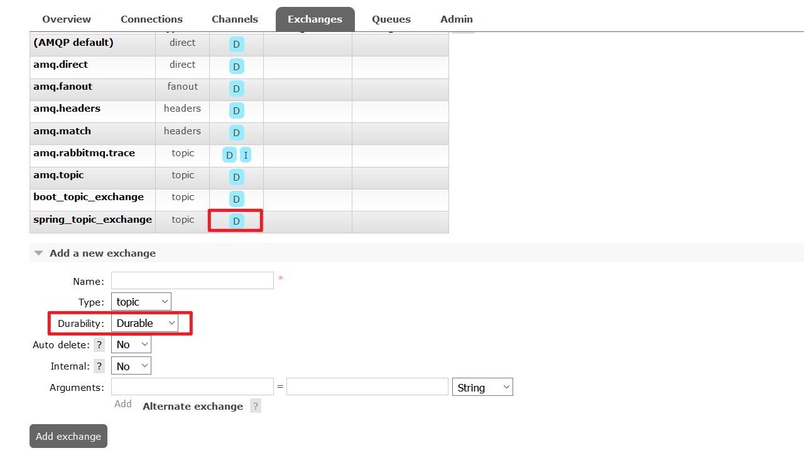

 <center><h1><b><font color='gold'>RabbitMQ高级篇</font></b></h1></center>

# 问题一.如何保证消息的可靠性

## 1.持久化机制

>​	Queue持久化


>Exchange持久化



>Message持久化(默认)

## 2.确认机制


### 生产端 Confirm机制

>step1:开启生产端Confirm机制


>step2:编写confirmCallBack方法,并测试

```java
import org.junit.Test;
import org.junit.runner.RunWith;
import org.springframework.amqp.rabbit.connection.CorrelationData;
import org.springframework.amqp.rabbit.core.RabbitTemplate;
import org.springframework.beans.factory.annotation.Autowired;
import org.springframework.test.context.ContextConfiguration;
import org.springframework.test.context.junit4.SpringJUnit4ClassRunner;

import java.util.UUID;

@RunWith(SpringJUnit4ClassRunner.class)
@ContextConfiguration(locations = "classpath:application-rabbitmq.xml")
public class RabbitMqTest {


    @Autowired
    private RabbitTemplate rabbitTemplate;
    @Test
    public void testTopic3() {
        
        //设置该消息的唯一id
        CorrelationData correlationData = new CorrelationData(UUID.randomUUID().toString());
        //设置confirmCallBack回调函数
        rabbitTemplate.setConfirmCallback(new RabbitTemplate.ConfirmCallback() {
            /**
             *
             * @param correlationData 对比数据
             * @param ack 是否收到了消息 true为成功 false 为失败
             * @param cause 失败原因
             */
            public void confirm(CorrelationData correlationData, boolean ack, String cause) {
                System.out.println("confirm方法执行......");
                if (ack) {
                    System.out.println("接收消息成功" + cause);
                    String id = correlationData.getId();
                    System.out.println("id:"+id);

                } else {
                    System.out.println("接收消息失败" + cause);
                    String id = correlationData.getId();
                    System.out.println("id:"+id);
                }
            }
        });

        //发送消息
        rabbitTemplate.convertAndSend("spring_topic_exchange",
                "x", "hello,一条任意消息",correlationData);
    }
}

```

### 生产端 Return机制

>step1:开启生产端Return机制


>step2:编写confirmCallBack方法,并测试

```java
package cn.wangshijia;


import org.junit.Test;
import org.junit.runner.RunWith;
import org.springframework.amqp.core.Message;
import org.springframework.amqp.rabbit.connection.CorrelationData;
import org.springframework.amqp.rabbit.core.RabbitTemplate;
import org.springframework.beans.factory.annotation.Autowired;
import org.springframework.test.context.ContextConfiguration;
import org.springframework.test.context.junit4.SpringJUnit4ClassRunner;

import java.util.UUID;

@RunWith(SpringJUnit4ClassRunner.class)
@ContextConfiguration(locations = "classpath:application-rabbitmq.xml")
public class RabbitMqTest {


    @Autowired
    private RabbitTemplate rabbitTemplate;

    @Test
    public void testTopic2() {

        /*
        *1.设置交换机处理错误方式
        * 如果消息没有路由到Queue，则丢弃消息（默认）
        * 如果消息没有路由到Queue，返回给消息发送方ReturnCallBack
        *
        */
        rabbitTemplate.setMandatory(true);

        //2.设置ReturnCallBack回调函数
        rabbitTemplate.setReturnCallback(new RabbitTemplate.ReturnCallback() {
            /**
             *
             * @param message 消息对象
             * @param replyCode 错误吗
             * @param replyText 错误信息
             * @param exchange 交换机
             * @param routingKey 路由键
             */
            public void returnedMessage(Message message, int replyCode, String replyText, String exchange, String routingKey) {
                System.out.println("return 执行了....");

                System.out.println(message);
                System.out.println(replyCode);
                System.out.println(replyText);
                System.out.println(exchange);
                System.out.println(routingKey);
            }
        });

        //3.发送消息
        rabbitTemplate.convertAndSend("spring_topic_exchange",
                "a.bcd", "hello,一条成功消息");
    }

}

```

### 消费端 ACK机制

>step1:设置确认模式为手动确认


>step2:改写监听类,实现ChannelAwareMessageListener

```java
import com.rabbitmq.client.Channel;
import org.springframework.amqp.core.AcknowledgeMode;
import org.springframework.amqp.core.Message;
import org.springframework.amqp.rabbit.listener.api.ChannelAwareMessageListener;

public class TopicListener3 implements ChannelAwareMessageListener {


    public void onMessage(Message message, Channel channel) throws Exception {
        long deliveryTag = message.getMessageProperties().getDeliveryTag();

        try {
            Thread.sleep(1000);
            //1.接收转换消息
            System.out.println(new String(message.getBody()));
            //2. 处理业务逻辑
            System.out.println("处理业务逻辑...");
            int i = 3/0;//出现错误
            //3. 手动签收
            channel.basicAck(deliveryTag,true);
        } catch (Exception e) {
            //4.拒绝签收
            /*
            第三个参数：requeue：重回队列。如果设置为true，则消息重新回到queue，broker会重新发送该消息给消费端
             */
            channel.basicNack(deliveryTag,true,true);
            // 了解,如果不确认,也不让消息重新回到queue,等同于拒收
            //channel.basicReject(deliveryTag,true);
        }
    }

    public void onMessage(Message message) {

    }

    public void containerAckMode(AcknowledgeMode mode) {

    }


}

```

## 3.Broker高可用

# 问题二.如何实现削峰填谷


## 消费端 限流

>step1:设置预加载数量


>step2:

```java
@Component
public class QosListener implements ChannelAwareMessageListener {

//perfetch = 1,表示消费端每次从mq拉去一条消息来消费，直到手动确认消费完毕后，才会继续拉去下一条消息。
    @Override
    public void onMessage(Message message, Channel channel) throws Exception {

        Thread.sleep(1000);
        //1.获取消息
        System.out.println(new String(message.getBody()));
        //2. 处理业务逻辑
        //3. 签收
      channel.basicAck(message.getMessageProperties().getDeliveryTag(),true);
    }
}
```

# 问题三.如何实现延迟队列


## 死信队列+DDL


>step1:构建基本的MQ项目架构,包括生产者消费者

>step2:编写application.xml配置文件

```xml
<?xml version="1.0" encoding="UTF-8"?>
<beans xmlns="http://www.springframework.org/schema/beans"
       xmlns:xsi="http://www.w3.org/2001/XMLSchema-instance"
       xmlns:context="http://www.springframework.org/schema/context"
       xmlns:rabbit="http://www.springframework.org/schema/rabbit"
       xsi:schemaLocation="http://www.springframework.org/schema/beans
       http://www.springframework.org/schema/beans/spring-beans.xsd
       http://www.springframework.org/schema/context
       https://www.springframework.org/schema/context/spring-context.xsd
       http://www.springframework.org/schema/rabbit
       http://www.springframework.org/schema/rabbit/spring-rabbit.xsd">
    <!-- ~~~~~~~~~~~~~~~~~~~~~~~~~~~~基本配置~~~~~~~~~~~~~~~~~~~~~~~~~~~~ -->
    <!--加载配置文件-->
    <context:property-placeholder location="classpath:rabbitmq.properties"/>
    <!-- 定义rabbitmq connectionFactory -->
    <rabbit:connection-factory id="connectionFactory" host="${rabbitmq.host}" port="${rabbitmq.port}"
                               username="${rabbitmq.username}" password="${rabbitmq.password}" virtual-host="${rabbitmq.virtual-host}"
                               publisher-confirms="true"
                               publisher-returns="true"
    />
    <!--定义管理交换机、队列-->
    <rabbit:admin connection-factory="connectionFactory"/>
    <!--定义rabbitTemplate对象操作可以在代码中方便发送消息-->
    <rabbit:template id="rabbitTemplate" connection-factory="connectionFactory"/>


    <!-- 1. 定义死信交换机和死信队列-->
    <rabbit:queue id="dlx_queue" name="dlx_queue" auto-declare="true"/>
    <rabbit:topic-exchange id="dlx_exchange" name="dlx_exchange" auto-declare="true">
        <rabbit:bindings>
            <rabbit:binding pattern="#.dlx" queue="dlx_queue"/>
        </rabbit:bindings>
    </rabbit:topic-exchange>
    <!-- 2. 定义正常交换机-->
    <rabbit:topic-exchange id="common_exchange" name="common_exchange" auto-declare="true">
        <rabbit:bindings>
            <rabbit:binding pattern="#.common" queue="common_queue"/>
        </rabbit:bindings>
    </rabbit:topic-exchange>
    <!-- 3. 定义正常队列-->
    <rabbit:queue id="common_queue" name="common_queue" auto-declare="true">
        <rabbit:queue-arguments>
            <!-- 4. 绑定死信交换机-->
            <entry key="x-dead-letter-exchange" value="dlx_exchange"/>
            <!-- 5. 绑定死信路由键-->
            <entry key="x-dead-letter-routing-key" value="test.dlx"/>
            <!-- 6. 设置队列过期时间-->
            <entry key="x-message-ttl" value="10000" value-type="java.lang.Integer"/>
        </rabbit:queue-arguments>
    </rabbit:queue>
</beans>

```

>3.测试

```java
package cn.wangshijia;


import org.junit.Test;
import org.junit.runner.RunWith;
import org.springframework.amqp.rabbit.core.RabbitTemplate;
import org.springframework.beans.factory.annotation.Autowired;
import org.springframework.test.context.ContextConfiguration;
import org.springframework.test.context.junit4.SpringJUnit4ClassRunner;

@RunWith(SpringJUnit4ClassRunner.class)
@ContextConfiguration(locations = "classpath:application-rabbitmq.xml")
public class DLXTest {

    @Autowired
    private RabbitTemplate rabbitTemplate;

    @Test
    public void test() {
        //将消息发送到普通交换机,并让消费端监听死信队列,观察10s后是否可以接收到消息
        rabbitTemplate.convertAndSend("common_exchange","test.common","过期消息1");
    }
}

```

