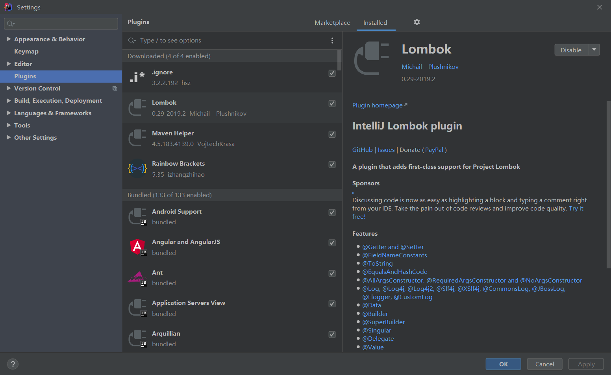

 <center><h1><b><font color='gold'>SpringBoot整合框架</font></b></h1></center>

# 1.Junit

>Step1:构建SpringBoot项目,导入启动器依赖

```xml
<!--Spring Boot的核心启动器-->
<dependency>
    <groupId>org.springframework.boot</groupId>
    <artifactId>spring-boot-starter</artifactId>
</dependency>
<!--支持常规的测试依赖，包括JUnit、Hamcrest、Mockito以及spring-test模块 -->
<dependency>
    <groupId>org.springframework.boot</groupId>
    <artifactId>spring-boot-starter-test</artifactId>
    <scope>test</scope>
</dependency>
```

>Step2:编写测试类

```java
import cn.wangshijia.service.UserService;
import org.junit.Test;
import org.junit.runner.RunWith;
import org.springframework.beans.factory.annotation.Autowired;
import org.springframework.boot.test.context.SpringBootTest;
import org.springframework.test.context.junit4.SpringRunner;
@SpringBootTest
@RunWith(SpringRunner.class)
public class UserServiceTest {

    @Autowired
    private UserService userService;

    @Test
    public void test() {
        userService.test();
    }
}
/*
注意点:
1.@SpringBootTest(classes = XXXApplication.class) 如果测试类处于启动类统一目录或其子目录中,括号内可以省略不写
2.@RunWith(SpringRunner.class) 高版本中可以省略,但需要在Jar中排除依赖,做一些优化
*/

```

>Step3:启动测试方法进行测试

```bash
  .   ____          _            __ _ _
 /\\ / ___'_ __ _ _(_)_ __  __ _ \ \ \ \
( ( )\___ | '_ | '_| | '_ \/ _` | \ \ \ \
 \\/  ___)| |_)| | | | | || (_| |  ) ) ) )
  '  |____| .__|_| |_|_| |_\__, | / / / /
 =========|_|==============|___/=/_/_/_/
 :: Spring Boot ::        (v2.1.8.RELEASE)

2020-07-02 10:13:45.086  INFO 2768 --- [           main] c.w.springboottest.UserServiceTest       : Starting UserServiceTest on DESKTOP-SQAI27M with PID 2768 (started by wangs in D:\IdeaProjects\SpringBoot\springboot-test)
2020-07-02 10:13:45.091  INFO 2768 --- [           main] c.w.springboottest.UserServiceTest       : No active profile set, falling back to default profiles: default
2020-07-02 10:13:45.596  INFO 2768 --- [           main] c.w.springboottest.UserServiceTest       : Started UserServiceTest in 0.74 seconds (JVM running for 1.338)

hello ,junit

#注意:启动测试类时会自动启动SpringBoot项目
```

# 2.Redis

>Step1:构建SpringBoot项目,导入启动器

```xml
<!--Redis启动器-->
<dependency>
    <groupId>org.springframework.boot</groupId>
    <artifactId>spring-boot-starter-data-redis</artifactId>
</dependency>
<!--测试依赖 -->
<dependency>
    <groupId>org.springframework.boot</groupId>
    <artifactId>spring-boot-starter-test</artifactId>
    <scope>test</scope>
</dependency>
```

>Step2:配置Redis相关属性

```yml
# SpringBoot默认配置本地ip,端口为6379
#可以通过RedisProperties文件,查阅有哪些配置项,默认值是什么
spring:
  redis:
    host: 127.0.0.1
    port: 6379
```

>Step3:编写测试方法,测试

```java
package cn.wangshijia.springbootredis;

import org.junit.Test;
import org.junit.runner.RunWith;
import org.springframework.beans.factory.annotation.Autowired;
import org.springframework.boot.test.context.SpringBootTest;
import org.springframework.data.redis.core.RedisTemplate;
import org.springframework.test.context.junit4.SpringRunner;
@SpringBootTest
@RunWith(SpringRunner.class)
public class SpringbootRedisApplicationTests {

    //注意:导入Redis依赖后,SpringBoot会自动将RedisTemplate<Object, Object>对象作为Bean注入IOC容器,我们可以直接使用
    @Autowired
    private RedisTemplate<Object, Object> redisTemplate;


    @Test
    public void test1() {
        redisTemplate.boundValueOps("name").set("zhangsan123");
    }

    @Test
    public void test2() {
        Object name = redisTemplate.boundValueOps("name").get();
        System.out.println(name);
    }

}

```

# 3.Mybatis

>Step1:构建SpringBoot项目,导入启动器

```xml
<!--Mybatis整合包-->
<dependency>
    <groupId>org.mybatis.spring.boot</groupId>
    <artifactId>mybatis-spring-boot-starter</artifactId>
    <version>2.1.3</version>
</dependency>
<!--MySQL驱动包-->
<dependency>
    <groupId>mysql</groupId>
    <artifactId>mysql-connector-java</artifactId>
    <scope>runtime</scope>
</dependency>

<!--以下非必须导入的依赖-->
<!--druid-->
<dependency>
    <groupId>com.alibaba</groupId>
    <artifactId>druid</artifactId>
    <version>1.1.20</version>
</dependency>
<!--lombok-->
<dependency>
    <groupId>org.projectlombok</groupId>
    <artifactId>lombok</artifactId>
</dependency>
<!--test-->
<dependency>
    <groupId>org.springframework.boot</groupId>
    <artifactId>spring-boot-starter-test</artifactId>
    <scope>test</scope>
</dependency>
```

>Step2:配置数据源和Mybatis

```yml
#DataSource
spring:
  datasource:
    username: root
    password: root
    #注意,url需要配置好时区和编码格式
    url: jdbc:mysql://localhost:3306/springboot?serverTimezone=UTC&useUnicode=true&characterEncoding=utf-8
    driver-class-name: com.mysql.cj.jdbc.Driver
    type: com.alibaba.druid.pool.DruidDataSource

#Mybatis
mybatis:
  #别名
  type-aliases-package: cn.wangshijia
```

>Step3:编写pojo类


```java
@Data //加在类上，相当于同时使用了@ToString、@EqualsAndHashCode、@Getter、@Setter和@RequiredArgsConstrutor这些注解；
@AllArgsConstructor //加在类上，可以生成含实体类全参数的构造方法
@NoArgsConstructor  //加在类上，可以生成无参构造方法
public class User {
    private int id;
    private String username;
    private String password;
}
```

>Step3:编写Dao类

```java
@Mapper
@Repository //注意,如果在启动类中添加MapperScan,@Mapper,@Repository这两个注解可以省略
public interface UserMapper {
	//@Select("select * from t_user")
    public List<User> findAll();
}

```

>Step4:配置启动类(注意:此步可以省略)

```java
import org.mybatis.spring.annotation.MapperScan;
import org.springframework.boot.SpringApplication;
import org.springframework.boot.autoconfigure.SpringBootApplication;

@SpringBootApplication
@MapperScan("cn.wangshijia.mapper")//注意,如果如果Dao加了@Mapper,@Repository这两个注解,则可以省略该注解
public class SpringbootMybatisApplication {

    public static void main(String[] args) {
        SpringApplication.run(SpringbootMybatisApplication.class, args);
    }
}

```

>Step5:编写XXXMapper.xml类(注意:此步可以省略)

```xml
<?xml version="1.0" encoding="UTF-8"?>
<!DOCTYPE mapper PUBLIC "-//mybatis.org//DTD Mapper 3.0//EN"
        "http://mybatis.org/dtd/mybatis-3-mapper.dtd" >
<mapper namespace="cn.wangshijia.mapper.UserMapper">
    <select id="findAll" resultType="user">
        select * from t_user
    </select>
</mapper>
<!--
注意:
XXXmapper.xml写在Dao同一层级下,可以被自动识别,否则,需要在配置文件中配置mapper的位置
-->
```

>Step6:编写测试类,测试

```java
@SpringBootTest
@RunWith(SpringRunner.class)
public class MyBatisTest {

    @Autowired
    private UserMapper userMapper;

    @Autowired
    private DataSource dataSource;

    @Test
    public void test1() {
        System.out.println(dataSource.getClass());
        List<User> all = userMapper.findAll();
        for (User user : all) {
            System.out.println(user);
        }
    }

}

```

# 4.SpringTask

>Step1:构建SpringBoot项目,导入启动器

```xml
<!--Spring-Task为spring内置的组件,所以无需额外导入依赖-->
<dependency>
    <groupId>org.springframework.boot</groupId>
    <artifactId>spring-boot-starter-web</artifactId>
</dependency>
<dependency>
    <groupId>org.springframework.boot</groupId>
    <artifactId>spring-boot-starter-test</artifactId>
    <scope>test</scope>
</dependency>

```

>Step2:编写Task类

```java
package cn.wangshijia.task;

import org.springframework.scheduling.annotation.Scheduled;
import org.springframework.stereotype.Component;

@Component
public class MyTask {

    @Scheduled(cron = "0/5 * * * * ?")
    public void run(){
        System.out.println("任务启动...");
    }
}

//注意:任务类必须处于启动类同一包下或其子包下,并添加@Componet注解,否则,无法被SpringBoot扫描到
```

>Step3:配置启动注解,启动任务

```java
@SpringBootApplication
@EnableScheduling //该注解的作用是启动定时任务
public class SpringbootTestApplication {
	public static void main(String[] args) {
		SpringApplication.run(SpringbootTestApplication.class, args);
	}
}
```

# 5.Lombok

>Step1:添加插件



>Step2:导入依赖

```xml
<dependency>
    <groupId>org.projectlombok</groupId>
    <artifactId>lombok</artifactId>
</dependency>
```

>Step3:改造Pojo文件

```java
@Data //加在类上，相当于同时使用了@ToString、@EqualsAndHashCode、@Getter、@Setter和@RequiredArgsConstrutor这些注解；
@AllArgsConstructor //加在类上，可以生成含实体类全参数的构造方法
@NoArgsConstructor  //加在类上，可以生成无参构造方法
public class User {
    private int id;
    private String username;
    private String password;
}
```

# 6.通用Mapper

## 开发流程介绍

>step1:构建项目,导入依赖

```xml
<!--通用mapper相关依赖-->
<dependency>
    <groupId>tk.mybatis</groupId>
    <artifactId>mapper-spring-boot-starter</artifactId>
    <version>2.0.4</version>
</dependency>

<!--MySQL驱动包-->
<dependency>
    <groupId>mysql</groupId>
    <artifactId>mysql-connector-java</artifactId>
    <scope>runtime</scope>
</dependency>

<!--以下非必须导入的依赖-->
<!--druid-->
<dependency>
    <groupId>com.alibaba</groupId>
    <artifactId>druid</artifactId>
    <version>1.1.20</version>
</dependency>
<!--lombok-->
<dependency>
    <groupId>org.projectlombok</groupId>
    <artifactId>lombok</artifactId>
</dependency>
<!--test-->
<dependency>
    <groupId>org.springframework.boot</groupId>
    <artifactId>spring-boot-starter-test</artifactId>
    <scope>test</scope>
</dependency>
```

>step2:编写配置文件

```yml
#DataSource
spring:
  datasource:
    username: root
    password: root
    #注意,url需要配置好时区和编码格式
    url: jdbc:mysql://localhost:3306/springboot?serverTimezone=UTC&useUnicode=true&characterEncoding=utf-8
    driver-class-name: com.mysql.cj.jdbc.Driver
    type: com.alibaba.druid.pool.DruidDataSource
```

>Step3:编写pojo类

```java

import lombok.AllArgsConstructor;
import lombok.Data;
import lombok.NoArgsConstructor;

import javax.persistence.Column;
import javax.persistence.Id;
import javax.persistence.Table;
import javax.persistence.Transient;

@Data
@AllArgsConstructor
@NoArgsConstructor
@Table(name = "t_user")//表名,默认以JavaBean类名首字母小写作为表名
public class User {

    @Id//指定 xxxByPrimaryKey() 的key值,不指定,则将所有字段作为联合主键处理
    @KeySql(useGeneratedKeys = true) //自动获取自增的主键值
    private integer id;
    @Column(name = "username1") //默认以驼峰命名方式映射_分隔的命名方式
    private String username;
    private String password;

    @Transient //标注不与数据库表映射的字段,会被忽略
    private String empty;

}

//注意:pojo中不要使用基本类型
```

>step4:编写Mapper

```java
import com.example.demo.pojo.User;
import tk.mybatis.mapper.common.Mapper;

public interface UserDao extends Mapper<User> {
}

```

>step5:编写启动类

```java
import org.springframework.boot.SpringApplication;
import org.springframework.boot.autoconfigure.SpringBootApplication;
import tk.mybatis.spring.annotation.MapperScan;

@SpringBootApplication
@MapperScan("com.example.demo.dao") //主要注解是tk.包下的
public class DemoApplication {

    public static void main(String[] args) {
        SpringApplication.run(DemoApplication.class, args);
    }

}
```

>step6:测试

## 基础API介绍

> 查询

```java
//1.根据T对象中的属性名称查询,类似于select * from table where t.username=xxx and t.mobile = xxxx
List<T> select(T t)
//2.如果断定T对象的查询条件是一个,可以调用此方法,返回单个对象
T selectOne(T t)
//3.根据主键查询
T selectByPrimaryKey(Object id)
```

> 删除

```java
//1.根据条件删除数据,原理同select(T)
int delete(T t)
//2.根据主键删除(即便T中其他属性和表中数据不一致,也会删除)
int deleteByPrimaryKey(T t)
```

> 修改

```java
//1.根据主键更新数据,T对象里面有什么属性就更新什么属性,如果T对象没有主键,返回0,不作修改
int updateByPrimaryKeySelective(T t)
//2.根据主键更新数据,需要把对象中所有的字段全部填充才能调用此方法,一般不常用!
int updateByPrimaryKey(T t)
```

> 新增

```java
//1.插入数据,需要有主键,有什么属性插入什么属性
int insertSelective(T t)
//2.插入数据,需要有主键,需要数据库表中的所有字段全都存在,否则插入失败,此方法不常用
int insert(T t)
```

>非主键字段条件操作(以查询为例)

```java
//获取criteria对象
Example example = new Example(User.class);
Example.Criteria criteria = example.createCriteria();
//等值查询
//criteria.andEqualTo("username", "lisi");
//模糊查询
criteria.andLike("username", "li%");
List<User> users = userMapper.selectByExample(example);
```

