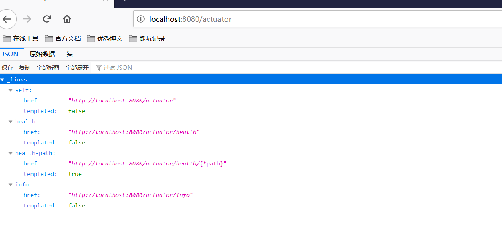
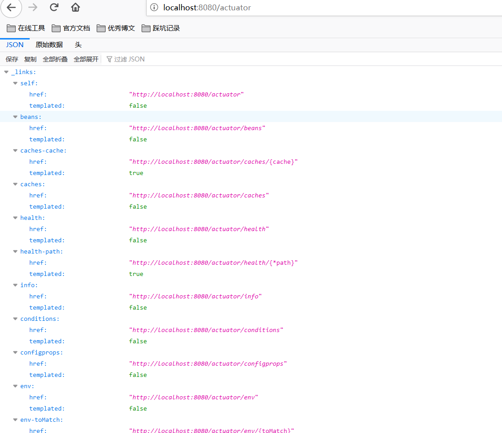
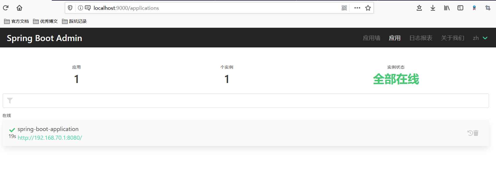

 <center><h1><b><font color='gold'>SpringBoot辅助功能</font></b></h1></center>


# 一.SpringBoot部署

## 1.jar包(官方推荐)

>直接打包为Jar包,通过cmd java -jar 命令启动即可

## 2.War包

>step1:修改Pom文件

```xml
 <!-- ...... 省略...... -->

	<packaging>war</packaging>
 <!-- ...... 省略...... -->
	<build>
           <finalName>springboot</finalName>
		<plugins>
			<plugin>
				<groupId>org.springframework.boot</groupId>
				<artifactId>spring-boot-maven-plugin</artifactId>
			</plugin>
		</plugins>
	</build>

```

>step2:修改启动类

```java
import org.springframework.boot.SpringApplication;
import org.springframework.boot.autoconfigure.SpringBootApplication;
import org.springframework.boot.builder.SpringApplicationBuilder;
import org.springframework.boot.web.servlet.support.SpringBootServletInitializer;

@SpringBootApplication
public class SpringbootDeployApplication extends SpringBootServletInitializer {

  public static void main(String[] args) {
    SpringApplication.run(SpringbootDeployApplication.class, args);
  }

  @Override
  protected SpringApplicationBuilder configure(SpringApplicationBuilder builder) {
    return builder.sources(SpringbootDeployApplication.class);
  }
}

```

# 二.SpringBoot监控

## 1.基本操作

>step1:导入依赖

```xml
<dependency>
  <groupId>org.springframework.boot</groupId>
  <artifactId>spring-boot-starter-actuator</artifactId>
</dependency>
```

>step2:访问http://localhost:8080/acruator



## 2.进阶操作


>step1:编写配置文件,可以通过配置文件选择监控的内容

```yml
management:
  # 开启所有endpoint
  endpoints:
    web:
      exposure:
        include: "*"
  #开启健康检查详细信息
  endpoint:
    health:
      show-details: always

```

>step2:访问http://localhost:8080/acruator



## 3.Springboot admin

>springboot admin是Spring官方提供的一个图形化监控组件,分为被监控的客户端和服务端

### 服务端配置

>step1:构建springBoot项目,导入依赖

```xml
<dependency>
  <groupId>de.codecentric</groupId>
  <artifactId>spring-boot-admin-starter-server</artifactId>
</dependency>
```

>step2:在启动类上启用监控功能@EnableAdminServer

```java
@EnableAdminServer
@SpringBootApplication
public class SpringbootAdminServerApplication {
    public static void main(String[] args) {
        SpringApplication.run(SpringbootAdminServerApplication.class, args);
    }
}
```

### 客户端配置

>step1:构建springBoot项目,导入依赖

```xml
<dependency>
  <groupId>de.codecentric</groupId>
  <artifactId>spring-boot-admin-starter-client</artifactId>
</dependency>
```

> step2:编写配置文件

```yml
spring:
  boot:
    admin:
      client:
        url: "http://localhost:9000"
management:
  endpoint:
    health:
      show-details: always
  endpoints:
    web:
      exposure:
        include: "*"
```

>step3:启动server和client服务，访问server



# 三.SpringBoot监听

>

# 四.SpringBoot服务器切换

>strp1:排除内置的Tomcat依赖

```xml
<dependency>
    <groupId>org.springframework.boot</groupId>
    <artifactId>spring-boot-starter-web</artifactId>
    <!--排除tomcat依赖-->
    <exclusions>
        <exclusion>
            <groupId>org.springframework.boot</groupId>
            <artifactId>spring-boot-starter-tomcat</artifactId> 
        </exclusion>
    </exclusions>
</dependency>

```

>strp2:引入Jetty依赖

```xml
<dependency>
    <artifactId>spring-boot-starter-jetty</artifactId>
    <groupId>org.springframework.boot</groupId>
</dependency>
```

