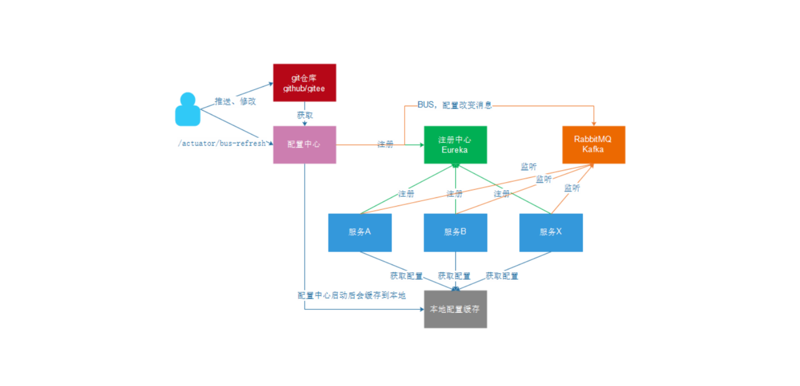
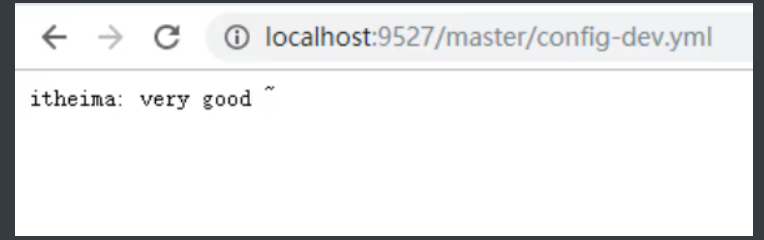

 <center><h1><b><font color='gold'>SpringCloud-Config</font></b></h1></center>

# 一.概述

## 1.Spring Cloud Config的优势

> Spring Cloud Config 解决了在分布式场景下多环境配置文件的管理和维护
>
>在传统的分布式开发中,我们的配置文件分布在不同的服务模块中,且每次修改都需要重启项目,维护起来十分麻烦,所以,我们就引入了Spring Cloud Config 技术,通过集中的配置管理容易修改的配置,实现了配置文件的动态更新

## 2.Spring Cloud Config的流程分析



# 二.Config开发流程

## 1.前期准备

>step1:搭建码云仓库

>step2:构建SpringBoot项目,并集成基础的SpringCloud组件

## 2.Config服务端搭建

>step1:单独构建一个模块作为Config服务端,并导入Config相关依赖以及Bus相关组件

```xml
<dependencies>
    	<!--config-server -->
        <dependency>
            <groupId>org.springframework.cloud</groupId>
            <artifactId>spring-cloud-config-server</artifactId>
        </dependency>
    	<!--开放bus-refresh端点端点需要导入-->
        <dependency>
            <groupId>org.springframework.boot</groupId>
            <artifactId>spring-boot-starter-actuator</artifactId>
        </dependency>
    	<!--bus-->
        <dependency>
            <groupId>org.springframework.cloud</groupId>
            <artifactId>spring-cloud-starter-bus-amqp</artifactId>
        </dependency>
</dependencies>
```

>step2:开启Config服务

```java
import org.springframework.boot.SpringApplication;
import org.springframework.boot.autoconfigure.SpringBootApplication;
import org.springframework.cloud.config.server.EnableConfigServer;
import org.springframework.cloud.netflix.eureka.EnableEurekaClient;

@SpringBootApplication
@EnableEurekaClient
@EnableConfigServer //开启Config服务
public class ConfigApp {
    public static void main(String[] args) {
        SpringApplication.run(ConfigApp.class, args);
    }
}

```

>step3:编写配置文件

```yml
#通用配置
server:
  port: 8888
spring:
  application:
    name: config-server
  # spring cloud config
  cloud:
    config:
      server:
        git:
          uri: https://gitee.com/wangshijia12138/SpringCloud-config.git #
      label: master
  #rabbitmq相关配置
  rabbitmq:
    host: localhost
    port: 5672
    username: guest
    password: guest
    virtual-host: /

#eureka客户端配置
eureka:
  client:
    service-url:
      defaultZone: http://localhost:8761/eureka
      
# 开放bus-refresh端点
management:
  endpoints:
    web:
      exposure:
        include: 'bus-refresh'
```

>step4:启动,测试



## 3.Config客户端配置

>step1:在原本的服务模块中导入Config相关依赖

```xml
<!--config client -->
<dependency>
    <groupId>org.springframework.cloud</groupId>
    <artifactId>spring-cloud-starter-config</artifactId>
</dependency>
<!--bus -->
<dependency>
    <groupId>org.springframework.cloud</groupId>
    <artifactId>spring-cloud-starter-bus-amqp</artifactId>
</dependency>
```

>step2:在需要配置更新的类上加上**@RefreshScope**注解

```java
import org.springframework.beans.factory.annotation.Autowired;
import org.springframework.beans.factory.annotation.Value;
import org.springframework.cloud.context.config.annotation.RefreshScope;
import org.springframework.web.bind.annotation.GetMapping;
import org.springframework.web.bind.annotation.PathVariable;
import org.springframework.web.bind.annotation.RestController;
import wangshijia.feign.UserFeign;
import wangshijia.pojo.User;

@RestController
@RefreshScope
public class UserController {

    @Autowired
    private UserFeign userFeign;

    @Value("${server.port}")
    private Integer port;

    @Value("${itheima}")
    private String itheima;

    @GetMapping("/getAll/{id}")
    public User getUserInfo(@PathVariable Integer id) {
        User userInfo = userFeign.getUserInfo(id);
        userInfo.setAddress(userInfo.getAddress()+":"+port+itheima);
        return userInfo;
    }


}

```


>step3:在<font color='yellow'>bootstrap.yml</font>中进行配置

```yml
# 配置config-server地址
# 配置获得配置文件的名称等信息
server:
  port: 9000

spring:
  application:
    name: consumer-one
  cloud:
    config:
      # 配置config-server地址
      #uri: http://localhost:8888
      name: consumer # 文件名
      profile: dev # profile指定，  config-dev.yml
      label: master # 分支
       #从注册中心获取config-server地址
      discovery:
      	enabled:true
      	service-id:CONFIG-SERVER
 #rabbitmq相关配置
  rabbitmq:
    host: localhost
    port: 5672
    username: guest
    password: guest
    virtual-host: /
    
#eureka客户端配置
eureka:
  client:
    service-url:
      defaultZone: http://localhost:8761/eureka
      
# 开启feign对hystrix的支持
feign:
  hystrix:
    enabled: true
```

>step4:启动,测试

## 4.开发人员修改配置文件

>step1:修改配置文件,推送到码云上

>step2:发送 http://localhost:9527/actuator/bus-refresh 如果没有返回值,说明发送成功