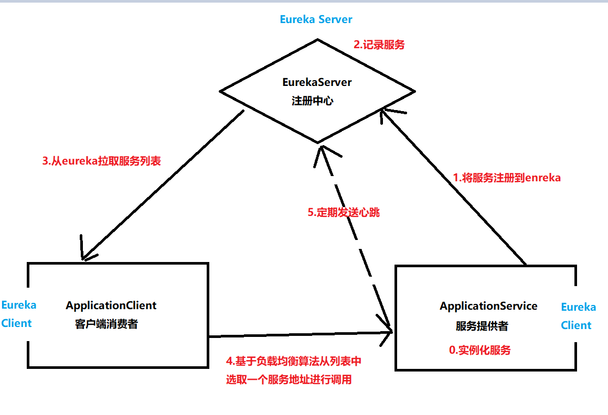
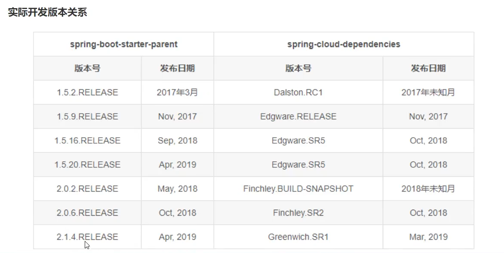
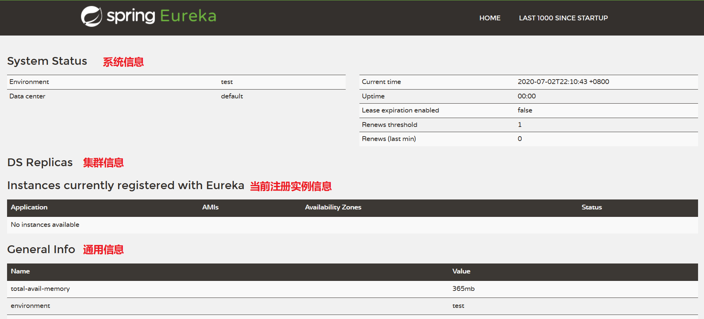
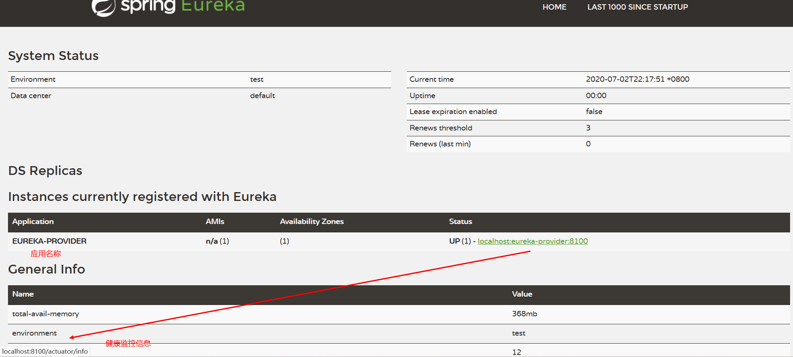

 <center><h1><b><font color='gold'>SpringCloud-Eureka</font></b></h1></center>

# 一.概述

## 1.Eureka基本架构



## 2.Eureka背景资料

> 1.Eureka 是 Netflix 公司开源的一个服务注册与发现的组件 
>
> 2.在Spring Cloud 社区中,Eureka 和其他 Netflix 公司的服务组件(例如熔断器,网关等）一起,被整合为Spring-Cloud-Netflix模块。
>
> 3.Eureka组件分为两部分,Eureka Server和Eureka Client,注册中心作为Eureka 服务端存在,其余与注册中心交互的模块都属于EurekaClient,我们一般根据导入依赖的不同,区分不同的身份
>
> 4.Eureka与其余服务治理组件不同,Eureka的服务端需要手动搭建,而不是官方提供的可执行文件

# 二.Eureka架构搭建流程

## 1.SpringCloud 环境搭建

>构建Maven工程,在父模块中导入相关父依赖

```xml
<!--spring boot 环境 -->
<parent>
    <groupId>org.springframework.boot</groupId>
    <artifactId>spring-boot-starter-parent</artifactId>
    <version>2.1.0.RELEASE</version>
</parent>

<properties>
    <!--spring cloud 版本-->
    <spring-cloud.version>Greenwich.RELEASE</spring-cloud.version>
</properties>

<!--引入Spring Cloud 依赖-->
<dependencyManagement>
    <dependencies>
        <dependency>
            <groupId>org.springframework.cloud</groupId>
            <artifactId>spring-cloud-dependencies</artifactId>
            <version>${spring-cloud.version}</version>
            <type>pom</type>
            <scope>import</scope>
        </dependency>
    </dependencies>
</dependencyManagement>
```

> **注意:**
>
> **SpringCloud是基于SpringBoot进行开发的,所以我们在父模块中不仅要锁定SpringCloud的版本依赖,还需要导入SpringBoot的父依赖,另外,SpringCloud与SpringBoot的版本之间存在兼容性问题,建议按照文档使用适合的版本**



## 2.EurekaServer 模块搭建

>step1:构建Eureka Server 模块,导入依赖

```xml
<!--Eureka Server 是在WEB项目中使用的,所以导入web启动器 -->
<dependency>
    <groupId>org.springframework.boot</groupId>
    <artifactId>spring-boot-starter-web</artifactId>
</dependency>

<dependency>
    <groupId>org.springframework.cloud</groupId>
    <artifactId>spring-cloud-starter-netflix-eureka-server</artifactId>
</dependency>
```

>step2:注解启用Eureka Server组件

```java
import org.springframework.boot.SpringApplication;
import org.springframework.boot.autoconfigure.SpringBootApplication;
import org.springframework.cloud.netflix.eureka.server.EnableEurekaServer;

@EnableEurekaServer
@SpringBootApplication
public class ServerApplication {

    public static void main(String[] args) {
        SpringApplication.run(ServerApplication.class, args);
    }
}
```

>step3:编写服务端配置信息

```yml
#通用配置
server:
  port: 8761 #端口号 默认端口号为8761
spring:
  application:
    name: eureka-server #当前应用名称  

#eureka相关配置
 eureka:
 #eureka的实例配置 
  instance:
    hostname: localhost #服务注册中心实例的主机名
 #eureka的客户端配置
  client:
    service-url:
      defaultZone: http://${eureka.instance.hostname}:${server.port}/euraka  #eureka server地址
    register-with-eureka: false #是否注册到eureka服务端 ,默认为true
    fetch-registry: false   #是否从服务端拉取注册信息 ,默认为true
 #eureka的服务端配置
  server:
    enable-self-preservation: false #是否开启自我保护,默认为true
    eviction-interval-timer-in-ms: 3000 #清理间隔 默认 60*1000 毫秒   
```

>step4:启动,访问服务器控制台



## 3.EurekaClient 模块搭建

>step1:构建Eureka Server 模块,导入依赖

```xml
<!--spring boot web-->
<dependency>
    <groupId>org.springframework.boot</groupId>
    <artifactId>spring-boot-starter-web</artifactId>
</dependency>

<!-- eureka-client -->
<dependency>
    <groupId>org.springframework.cloud</groupId>
    <artifactId>spring-cloud-starter-netflix-eureka-client</artifactId>
</dependency>
```

>step2:启用Eureka Client注解

```java
import org.springframework.boot.SpringApplication;
import org.springframework.boot.autoconfigure.SpringBootApplication;
import org.springframework.cloud.netflix.eureka.EnableEurekaClient;


@EnableEurekaClient
@SpringBootApplication
public class ProviderApplication {

    public static void main(String[] args) {
        SpringApplication.run(ProviderApplication.class, args);
    }
}

```

>step3:编写配置信息

```yml
#通用配置
server:
  port: 8100
spring:
  application:
    name: "eureka-provider"
    
#eureka相关配置
eureka:
  instance:
    hostname: localhost #主机名
    ip-address: 127.0.0.1 #ip地址
    #是否优先使用eureka.instance.ip-address的值进行注册,如果没有配置，则使用第一个非回环IP地址进行注册。默认为false
    prefer-ip-address: true
    #修改控制台显示,方便区分应用服务器 ,不设置,将由eureka自动生成
    instance-id: ${eureka.instance.ip-address}:${server.port}
    #每一次eureka client向eureka server 发送心跳的间隔
    lease-expiration-duration-in-seconds: 30  
    #如果90秒内eureka server没有收到eureka client的心跳包,即移除服务
    lease-renewal-interval-in-seconds: 90 
  client:
    service-url:
      defaultZone: http://localhost:8761/eureka #eureka 服务器地址
```

>step4:启动,访问服务器控制台


