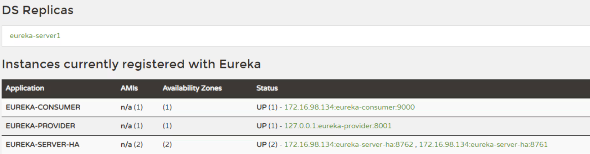
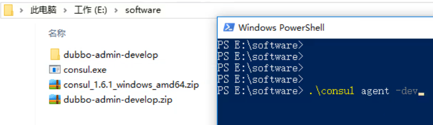
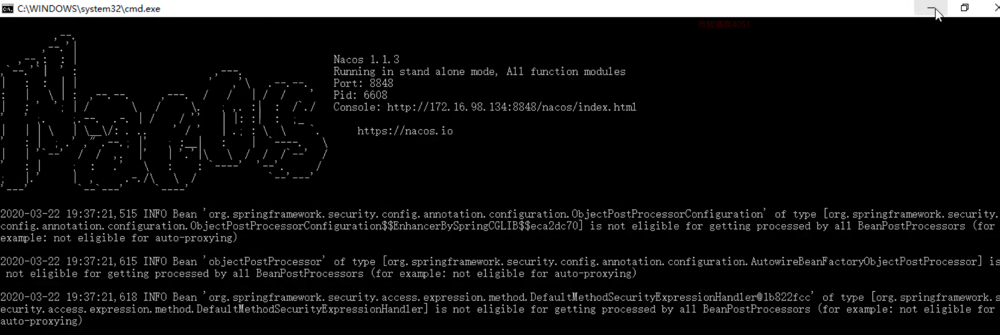

# 1.今日内容

- 初识 Spring Cloud
- Spring Cloud 服务治理


# 2.初识Spring Cloud

## 2.1-微服架构


**微服务架构**：
"微服务”一词源于 Martin Fowler的名为 Microservices的博文,可以在他的官方博客上找到
http://martinfowler.com/articles/microservices.html

-  微服务是系统架构上的一种设计风格,它的主旨是将一个原本独立的系统拆分成多个小型服务,这些小型服务都在各自独立的进程中运行,服务之间一般通过 HTTP 的 RESTfuLAPI 进行通信协作。

- 被拆分成的每一个小型服务都围绕着系统中的某一项或些耦合度较高的业务功能进行构建,并且每个服务都维护着自身的数据存储、业务开发自动化测试案例以及独立部署机
  制。

- 由于有了轻量级的通信协作基础,所以这些微服务可以使用
  不同的语言来编写。


## 2.2-初识Spring Cloud


- Spring Cloud 是一系列框架的有序集合。

-  Spring Cloud 并没有重复制造轮子，它只是将目前各家公司开发的比较成熟、经得起实际考验的服务框架组合起来。

-  通过 Spring Boot 风格进行再封装屏蔽掉了复杂的配置和实现原理，最终给开发者留出了一套简单易懂、易部署和易维护的分布式系统开发工具包。

- 它利用Spring Boot的开发便利性巧妙地简化了分布式系统基础设施的开发，如服务发现注册、配置中心、消息总线、负载均衡、 断路器、数据监控等，都可以用Spring Boot的开发风格做到一键启动和部署。

-  Spring Cloud项目官方网址：https://spring.io/projects/spring-cloud

- Spring Cloud 版本命名方式采用了伦敦地铁站的名称，同时根据字母表的顺序来对应版本时间顺序，比如：最早的Release版本：Angel，第二个Release版本：Brixton，然后是Camden、Dalston、Edgware，Finchley，Greenwich，Hoxton。

- 目前最新的是Hoxton版本。

  


## 2.3-Spring Cloud 和dubbo对比


**Spring Cloud 和dubbo对比**

- Spring Cloud 与 Dubbo 都是实现微服务有效的工具。

- Dubbo 只是实现了服务治理，而 Spring Cloud 子项目分别覆盖了微服务架构下的众多部件。

-  Dubbo 使用 RPC 通讯协议，Spring Cloud 使用 RESTful 完成通信，Dubbo 效率略高于 Spring Cloud。


**总结**

-  微服务就是将项目的各个模块拆分为可独立运行、部署、测试的架构设计风格。

-  Spring 公司将其他公司中微服务架构常用的组件整合起来，并使用 SpringBoot 简化其开发、配置。

  称为 Spring Cloud

-  Spring Cloud 与 Dubbo都是实现微服务有效的工具。Dubbo 性能更好，而 Spring Cloud 功能更全面。


# 3.Spring Cloud服务治理

##  3.1-Eureka介绍


• Eureka 是 Netflix 公司开源的一个服务注册与发现的组件 。

• Eureka 和其他 Netflix 公司的服务组件（例如负载均衡、熔断器、网关等） 一起，被 Spring Cloud 社区整合为
Spring-Cloud-Netflix 模块。

• Eureka 包含两个组件：Eureka Server (注册中心) 和 Eureka Client (服务提供者、服务消费者)。


**Eureka学习步骤**

1. 搭建 Provider 和 Consumer 服务。
2. 使用 RestTemplate 完成远程调用。
3. 搭建 Eureka Server 服务。
4. 改造 Provider 和 Consumer 称为 Eureka Client。
5. Consumer 服务 通过从 Eureka Server 中抓取 Provider
地址 完成 远程调用


## 3.2-Eureka快速入门

###   3.2.1-环境搭建


#### 3.2.1.1-创建父工程 


创建module -父工程 Spring-cloud-parent


- 创建后的目录结构（删除src）


Spring-cloud-parent pom.xml

```xml
   <!--spring boot 环境 -->
    <parent>
        <groupId>org.springframework.boot</groupId>
        <artifactId>spring-boot-starter-parent</artifactId>
        <version>2.1.0.RELEASE</version>
        <relativePath/>
    </parent>


    <properties>
        <project.build.sourceEncoding>UTF-8</project.build.sourceEncoding>
        <project.reporting.outputEncoding>UTF-8</project.reporting.outputEncoding>
        <java.version>1.8</java.version>
    </properties>
```

#### 3.2.1.2-创建服务提供者

- 创建服务提供者eureka-provider


eureka-provider  pom.xml

```xml
    <dependencies>

        <!--spring boot web-->
        <dependency>
            <groupId>org.springframework.boot</groupId>
            <artifactId>spring-boot-starter-web</artifactId>
        </dependency>

    </dependencies>
```


GoodsController

```java
package com.itheima.provider.controller;

import com.itheima.provider.domain.Goods;
import com.itheima.provider.service.GoodsService;
import org.springframework.beans.factory.annotation.Autowired;
import org.springframework.web.bind.annotation.GetMapping;
import org.springframework.web.bind.annotation.PathVariable;
import org.springframework.web.bind.annotation.RequestMapping;
import org.springframework.web.bind.annotation.RestController;

/**
 * Goods Controller 服务提供方
 */

@RestController
@RequestMapping("/goods")
public class GoodsController {

    @Autowired
    private GoodsService goodsService;

    @GetMapping("/findOne/{id}")
    public Goods findOne(@PathVariable("id") int id){

        Goods goods = goodsService.findOne(id);

        return goods;
    }
}

```


GoodsService

```java
package com.itheima.provider.service;

import com.itheima.provider.dao.GoodsDao;
import com.itheima.provider.domain.Goods;
import org.springframework.beans.factory.annotation.Autowired;
import org.springframework.stereotype.Service;

/**
 * Goods 业务层
 */
@Service
public class GoodsService {

    @Autowired
    private GoodsDao goodsDao;


    /**
     * 根据id查询
     * @param id
     * @return
     */
    public Goods findOne(int id){
        return goodsDao.findOne(id);
    }
}

```


Goods

```java
package com.itheima.provider.domain;

/**
 * 商品实体类
 */
public class Goods {

    private int id;
    private String title;//商品标题
    private double price;//商品价格
    private int count;//商品库存

    public Goods() {
    }

    public Goods(int id, String title, double price, int count) {
        this.id = id;
        this.title = title;
        this.price = price;
        this.count = count;
    }

    public int getId() {
        return id;
    }

    public void setId(int id) {
        this.id = id;
    }

    public String getTitle() {
        return title;
    }

    public void setTitle(String title) {
        this.title = title;
    }

    public double getPrice() {
        return price;
    }

    public void setPrice(double price) {
        this.price = price;
    }

    public int getCount() {
        return count;
    }

    public void setCount(int count) {
        this.count = count;
    }
}

```

GoodsDao

```java
package com.itheima.provider.dao;

import com.itheima.provider.domain.Goods;
import org.springframework.stereotype.Repository;

import javax.validation.ReportAsSingleViolation;

/**
 * 商品Dao
 */

@Repository
public class GoodsDao {


    public Goods findOne(int id){
        return new Goods(1,"华为手机",3999,10000);
    }
}

```


ProviderApp

```java
package com.itheima.provider;

import org.springframework.boot.SpringApplication;
import org.springframework.boot.autoconfigure.SpringBootApplication;

/**
 * 启动类
 */

@SpringBootApplication
public class ProviderApp {


    public static void main(String[] args) {
        SpringApplication.run(ProviderApp.class,args);
    }
}

```

application.yml

```
server:
  port: 8000
```


#### 3.2.1.2-创建服务消费者

- 创建服务消费者eureka-consumer


- 最终目录结构


OrderController

```java
package com.itheima.consumer.controller;


import com.itheima.consumer.domain.Goods;
import org.springframework.beans.factory.annotation.Autowired;
import org.springframework.web.bind.annotation.GetMapping;
import org.springframework.web.bind.annotation.PathVariable;
import org.springframework.web.bind.annotation.RequestMapping;
import org.springframework.web.bind.annotation.RestController;


/**
 * 服务的调用方
 */

@RestController
@RequestMapping("/order")
public class OrderController {

    @GetMapping("/goods/{id}")
    public Goods findGoodsById(@PathVariable("id") int id){
        System.out.println("findGoodsById..."+id);


		//远程调用Goods服务中的findOne接口
        return null;
    }
}

```


Goods

```java
package com.itheima.consumer.domain;

/**
 * 商品实体类
 */
public class Goods {

    private int id;
    private String title;//商品标题
    private double price;//商品价格
    private int count;//商品库存

    public Goods() {
    }

    public Goods(int id, String title, double price, int count) {
        this.id = id;
        this.title = title;
        this.price = price;
        this.count = count;
    }

    public int getId() {
        return id;
    }

    public void setId(int id) {
        this.id = id;
    }

    public String getTitle() {
        return title;
    }

    public void setTitle(String title) {
        this.title = title;
    }

    public double getPrice() {
        return price;
    }

    public void setPrice(double price) {
        this.price = price;
    }

    public int getCount() {
        return count;
    }

    public void setCount(int count) {
        this.count = count;
    }
}

```


ConsumerApp

```java
package com.itheima.consumer;

import org.springframework.boot.SpringApplication;
import org.springframework.boot.autoconfigure.SpringBootApplication;

@SpringBootApplication
public class ConsumerApp {


    public static void main(String[] args) {
        SpringApplication.run(ConsumerApp.class,args);
    }
}

```

application.yml

```yaml
server:
  port: 9000
```


###  3.2.2-RestTemplate远程调用

 • Spring提供的一种简单便捷的模板类，用于在 java 代码里访问 restful 服务。
• 其功能与 HttpClient 类似，但是 RestTemplate 实现更优雅，使用更方便。


修改消费方代码

RestTemplateConfig

```java
package com.itheima.consumer.config;


import org.springframework.context.annotation.Bean;
import org.springframework.context.annotation.Configuration;
import org.springframework.web.client.RestTemplate;

@Configuration
public class RestTemplateConfig {


    @Bean
    public RestTemplate restTemplate(){
        return new RestTemplate();
    }
}

```


OrderController

```java
package com.itheima.consumer.controller;


import com.itheima.consumer.domain.Goods;
import org.springframework.beans.factory.annotation.Autowired;
import org.springframework.web.bind.annotation.GetMapping;
import org.springframework.web.bind.annotation.PathVariable;
import org.springframework.web.bind.annotation.RequestMapping;
import org.springframework.web.bind.annotation.RestController;
import org.springframework.web.client.RestTemplate;

/**
 * 服务的调用方
 */

@RestController
@RequestMapping("/order")
public class OrderController {
    @Autowired
    private RestTemplate restTemplate;

    @GetMapping("/goods/{id}")
    public Goods findGoodsById(@PathVariable("id") int id){
        System.out.println("findGoodsById..."+id);
        /*
            //远程调用Goods服务中的findOne接口
            使用RestTemplate
            1. 定义Bean  restTemplate
            2. 注入Bean
            3. 调用方法
         */

        String url = "http://localhost:8000/goods/findOne/"+id;
        // 3. 调用方法
        Goods goods = restTemplate.getForObject(url, Goods.class);
        return goods;
    }
}

```


### 3.2.3- Eureka Server搭建

① 创建 eureka-server 模块


② 引入 SpringCloud 和 euraka-server 相关依赖

Spring-cloud-parent pom.xml

```xml
<properties>
        <project.build.sourceEncoding>UTF-8</project.build.sourceEncoding>
        <project.reporting.outputEncoding>UTF-8</project.reporting.outputEncoding>
        <java.version>1.8</java.version>
        <!--spring cloud 版本-->
        <spring-cloud.version>Greenwich.RELEASE</spring-cloud.version>
    </properties>

    <!--引入Spring Cloud 依赖-->
    <dependencyManagement>
        <dependencies>
            <dependency>
                <groupId>org.springframework.cloud</groupId>
                <artifactId>spring-cloud-dependencies</artifactId>
                <version>${spring-cloud.version}</version>
                <type>pom</type>
                <scope>import</scope>
            </dependency>
        </dependencies>
    </dependencyManagement>
```

eureka-server pom.xml

```xml
 <dependencies>

        <dependency>
            <groupId>org.springframework.boot</groupId>
            <artifactId>spring-boot-starter-web</artifactId>
        </dependency>

        <!-- eureka-server -->
        <dependency>
            <groupId>org.springframework.cloud</groupId>
            <artifactId>spring-cloud-starter-netflix-eureka-server</artifactId>
        </dependency>
    </dependencies>
```

EurekaApp

```java
package com.itheima.eureka;

import org.springframework.boot.SpringApplication;
import org.springframework.boot.autoconfigure.SpringBootApplication;
import org.springframework.cloud.netflix.eureka.server.EnableEurekaServer;

@SpringBootApplication
// 启用EurekaServer
@EnableEurekaServer
public class EurekaApp {

    public static void main(String[] args) {
        SpringApplication.run(EurekaApp.class,args);
    }
}

```

③ 完成 Eureka Server 相关配置

application.yml

```yaml
server:
  port: 8761

# eureka 配置
# eureka 一共有4部分 配置
# 1. dashboard:eureka的web控制台配置
# 2. server:eureka的服务端配置
# 3. client:eureka的客户端配置
# 4. instance:eureka的实例配置


eureka:
  instance:
    hostname: localhost # 主机名
  client:
    service-url:
      defaultZone: http://${eureka.instance.hostname}:${server.port}/eureka # eureka服务端地址，将来客户端使用该地址和eureka进行通信

    register-with-eureka: false # 是否将自己的路径 注册到eureka上。eureka server 不需要的，eureka provider client 需要
    fetch-registry: false # 是否需要从eureka中抓取路径。eureka server 不需要的，eureka consumer client 需要

```


④ 启动该模块


### 3.2.4-Eureka控制台介绍 


System status:系统状态信息

DS Replicas:集群信息

tance currently registered with Eureka: 实例注册信息

General Info ：通用信息

Instance Info ：实例信息


###  3.2.5-Eureka Client


① 引 eureka-client 相关依赖

eureka-provider pom.xml

```xml
  <dependencies>

        <!--spring boot web-->
        <dependency>
            <groupId>org.springframework.boot</groupId>
            <artifactId>spring-boot-starter-web</artifactId>
        </dependency>

        <!-- eureka-client -->
        <dependency>
            <groupId>org.springframework.cloud</groupId>
            <artifactId>spring-cloud-starter-netflix-eureka-client</artifactId>
        </dependency>

    </dependencies>
```

ProviderApp

```java
package com.itheima.provider;

import org.springframework.boot.SpringApplication;
import org.springframework.boot.autoconfigure.SpringBootApplication;
import org.springframework.cloud.netflix.eureka.EnableEurekaClient;

/**
 * 启动类
 */

@EnableEurekaClient //该注解 在新版本中可以省略
@SpringBootApplication
public class ProviderApp {


    public static void main(String[] args) {
        SpringApplication.run(ProviderApp.class,args);
    }
}

```


② 完成 eureka client 相关配置

application.yml

```yaml
server:
  port: 8001


eureka:
  instance:
    hostname: localhost # 主机名
  client:
    service-url:
      defaultZone: http://localhost:8761/eureka # eureka服务端地址，将来客户端使用该地址和eureka进行通信
spring:
  application:
    name: eureka-provider # 设置当前应用的名称。将来会在eureka中Application显示。将来需要使用该名称来获取路径

```


③ 启动 测试


服务消费者eureka-consumer通过修改，也可以展示在控制台

eureka-consumer在这里仅仅是我们人为定义为消费者，作为一个服务，其实既可以作为服务提供方，同时也可以作为服务消费方

ConsumerApp添加@EnableEurekaClient

```java
package com.itheima.consumer;

import org.springframework.boot.SpringApplication;
import org.springframework.boot.autoconfigure.SpringBootApplication;
import org.springframework.cloud.client.discovery.EnableDiscoveryClient;
import org.springframework.cloud.netflix.eureka.EnableEurekaClient;


@EnableEurekaClient
@SpringBootApplication
public class ConsumerApp {


    public static void main(String[] args) {
        SpringApplication.run(ConsumerApp.class,args);
    }
}

```

application.yml

```yaml
server:
  port: 9000


eureka:
  instance:
    hostname: localhost # 主机名
  client:
    service-url:
      defaultZone: http://localhost:8761/eureka # eureka服务端地址，将来客户端使用该地址和eureka进行通信
spring:
  application:
    name: eureka-consumer # 设置当前应用的名称。将来会在eureka中Application显示。将来需要使用该名称来获取路径

```


### 3.2.6- 动态获取路径

​    

ConsumerApp添加@EnableDiscoveryClient

```java
package com.itheima.consumer;

import org.springframework.boot.SpringApplication;
import org.springframework.boot.autoconfigure.SpringBootApplication;
import org.springframework.cloud.client.discovery.EnableDiscoveryClient;
import org.springframework.cloud.netflix.eureka.EnableEurekaClient;

@EnableDiscoveryClient // 激活DiscoveryClient
@EnableEurekaClient
@SpringBootApplication
public class ConsumerApp {
    public static void main(String[] args) {
        SpringApplication.run(ConsumerApp.class,args);
    }
}
```


OrderController修改代码动态获取路径

```java
package com.itheima.consumer.controller;


import com.itheima.consumer.domain.Goods;
import org.springframework.beans.factory.annotation.Autowired;
import org.springframework.cloud.client.ServiceInstance;
import org.springframework.cloud.client.discovery.DiscoveryClient;
import org.springframework.web.bind.annotation.GetMapping;
import org.springframework.web.bind.annotation.PathVariable;
import org.springframework.web.bind.annotation.RequestMapping;
import org.springframework.web.bind.annotation.RestController;
import org.springframework.web.client.RestTemplate;

import java.util.List;

/**
 * 服务的调用方
 */

@RestController
@RequestMapping("/order")
public class OrderController {

    @Autowired
    private RestTemplate restTemplate;

    @Autowired
    private DiscoveryClient discoveryClient;

    @GetMapping("/goods/{id}")
    public Goods findGoodsById(@PathVariable("id") int id){
        System.out.println("findGoodsById..."+id);


        /*
            //远程调用Goods服务中的findOne接口
            使用RestTemplate
            1. 定义Bean  restTemplate
            2. 注入Bean
            3. 调用方法
         */

        /*
            动态从Eureka Server 中获取 provider 的 ip 和端口
             1. 注入 DiscoveryClient 对象.激活
             2. 调用方法
         */

        //演示discoveryClient 使用
       List<ServiceInstance> instances = discoveryClient.getInstances("EUREKA-PROVIDER");

        //判断集合是否有数据
        if(instances == null || instances.size() == 0){
            //集合没有数据
            return null;
        }

        ServiceInstance instance = instances.get(0);
        String host = instance.getHost();//获取ip
        int port = instance.getPort();//获取端口

        System.out.println(host);
        System.out.println(port);

        String url = "http://"+host+":"+port+"/goods/findOne/"+id;
        // 3. 调用方法
        Goods goods = restTemplate.getForObject(url, Goods.class);


        return goods;
    }
}

```


## 3.3-Eureka属性

### 3.3.1-instance相关属性


Eureka Instance的配置信息全部保存在org.springframework.cloud.netflix.eureka.EurekaInstanceConfigBean配置类里，实际上它是com.netflix.appinfo.EurekaInstanceConfig的实现类，替代了netflix的com.netflix.appinfo.CloudInstanceConfig的默认实现。

Eureka Instance的配置信息全部以eureka.instance.xxx的格式配置。

**配置列表**

- appname = unknown

应用名，首先获取spring.application.name的值，如果取值为空，则取默认unknown。

- appGroupName = null

应用组名

- instanceEnabledOnit = false

实例注册到Eureka上是，是否立刻开启通讯。有时候应用在准备好服务之前需要一些预处理。

- nonSecurePort = 80

非安全的端口

- securePort = 443

安全端口

- nonSecurePortEnabled = true

是否开启非安全端口通讯

- securePortEnabled = false

是否开启安全端口通讯

- leaseRenewalIntervalInSeconds = 30

实例续约间隔时间

- leaseExpirationDurationInSeconds = 90

实例超时时间，表示最大leaseExpirationDurationInSeconds秒后没有续约，Server就认为他不可用了，随之就会将其剔除。

- virtualHostName = unknown

虚拟主机名，首先获取spring.application.name的值，如果取值为空，则取默认unknown。

- instanceId

注册到eureka上的唯一实例ID，不能与相同appname的其他实例重复。

- secureVirtualHostName = unknown

安全虚拟主机名，首先获取spring.application.name的值，如果取值为空，则取默认unknown。

- metadataMap = new HashMap();

实例元数据，可以供其他实例使用。比如spring-boot-admin在监控时，获取实例的上下文和端口。

- dataCenterInfo = new MyDataCenterInfo(DataCenterInfo.Name.MyOwn);

实例部署的数据中心。如AWS、MyOwn。

- ipAddress=null

实例的IP地址

- statusPageUrlPath = "/actuator/info"

实例状态页相对url

- statusPageUrl = null

实例状态页绝对URL

- homePageUrlPath = "/"

实例主页相对URL

- homePageUrl = null

实例主页绝对URL

- healthCheckUrlUrlPath = "/actuator/health"

实例健康检查相对URL

- healthCheckUrl = null

实例健康检查绝对URL

- secureHealthCheckUrl = null

实例安全的健康检查绝对URL

- namespace = "eureka"

配置属性的命名空间（Spring Cloud中被忽略）

- hostname = null

主机名,不配置的时候讲根据操作系统的主机名来获取

- preferIpAddress = false

是否优先使用IP地址作为主机名的标识


### 3.3.1-server相关属性


Eureka Server注册中心端的配置是对注册中心的特性配置。Eureka Server的配置全部在org.springframework.cloud.netflix.eureka.server.EurekaServerConfigBean里，实际上它是com.netflix.eureka.EurekaServerConfig的实现类，替代了netflix的默认实现。

Eureka Server的配置全部以eureka.server.xxx的格式进行配置。

**配置列表**

- enableSelfPreservation=true

是否开启自我保护

- renewalPercentThreshold = 0.85

自我保护续约百分比阀值因子。如果实际续约数小于续约数阀值，则开启自我保护

- renewalThresholdUpdateIntervalMs = 15 * 60 * 1000

续约数阀值更新频率。

- peerEurekaNodesUpdateIntervalMs = 10 * 60 * 1000

Eureka Server节点更新频率。

- enableReplicatedRequestCompression = false

是否启用复制请求压缩。

- waitTimeInMsWhenSyncEmpty=5 * 60 * 1000

当从其他节点同步实例信息为空时等待的时间。

- peerNodeConnectTimeoutMs=200

节点间连接的超时时间。

- peerNodeReadTimeoutMs=200

节点间读取信息的超时时间。

- peerNodeTotalConnections=1000

节点间连接总数。

- peerNodeTotalConnectionsPerHost = 500;

单个节点间连接总数。

- peerNodeConnectionIdleTimeoutSeconds = 30;

节点间连接空闲超时时间。

- retentionTimeInMSInDeltaQueue = 3 * MINUTES;

增量队列的缓存时间。

- deltaRetentionTimerIntervalInMs = 30 * 1000;

清理增量队列中过期的频率。

- evictionIntervalTimerInMs = 60 * 1000;

剔除任务频率。

- responseCacheAutoExpirationInSeconds = 180;

注册列表缓存超时时间（当注册列表没有变化时）

- responseCacheUpdateIntervalMs = 30 * 1000;

注册列表缓存更新频率。

- useReadOnlyResponseCache = true;

是否开启注册列表的二级缓存。

- disableDelta=false。

是否为client提供增量信息。

- maxThreadsForStatusReplication = 1;

状态同步的最大线程数。

- maxElementsInStatusReplicationPool = 10000;

状态同步队列的最大容量。

- syncWhenTimestampDiffers = true;

当时间差异时是否同步。

- registrySyncRetries = 0;

注册信息同步重试次数。

- registrySyncRetryWaitMs = 30 * 1000;

注册信息同步重试期间的时间间隔。

- maxElementsInPeerReplicationPool = 10000;

节点间同步事件的最大容量。

- minThreadsForPeerReplication = 5;

节点间同步的最小线程数。

- maxThreadsForPeerReplication = 20;

节点间同步的最大线程数。

- maxTimeForReplication = 30000;

节点间同步的最大时间，单位为毫秒。

- disableDeltaForRemoteRegions = false；

是否启用远程区域增量。

- remoteRegionConnectTimeoutMs = 1000;

远程区域连接超时时间。

- remoteRegionReadTimeoutMs = 1000;

远程区域读取超时时间。

- remoteRegionTotalConnections = 1000;

远程区域最大连接数

- remoteRegionTotalConnectionsPerHost = 500;

远程区域单机连接数

- remoteRegionConnectionIdleTimeoutSeconds = 30;

远程区域连接空闲超时时间。

- remoteRegionRegistryFetchInterval = 30;

远程区域注册信息拉取频率。

- remoteRegionFetchThreadPoolSize = 20;

远程区域注册信息线程数。


## 3.4-Eureka高可用


1. 准备两个Eureka Server
2. 分别进行配置，相互注册
3. Eureka Client 分别注册到这两个 Eureka Server中


### 3.4.1-搭建


创建eureka-server-1

pom.xml

```xml
    <dependencies>

        <dependency>
            <groupId>org.springframework.boot</groupId>
            <artifactId>spring-boot-starter-web</artifactId>
        </dependency>

        <!-- eureka-server -->
        <dependency>
            <groupId>org.springframework.cloud</groupId>
            <artifactId>spring-cloud-starter-netflix-eureka-server</artifactId>
        </dependency>

    </dependencies>
```

application.yml

```yaml
server:
  port: 8761


eureka:
  instance:
    hostname: eureka-server1 # 主机名
  client:
    service-url:
      defaultZone: http://eureka-server2:8762/eureka
    register-with-eureka: true # 是否将自己的路径 注册到eureka上。eureka server 不需要的，eureka provider client 需要
    fetch-registry: true # 是否需要从eureka中抓取路径。eureka server 不需要的，eureka consumer client 需要


spring:
  application:
    name: eureka-server-ha
```

Eureka1App

```java
package eureka;

import org.springframework.boot.SpringApplication;
import org.springframework.boot.autoconfigure.SpringBootApplication;
import org.springframework.cloud.netflix.eureka.server.EnableEurekaServer;

@SpringBootApplication
// 启用EurekaServer
@EnableEurekaServer
public class Eureka1App {

    public static void main(String[] args) {
        SpringApplication.run(Eureka1App.class,args);

    }
}

```


创建eureka-server-2

pom.xml

```xml
    <dependencies>

        <dependency>
            <groupId>org.springframework.boot</groupId>
            <artifactId>spring-boot-starter-web</artifactId>
        </dependency>

        <!-- eureka-server -->
        <dependency>
            <groupId>org.springframework.cloud</groupId>
            <artifactId>spring-cloud-starter-netflix-eureka-server</artifactId>
        </dependency>

    </dependencies>
```

application.yml

```yaml
server:
  port: 8762


eureka:
  instance:
    hostname: eureka-server2 # 主机名
  client:
    service-url:
      defaultZone: http://eureka-server1:8761/eureka

    register-with-eureka: true # 是否将自己的路径 注册到eureka上。eureka server 不需要的，eureka provider client 需要
    fetch-registry: true # 是否需要从eureka中抓取路径。eureka server 不需要的，eureka consumer client 需要
spring:
  application:
    name: eureka-server-ha

```

Eureka2App

```java
package eureka;

import org.springframework.boot.SpringApplication;
import org.springframework.boot.autoconfigure.SpringBootApplication;
import org.springframework.cloud.netflix.eureka.server.EnableEurekaServer;

@SpringBootApplication
// 启用EurekaServer
@EnableEurekaServer
public class Eureka2App {

    public static void main(String[] args) {
        SpringApplication.run(Eureka2App.class,args);

    }
}

```

修改本地host


### 3.4.2-客户端测试


修改服务提供者和服务消费者配置文件中的注册服务地址

eureka-provider   application.yml

```yaml
server:
  port: 8001


eureka:
  instance:
    hostname: localhost # 主机名
    prefer-ip-address: true # 将当前实例的ip注册到eureka server 中。默认是false 注册主机名
    ip-address: 127.0.0.1 # 设置当前实例的ip
    instance-id: ${eureka.instance.ip-address}:${spring.application.name}:${server.port} # 设置web控制台显示的 实例id
    lease-renewal-interval-in-seconds: 3 # 每隔3 秒发一次心跳包
    lease-expiration-duration-in-seconds: 9 # 如果9秒没有发心跳包，服务器呀，你把我干掉吧~
  client:
    service-url:
      defaultZone: http://eureka-server1:8761/eureka,http://eureka-server2:8762/eureka # eureka服务端地址，将来客户端使用该地址和eureka进行通信
spring:
  application:
    name: eureka-provider # 设置当前应用的名称。将来会在eureka中Application显示。将来需要使用该名称来获取路径


```


eureka-consumer application.yml

```yaml
server:
  port: 9000


eureka:
  instance:
    hostname: localhost # 主机名
  client:
    service-url:
      defaultZone:  http://eureka-server1:8761/eureka,http://eureka-server2:8762/eureka  # eureka服务端地址，将来客户端使用该地址和eureka进行通信
spring:
  application:
    name: eureka-consumer # 设置当前应用的名称。将来会在eureka中Application显示。将来需要使用该名称来获取路径

```

测试结果



## 3.5-Consul 

### 3.5.1-Consul 概述

Consul 是由 HashiCorp 基于 Go 语言开发的，支持多数据中心，分布式高可用的服务发布和注册服务软件。
• 用于实现分布式系统的服务发现与配置。
• 使用起来也较 为简单。具有天然可移植性(支持Linux、windows和Mac OS X)；安装包仅包含一个可执行文件，
方便部署 。
• 官网地址： https://www.consul.io

启动consul




dev模式：不会持久化数据

启动成功


控制台


### 3.5.2-Consul 快速入门


1. 搭建 Provider 和 Consumer 服务。
2. 使用 RestTemplate 完成远程调用。
3. 将Provider服务注册到Consul中。
4. Consumer 服务 通过从 Consul 中抓取 Provider 地
址 完成 远程调用


Provider   pom.xml

```xml
<dependencies>

        <!--consul 客户端-->
        <dependency>
            <groupId>org.springframework.cloud</groupId>
            <artifactId>spring-cloud-starter-consul-discovery</artifactId>
        </dependency>

        <dependency>
            <groupId>org.springframework.boot</groupId>
            <artifactId>spring-boot-starter-web</artifactId>
        </dependency>

        <dependency>
            <groupId>org.springframework.boot</groupId>
            <artifactId>spring-boot-starter-test</artifactId>
            <scope>test</scope>
        </dependency>

        <dependency>
            <groupId>org.springframework.boot</groupId>
            <artifactId>spring-boot-starter-actuator</artifactId>
        </dependency>

    </dependencies>
```


application.yml

```yaml
server:
  port: 8000
spring:
  cloud:
    consul:
      host: localhost # consul 服务端的 ip
      port: 8500 # consul 服务端的端口 默认8500
      discovery:
        service-name: ${spring.application.name} # 当前应用注册到consul的名称
        prefer-ip-address: true # 注册ip

  application:
    name: consul-provider # 应用名称

```


consumer pom.xml

```xml
<dependencies>
        <!--consul 客户端-->
        <dependency>
            <groupId>org.springframework.cloud</groupId>
            <artifactId>spring-cloud-starter-consul-discovery</artifactId>
        </dependency>
        <dependency>
            <groupId>org.springframework.boot</groupId>
            <artifactId>spring-boot-starter-web</artifactId>
        </dependency>

        <dependency>
            <groupId>org.springframework.boot</groupId>
            <artifactId>spring-boot-starter-test</artifactId>
            <scope>test</scope>
        </dependency>

        <dependency>
            <groupId>org.springframework.boot</groupId>
            <artifactId>spring-boot-starter-actuator</artifactId>
        </dependency>

    </dependencies>
```


application.yml

```yaml
server:
  port: 9000


spring:
  cloud:
    consul:
      host: localhost # consul 服务端的 ip
      port: 8500 # consul 服务端的端口 默认8500
      discovery:
        service-name: ${spring.application.name} # 当前应用注册到consul的名称
        prefer-ip-address: true # 注册ip

  application:
    name: consul-consumer # 应用名称

```


OrderController

```java
package com.itheima.consul.controller;


import com.itheima.consul.domain.Goods;
import org.springframework.beans.factory.annotation.Autowired;
import org.springframework.cloud.client.ServiceInstance;
import org.springframework.cloud.client.discovery.DiscoveryClient;
import org.springframework.web.bind.annotation.GetMapping;
import org.springframework.web.bind.annotation.PathVariable;
import org.springframework.web.bind.annotation.RequestMapping;
import org.springframework.web.bind.annotation.RestController;
import org.springframework.web.client.RestTemplate;

import java.util.List;

/**
 * 服务的调用方
 */

@RestController
@RequestMapping("/order")
public class OrderController {

    @Autowired
    private RestTemplate restTemplate;

    @Autowired
    private DiscoveryClient discoveryClient;

    @GetMapping("/goods/{id}")
    public Goods findGoodsById(@PathVariable("id") int id){
        //演示discoveryClient 使用
        List<ServiceInstance> instances = discoveryClient.getInstances("consul-PROVIDER");

        //判断集合是否有数据
        if(instances == null || instances.size() == 0){
            //集合没有数据
            return null;
        }

        ServiceInstance instance = instances.get(0);
        String host = instance.getHost();//获取ip
        int port = instance.getPort();//获取端口

        System.out.println(host);
        System.out.println(port);

        String url = "http://"+host+":"+port+"/goods/findOne/"+id;
        // 3. 调用方法
        Goods goods = restTemplate.getForObject(url, Goods.class);


        return goods;
    }
}

```


## 3.6-Nacos

### 3.6.1-Nacos 概述

Nacos（Dynamic Naming and Configuration Service） 是阿里巴巴2018年7月开源的项目。
• 它专注于服务发现和配置管理领域 致力于帮助您发现、配置和管理微服务。Nacos 支持几乎所有主流类型的“服
务”的发现、配置和管理。
• 一句话概括就是**Nacos = Spring Cloud注册中心 + Spring Cloud配置中心。**
• 官网：https://nacos.io/
• 下载地址： https://github.com/alibaba/nacos/releases


启动


启动成功效果：




控制台登录

账号，密码：nacos


控制台页面


Spring cloud Alibaba 组件


### 3.6.2-Nacos 快速入门


nacos-provider   pom.xml

```xml
<dependencies>

        <!--nacos-->
        <dependency>
            <groupId>org.springframework.cloud</groupId>
            <artifactId>spring-cloud-starter-alibaba-nacos-discovery</artifactId>
            <version>0.2.2.RELEASE</version>
        </dependency>
        <dependency>
            <groupId>com.alibaba.nacos</groupId>
            <artifactId>nacos-client</artifactId>
            <version>1.1.0</version>
        </dependency>


        <dependency>
            <groupId>org.springframework.boot</groupId>
            <artifactId>spring-boot-starter-web</artifactId>
        </dependency>

        <dependency>
            <groupId>org.springframework.boot</groupId>
            <artifactId>spring-boot-starter-test</artifactId>
            <scope>test</scope>
        </dependency>

        <dependency>
            <groupId>org.springframework.boot</groupId>
            <artifactId>spring-boot-starter-actuator</artifactId>
        </dependency>


    </dependencies>
```


application.yml

```yaml
server:
  port: 8000
spring:
  cloud:
    nacos:
      discovery:
        server-addr:  127.0.0.1:8848 # 配置nacos 服务端地址
  application:
    name: nacos-provider # 服务名称

```


nacos consumer   pom.xml

```xml
<dependencies>

        <!--nacos-->
        <dependency>
            <groupId>org.springframework.cloud</groupId>
            <artifactId>spring-cloud-starter-alibaba-nacos-discovery</artifactId>
            <version>0.2.2.RELEASE</version>
        </dependency>
        <dependency>
            <groupId>com.alibaba.nacos</groupId>
            <artifactId>nacos-client</artifactId>
            <version>1.1.0</version>
        </dependency>


        <dependency>
            <groupId>org.springframework.boot</groupId>
            <artifactId>spring-boot-starter-web</artifactId>
        </dependency>

        <dependency>
            <groupId>org.springframework.boot</groupId>
            <artifactId>spring-boot-starter-test</artifactId>
            <scope>test</scope>
        </dependency>

        <dependency>
            <groupId>org.springframework.boot</groupId>
            <artifactId>spring-boot-starter-actuator</artifactId>
        </dependency>


    </dependencies>
```


application.yml

```yml
server:
  port: 9000


spring:
  cloud:
    nacos:
      discovery:
        server-addr:  127.0.0.1:8848 # 配置nacos 服务端地址
  application:
    name: nacos-consumer # 服务名称

```


控制台显示   


详情页面


示例代码


## 4.Ribbon负载均衡

### 4.1-Ribbon概述

Ribbon是Netflix提供的一个基于HTTP和TCP的客户端负载均衡工具。

- **主要作用**

  1、简化远程调用

  2、负载均衡

  - **服务端负载均衡**

    负载均衡算法在服务器

    由负载均衡器维护服务地址列表

    

  - **客户端负载均衡**

    负载均衡算法在客户端

    客户端维护服务地址列表

    

### 4.2-Ribbon简化远程调用

​	Ribbon可以与简化RestTemplate的远程调用。

**实现步骤1-**在consumer项目RestTemplateConfig中新增@LoadBalanced注解：

```java
@Configuration
public class RestTemplateConfig {

    @Bean
    @LoadBalanced
    public RestTemplate restTemplate(){
        return new RestTemplate();
    }
}
```

**实现步骤2-**在consumer项目OrderController中新增findGoodsById2方法：

```java
    /*
    * 使用Ribbon简化RestTemplate远程调用
    * 1、在声明restTemplate的bean时候，添加@LoadBalanced注解
    * 2、在使用restTemplate发起请求时，需要定义url时，host:port可以替换成"应用名称"
    * */
    @GetMapping("/goods2/{id}")
    public Goods findGoodsById2(@PathVariable("id") int id){
        System.out.println("findGoodsById..."+id);
        String url = "http://eureka-provider/goods/findOne/"+id;
        // 3. 调用方法
        Goods goods = restTemplate.getForObject(url, Goods.class);
        return goods;
    }
```

**实现步骤3-**在provider项目GoodController中修改findOne方法

```java
    @Value("${server.port}")
    private String port;

    @GetMapping("/findOne/{id}")
    public Goods findOne(@PathVariable("id") int id){

        Goods goods = goodsService.findOne(id);
        goods.setTitle(goods.getTitle()+":"+port);//将端口号设置到上屏的title上，便于分辨
        return goods;
    }
```

### 4.3-负载均衡

- **Ribbon负载均衡策略**

  - 随机：RandomRule
  - 轮询：RoundRobinRule
  - 最小并发：BestAvailabelRule
  - 过滤：AvailabilityFilteringRule
  - 响应时间：WeightedResponseTimeRule
  - 轮询重试：RetryRule
  - 性能可用性：ZoneAvoidanceRule

- **设置负载均衡策略**

  - **编码**

    1.创建MyRule

    ```java
    package com.itheima.consumer.config;
    
    import com.netflix.loadbalancer.IRule;
    import com.netflix.loadbalancer.RandomRule;
    import org.springframework.context.annotation.Bean;
    import org.springframework.context.annotation.Configuration;
    
    @Configuration
    public class MyRule {
    
        @Bean
        public IRule getRule(){
            return new RandomRule();
        }
    }
    ```

  - **配置**

    - 代码的方式配置负载均衡策略

    ```java
    /**
     *
     * 配置ribbon的策略
     * name：设置应用的名称
     * configuration：设置负载均衡策略
     * */
    @RibbonClient(name = "eureka-provider",configuration = MyRule.class)
    @EnableDiscoveryClient // 激活DiscoveryClient
    @EnableEurekaClient
    @SpringBootApplication
    public class ConsumerApp {
    
        public static void main(String[] args) {
            SpringApplication.run(ConsumerApp.class,args);
        }
    }
    ```

    - 配置文件配置负载均衡策略

    ```yaml
    eureka-provider:
      ribbon:
        NFLoadBalancerRuleClassName: com.netflix.loadbalancer.RandomRule
    ```

    