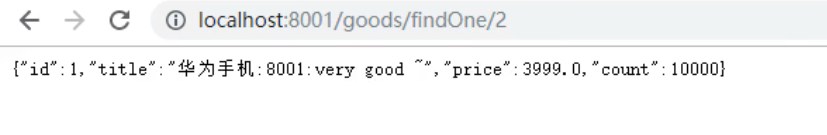

# 1.今日内容

- Config 分布式配置中心
- Bus 消息总线
-  Stream 消息驱动
-  Sleuth+Zipkin 链路追踪

# 2.config

## 2.1-config-概述


• Spring Cloud Config 解决了在分布式场景下多环境配置文件的管理和维护。
• 好处：
    集中管理配置文件
    不同环境不同配置，动态化的配置更新
    配置信息改变时，不需要重启即可更新配置信息到服务


## 2.2-config-快速入门

### 2.2.1-gitee搭建远程仓库

1.编写仓库名称、仓库路径、公开（公开的比较方便）


2.语言和模板可以不选，一般使用单分支模型，只创建master分支


3.使用小乌龟工具，将远程仓库clone到本地


4.使用小乌龟工具将配置文件提交到远程仓库


### 2.2.2-config server搭建

config server：
1. 使用gitee创建远程仓库，上传配置文件

2. 搭建 config server 模块

3. 导入 config-server 依赖

   ```xml
   <dependencies>
       <!-- config-server -->
       <dependency>
           <groupId>org.springframework.cloud</groupId>
           <artifactId>spring-cloud-config-server</artifactId>
       </dependency>
   </dependencies>
   ```

4. 编写配置，设置 gitee 远程仓库地址

```yml
server:
  port: 9527

spring:
  application:
    name: config-server
  # spring cloud config
  cloud:
    config:
      server:
        # git 的 远程仓库地址
        git:
          uri: https://gitee.com/itheima_cch/itheima-configs.git
      label: master # 分支配置

```


5. 测试访问远程配置文件


### 2.2.3-config client搭建

config client：
1. 导入 starter-config 依赖

   ```xml
      <!--config client -->
           <dependency>
               <groupId>org.springframework.cloud</groupId>
               <artifactId>spring-cloud-starter-config</artifactId>
           </dependency>
   ```

   

2. 配置config server 地址，读取配置文件名称等信息

   创建配置文件bootstrap.yml

   ```yaml
   # 配置config-server地址
   # 配置获得配置文件的名称等信息
   spring:
     cloud:
       config:
         # 配置config-server地址
         uri: http://localhost:9527
         # 配置获得配置文件的名称等信息
         name: config # 文件名
         profile: dev # profile指定，  config-dev.yml
         label: master # 分支
   ```

   

3. 获取配置值

   ```java
       @Value("${itheima}")
       private String itheima;
   ```

   

4. 启动测试



### 2.2.4-config client刷新

1. 在 config 客户端引入 actuator 依赖

   ```xml
   
           <dependency>
               <groupId>org.springframework.boot</groupId>
               <artifactId>spring-boot-starter-actuator</artifactId>
           </dependency>
   ```

   

2. 获取配置信息类上，添加 @RefreshScope 注解

```java
/**
 * Goods Controller 服务提供方
 */

@RestController
@RequestMapping("/goods")
@RefreshScope // 开启刷新功能
public class GoodsController {

    @Autowired
    private GoodsService goodsService;

    @Value("${server.port}")
    private int port;


    @Value("${itheima}")
    private String itheima;
    ...
    }
```


3. 添加配置management.endpoints.web.exposure.include: refresh

  ```yaml
  # 配置config-server地址
  # 配置获得配置文件的名称等信息
  spring:
    cloud:
      config:
        # 配置config-server地址
        uri: http://localhost:9527
        # 配置获得配置文件的名称等信息
        name: config # 文件名
        profile: dev # profile指定，  config-dev.yml
        label: master # 分支
  
  management:
    endpoints:
      web:
        exposure:
          include: refresh
  
  ```

  

4. 使用curl工具发送post请求
    curl -X POST http://localhost:8001/actuator/refresh


## 2.3-config集成Eureka


1.config-server pom.xml中引入eureka-client 坐标

```xml
    <!-- eureka-client -->
        <dependency>
            <groupId>org.springframework.cloud</groupId>
            <artifactId>spring-cloud-starter-netflix-eureka-client</artifactId>
        </dependency>
```


2.配置文件中配置eureka地址

```yaml
eureka:
	client:
		service-url:
			defaultZone: http://localhost:8761/eureka/
```

3.启动类中添加注解

```java
package com.itheima.config;

import org.springframework.boot.SpringApplication;
import org.springframework.boot.autoconfigure.SpringBootApplication;
import org.springframework.cloud.config.server.EnableConfigServer;

@SpringBootApplication
@EnableConfigServer // 启用config server功能
@EnableEurekaClient
public class ConfigServerApp {

    public static void main(String[] args) {
        SpringApplication.run(ConfigServerApp.class,args);
    }
}

```


4.config-provider 工程中bootstrap.yaml中注掉写死的地址，改为从Eureka中获取

```yaml
# 配置config-server地址
# 配置获得配置文件的名称等信息
spring:
  cloud:
    config:
      # 配置config-server地址
      #uri: http://localhost:9527
      # 配置获得配置文件的名称等信息
      name: config # 文件名
      profile: dev # profile指定，  config-dev.yml
      label: master # 分支
      #从注册中心获取config-server地址
      discovery:
      	enabled:true
      	service-id:CONFIG-SERVER
```


# 3.bus

## 3.1-bus-概述


• Spring Cloud Bus 是用轻量的消息中间件将分布式的节点连接起来，可以用于广播配置文件的更改或者服务的监控管理。关键的思想就是，消息总线可以为微服务做监控，也可以实现应用程序之间相通信。

• Spring Cloud Bus 可选的消息中间件包括 RabbitMQ 和 Kafka 


## 3.2-bus-rabbitmq回顾


RabbitMQ 提供了 6 种工作模式：简单模式、work queues、Publish/Subscribe 发布与订阅模式、Routing
路由模式、Topics 主题模式、RPC 远程调用模式（远程调用，不太算 MQ；暂不作介绍）。


RabbitMQ  Window 安装参考资料中RabbitMQ Windows 安装.md


## 3.3-bus-快速入门

1. 分别在 config-server 和 config-client中引入 bus依赖：bus-amqp

   ```xml
   
           <!-- bus -->
           <dependency>
               <groupId>org.springframework.cloud</groupId>
               <artifactId>spring-cloud-starter-bus-amqp</artifactId>
           </dependency>
   ```

   

2. 分别在 config-server 和 config-client中配置 RabbitMQ

   bootstrap.yml

   ```yaml
     #配置rabbitmq信息
     rabbitmq:
       host: localhost
       port: 5672
       username: guest
       password: guest
       virtual-host: /
   ```

OrderController上添加@RefreshScope注解

```
@RestController
@RequestMapping("/order")
@RefreshScope
public class OrderController {


    @Value("${itheima}")
    private String itheima;
    ...
    }
```


3. 在config-server中设置暴露监控断点：bus-refresh

   application.yml

   ```yaml
   
   # 暴露bus的刷新端点
   management:
     endpoints:
       web:
         exposure:
           include: 'bus-refresh'
   ```

   

4. 启动测试

   curl结果中没有信息，说明成功了

   

   


# 4.stream

## 4.1-stream-概述

• Spring Cloud Stream 是一个构建消息驱动微服务应用的框架。
• Stream 解决了开发人员无感知的使用消息中间件的问题，因为Stream对消息中间件的进一步封装，可以做
到代码层面对中间件的无感知，甚至于动态的切换中间件，使得微服务开发的高度解耦，服务可以关注更多
自己的业务流程。
• Spring Cloud Stream目前支持两种消息中间件RabbitMQ和Kafka


## 4.2-stream-组件

• Spring Cloud Stream 构建的应用程序与消息中间件之间是通过绑定器 Binder相关联的。绑定器对于应用程序而言起到了隔离作用， 它使得不同消息中间件的实现细节对应用程序来说是透明的。

• binding 是我们通过配置把应用和spring cloud stream 的 binder 绑定在一起

• output：发送消息 Channel，内置 Source接口

• input：接收消息 Channel，内置 Sink接口


## 4.3-stream-消息生产者

1. 创建消息生产者模块，引入依赖 starter-stream-rabbit

   ```xml
   
           <!-- stream -->
           <dependency>
               <groupId>org.springframework.cloud</groupId>
               <artifactId>spring-cloud-starter-stream-rabbit</artifactId>
           </dependency>
   ```

   

2. 编写配置，定义 binder，和 bingings

   ```yaml
   server:
     port: 8000
   spring:
     cloud:
       stream:
         # 定义绑定器，绑定到哪个消息中间件上
         binders:
           itheima_binder: # 自定义的绑定器名称
             type: rabbit # 绑定器类型
             environment: # 指定mq的环境
               spring:
                 rabbitmq:
                   host: localhost
                   port: 5672
                   username: guest
                   password: guest
                   virtual-host: /
         bindings:
           output: # channel名称
             binder: itheima_binder #指定使用哪一个binder
             destination: itheima_exchange # 消息目的地
   
   ```
   
   
   
3. 定义消息发送业务类。添加 @EnableBinding(Source.class)，注入
    MessageChannel output ，完成消息发送

  MessageProducer

  ```java
  package com.itheima.stream.producer;
  
  
  import org.springframework.beans.factory.annotation.Autowired;
  import org.springframework.cloud.stream.annotation.EnableBinding;
  import org.springframework.cloud.stream.messaging.Source;
  import org.springframework.messaging.MessageChannel;
  import org.springframework.messaging.support.MessageBuilder;
  import org.springframework.stereotype.Component;
  
  @Component
  @EnableBinding(Source.class)
  public class MessageProducer {
  
      @Autowired
      private MessageChannel output;
  
      public void send(){
          String msessage = "hello stream~~~";
  
          //发送消息
          output.send(MessageBuilder.withPayload(msessage).build());
  
          System.out.println("消息发送成功~~~");
  
      }
  }
  
  ```


ProducerController


```java
package com.itheima.stream.producer;

import org.springframework.beans.factory.annotation.Autowired;
import org.springframework.web.bind.annotation.RequestMapping;
import org.springframework.web.bind.annotation.RestController;

@RestController
public class ProducerController {

    @Autowired
    private MessageProducer producer;

    @RequestMapping("/send")
        public String sendMsg(){
        producer.send();
        return "success";
    }
}

```


4. 编写启动类，测试

```java
package com.itheima.stream;

import org.springframework.boot.SpringApplication;
import org.springframework.boot.autoconfigure.SpringBootApplication;

@SpringBootApplication
public class ProducerApp {
    public static void main(String[] args) {

        SpringApplication.run(ProducerApp.class,args);
    }
}

```


## 4.4-stream-消息消费者

1. 创建消息消费者模块，引入依赖 starter-stream-rabbit

   ```xml
           <!-- stream -->
           <dependency>
               <groupId>org.springframework.cloud</groupId>
               <artifactId>spring-cloud-starter-stream-rabbit</artifactId>
           </dependency>
   ```

   

2. 编写配置，定义 binder，和 bingings

   ```yaml
   server:
     port: 9000
   spring:
     cloud:
       stream:
         # 定义绑定器，绑定到哪个消息中间件上
         binders:
           itheima_binder: # 自定义的绑定器名称
             type: rabbit # 绑定器类型
             environment: # 指定mq的环境
               spring:
                 rabbitmq:
                   host: localhost
                   port: 5672
                   username: guest
                   password: guest
                   virtual-host: /
         bindings:
           output: # channel名称
             binder: itheima_binder #指定使用哪一个binder
             destination: itheima_exchange # 消息目的地
   
   ```
   
   
   
3. 定义消息接收业务类。添加 @EnableBinding(Sink.class)，使用
    @StreamListener(Sink.INPUT)，完成消息接收。

  ```java
  package com.itheima.stream.consumer;
  
  import org.springframework.cloud.stream.annotation.EnableBinding;
  import org.springframework.cloud.stream.annotation.StreamListener;
  import org.springframework.cloud.stream.messaging.Sink;
  import org.springframework.messaging.Message;
  import org.springframework.stereotype.Component;
  
  /**
   * 消息接收类
   */
  @EnableBinding({Sink.class})
  @Component
  public class MessageListener {
  
      @StreamListener(Sink.INPUT)
      public void receive(Message message){
  
          System.out.println(message);
          System.out.println(message.getPayload());
      }
  }
  
  ```

  

4. 编写启动类，测试

```java
package com.itheima.stream;

import org.springframework.boot.SpringApplication;
import org.springframework.boot.autoconfigure.SpringBootApplication;

@SpringBootApplication
public class ConsumerApp {
    public static void main(String[] args) {

        SpringApplication.run(ConsumerApp.class,args);
    }
}

```


# 5.Sleuth+Zipkin

## 5.1-Sleuth+Zipkin-概述

• Spring Cloud Sleuth 其实是一个工具,它在整个分布式系统中能跟踪一个用户请求的过程，捕获这些跟踪数
据，就能构建微服务的整个调用链的视图，这是调试和监控微服务的关键工具。
• 耗时分析
• 可视化错误
• 链路优化
• Zipkin 是 Twitter 的一个开源项目，它致力于收集服务的定时数据，以解决微服务架构中的延迟问题，包
括数据的收集、存储、查找和展现。

## 5.2-Sleuth+Zipkin-快速入门

1. 安装启动zipkin。 java –jar zipkin.jar

   


​			启动成功日志

​		


2. 访问zipkin web界面。 http://localhost:9411/


3. 在服务提供方和消费方分别引入 sleuth 和 zipkin 依赖

```xml
        <!-- sleuth-zipkin -->
        <!--<dependency>
            <groupId>org.springframework.cloud</groupId>
            <artifactId>spring-cloud-starter-sleuth</artifactId>
        </dependency>-->

        <dependency>
            <groupId>org.springframework.cloud</groupId>
            <artifactId>spring-cloud-starter-zipkin</artifactId>
        </dependency>
```


4. 分别配置服务提供方和消费方。

sleuth-provider   application.yaml 

```yaml
server:
  port: 8001

eureka:
  client:
    service-url:
      defaultZone: http://localhost:8761/eureka
spring:
  application:
    name: feign-provider
  zipkin:
    base-url: http://localhost:9411/  # 设置zipkin的服务端路径

  sleuth:
    sampler:
      probability: 1 # 采集率 默认 0.1 百分之十。


```


sleuth-consumer    application.yaml 

```yml
server:
  port: 9000


eureka:
  instance:
    hostname: localhost # 主机名
  client:
    service-url:
      defaultZone: http://localhost:8761/eureka
spring:
  application:
    name: feign-consumer # 设置当前应用的名称。将来会在eureka中Application显示。将来需要使用该名称来获取路径
  zipkin:
    base-url: http://localhost:9411/  # 设置zipkin的服务端路径

  sleuth:
    sampler:
      probability: 1 # 采集率 默认 0.1 百分之十。


logging:
  level:
    com.itheima: debug


```


5. 启动，测试  http://localhost:9411/


详细信息

