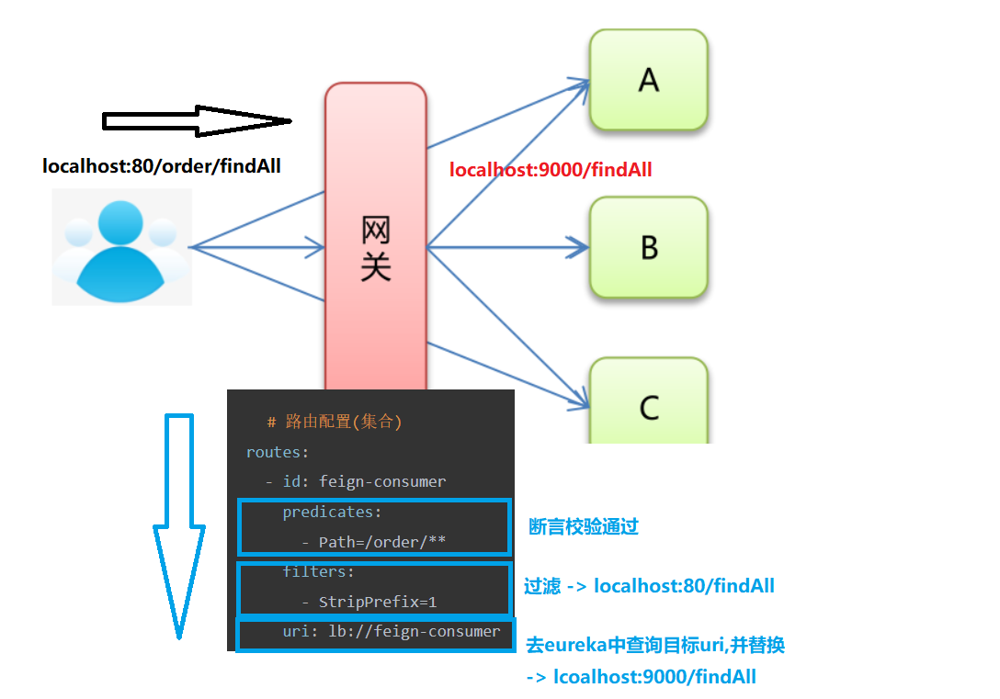
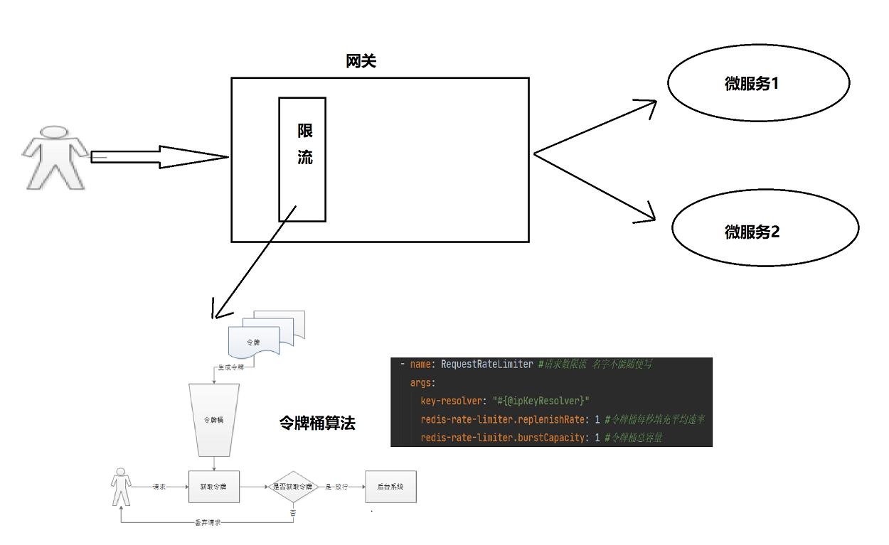
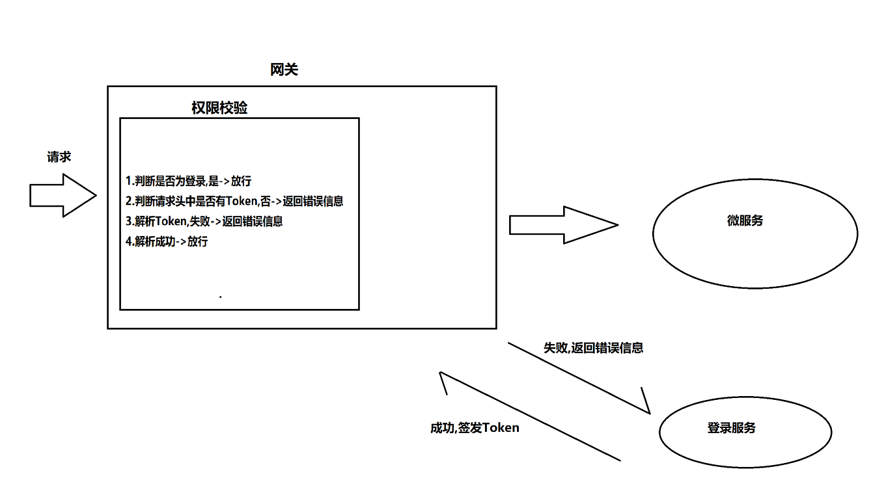

 <center><h1><b><font color='gold'>SpringCloud-Gateway</font></b></h1></center>

# 一.Gateway基本架构搭建

## 1.流程分析



## 2.前期开发环境搭建

>step0:构建基础的Eureka架构

## 3.搭建Gateway服务端

>step1:单独构建一个Eureka客户端模块作为Gateway服务模块,导入Gateway相关依赖

```xml
 <dependencies>
        <!--引入gateway 网关-->
        <dependency>
            <groupId>org.springframework.cloud</groupId>
            <artifactId>spring-cloud-starter-gateway</artifactId>
        </dependency>
        <!-- eureka-client -->
        <dependency>
            <groupId>org.springframework.cloud</groupId>
            <artifactId>spring-cloud-starter-netflix-eureka-client</artifactId>
        </dependency>
</dependencies>
```

>~~step2:编写启动类,只需要启动Eureka服务即可,Gateway功能会自动启动~~

```java
import org.springframework.boot.SpringApplication;
import org.springframework.boot.autoconfigure.SpringBootApplication;
import org.springframework.cloud.netflix.eureka.EnableEurekaClient;

@EnableEurekaClient
@SpringBootApplication
public class GateWayApp {
    public static void main(String[] args) {
        SpringApplication.run(GateWayApp.class,args);
    }
}
```

>step3:编写配置文件

```yml
# 通用配置
server:
  port: 80 #端口号 ,推荐HTTP协议的默认端口80
spring:
  application:
    name: gateway-server #应用名称
  cloud:
  # 网关配置
    gateway:   
    
     	# 路由配置(集合)
      routes:
        - id: feign-consumer 	     # id: 唯一标识。默认是一个UUID         
          predicates:  			    # predicates: 断言,用于请求网关路径的匹配规则 (集合)
            - Path=/order/**
          filters: 				    # filters：配置局部过滤器 (集合)
            - StripPrefix=1  
          uri: lb://feign-consumer   # uri: 转发路径    注意:这里配置的是动态路由
          
      	# 微服务名称配置(配置后,是否添加应用名都不影响访问)
      discovery:  
        locator:
          enabled: true 			 # 设置为true 请求路径前可以添加微服务名称
          lower-case-service-id: true # 允许为小写
        # 跨域处理
      globalcors:
        cors-configurations:
          '[/**]': # 匹配所有请求
            allowedOrigins: "*" #跨域处理 允许所有的域
            allowedMethods: # 支持的方法
              - GET
              - POST
              - PUT
              - DELETE
          
# eureka客户端配置
eureka:
  client:
    service-url:
      defaultZone: http://localhost:8761/eureka

```

>step4:启动测试


## 4.扩展-自定义全局过滤器

>step1:定义类实现 GlobalFilter 和 Ordered接口复写方法完成逻辑处理

```java
import org.springframework.cloud.gateway.filter.GatewayFilterChain;
import org.springframework.cloud.gateway.filter.GlobalFilter;
import org.springframework.core.Ordered;
import org.springframework.stereotype.Component;
import org.springframework.web.server.ServerWebExchange;
import reactor.core.publisher.Mono;

@Component
public class MyFilter implements GlobalFilter, Ordered {
    /**
     *  过滤器业务逻辑
     */
    @Override
    public Mono<Void> filter(ServerWebExchange exchange, GatewayFilterChain chain) {
        //exchange 一个上下文对象,可以获取request ,response等
        //ServerHttpRequest request = exchange.getRequest();
        //ServerHttpResponse response = exchange.getResponse();
        System.out.println("过滤器执行....");
        return chain.filter(exchange);//放行
    }

    /**
     *  过滤器执行优先级
     * @return 数值越小,优先级越高
     */

    @Override
    public int getOrder() {
        return 0;
    }
}
```

>step2:启动,测试

# 二.限流处理(令牌桶)

## 1.流程分析



## 2.开发流程详解

>step1:导入Redis依赖,令牌桶底层通过redis实现,也可以通过Guava实现

```xml
<dependency>
    <groupId>org.springframework.boot</groupId>
    <artifactId>spring-boot-starter-data-redis-reactive</artifactId>
    <version>2.1.3.RELEASE</version>
</dependency>
```

>step2:编写配置类

```java
import org.springframework.boot.SpringApplication;
import org.springframework.boot.autoconfigure.SpringBootApplication;
import org.springframework.cloud.gateway.filter.ratelimit.KeyResolver;
import org.springframework.cloud.netflix.eureka.EnableEurekaClient;
import org.springframework.context.annotation.Bean;
import org.springframework.web.server.ServerWebExchange;
import reactor.core.publisher.Mono;

@SpringBootApplication
@EnableEurekaClient
public class GatewayApplication {
    public static void main(String[] args) {
        SpringApplication.run(GatewayApplication.class, args);
    }

    @Bean
    public KeyResolver ipKeyResolver() {
        return new KeyResolver() {
            @Override
            public Mono<String> resolve(ServerWebExchange exchange) {
                //针对IP地址进行一个限制
                return Mono.just(exchange.getRequest().getRemoteAddress().getHostName());
            }
        };
    }
}
```

>step3:编写配置文件

```yml
server:
  port: 9101
spring:
  application:
    name: sysgateway
  cloud:
    gateway:
      routes:
        - id: goods
          uri: lb://goods
          predicates:
            - Path=/goods/**
          filters:
            - StripPrefix= 1
            - name: RequestRateLimiter #请求数限流 名字不能随便写-----------------------------------------新增
              args:
                key-resolver: "#{@ipKeyResolver}"
                redis-rate-limiter.replenishRate: 1 #令牌桶每秒填充平均速率
                redis-rate-limiter.burstCapacity: 1 #令牌桶总容量
        - id: system
          uri: lb://system
          predicates:
            - Path=/system/**
          filters:
            - StripPrefix= 1

      globalcors:
        cors-configurations:
          '[/**]': # 匹配所有请求
            allowedOrigins: "*" #跨域处理 允许所有的域
            allowedMethods: # 支持的方法
              - GET
              - POST
              - PUT
              - DELETE
  # 配置Redis 127.0.0.1可以省略配置--------------------------------------------------------------新增
  redis:
    host: 192.168.200.128
    port: 6379

eureka:
  client:
    service-url:
      defaultZone: http://127.0.0.1:6868/eureka
  instance:
    prefer-ip-address: true
```

>4.测试,1s内多次访问,会返回429响应码

# 三.微服务鉴权(JWT)

## 1.流程分析



>1.请求经过网关时,判断是否为登录请求,如果是,则直接放行
>
>2.用户登录成功后,签发Token信息返回给用户
>
>3.用户下次访问时,携带着Token信息
>
>4.网关过滤器解析Token,解析成功则放行


## 2.开发流程详解

>step1:搭建网关,导入JJWT依赖

```xml
<dependency>
    <groupId>io.jsonwebtoken</groupId>
    <artifactId>jjwt</artifactId>
    <version>0.9.0</version>
</dependency>
```

>step2:导入JWT生成和解析的工具类

```java
import io.jsonwebtoken.Claims;
import io.jsonwebtoken.JwtBuilder;
import io.jsonwebtoken.Jwts;
import io.jsonwebtoken.SignatureAlgorithm;

import javax.crypto.SecretKey;
import javax.crypto.spec.SecretKeySpec;
import java.util.Base64;
import java.util.Date;

/**
 * JWT工具类
 */
public class JwtUtil {

    //有效期为
    public static final Long JWT_TTL = 3600000L;// 60 * 60 *1000  一个小时
    //设置秘钥明文
    public static final String JWT_KEY = "itcast";

    /**
     * 创建token
     * @param id
     * @param subject
     * @param ttlMillis
     * @return
     */
    public static String createJWT(String id, String subject, Long ttlMillis) {

        SignatureAlgorithm signatureAlgorithm = SignatureAlgorithm.HS256;
        long nowMillis = System.currentTimeMillis();
        Date now = new Date(nowMillis);
        if(ttlMillis==null){
            ttlMillis=JwtUtil.JWT_TTL;
        }
        long expMillis = nowMillis + ttlMillis;
        Date expDate = new Date(expMillis);
        SecretKey secretKey = generalKey();

        JwtBuilder builder = Jwts.builder()
                .setId(id)              //唯一的ID
                .setSubject(subject)   // 主题  可以是JSON数据
                .setIssuer("admin")     // 签发者
                .setIssuedAt(now)      // 签发时间
                .signWith(signatureAlgorithm, secretKey) //使用HS256对称加密算法签名, 第二个参数为秘钥
                .setExpiration(expDate);// 设置过期时间
        return builder.compact();
    }

    /**
     * 生成加密后的秘钥 secretKey
     * @return
     */
    public static SecretKey generalKey() {
        byte[] encodedKey = Base64.getDecoder().decode(JwtUtil.JWT_KEY);
        SecretKey key = new SecretKeySpec(encodedKey, 0, encodedKey.length, "AES");
        return key;
    }
    
    /**
     * 解析
     *
     * @param jwt
     * @return
     * @throws Exception
     */
    public static Claims parseJWT(String jwt) throws Exception {
        SecretKey secretKey = generalKey();
        return Jwts.parser()
                .setSigningKey(secretKey)
                .parseClaimsJws(jwt)
                .getBody();
    }
}
```

>step3:基于全局过滤器进行权限校验

```java
import com.changgou.system.util.JwtUtil;
import org.springframework.cloud.gateway.filter.GatewayFilterChain;
import org.springframework.cloud.gateway.filter.GlobalFilter;
import org.springframework.core.Ordered;
import org.springframework.http.HttpHeaders;
import org.springframework.http.HttpStatus;
import org.springframework.http.server.reactive.ServerHttpRequest;
import org.springframework.http.server.reactive.ServerHttpResponse;
import org.springframework.stereotype.Component;
import org.springframework.web.server.ServerWebExchange;
import reactor.core.publisher.Mono;

import java.net.URI;
import java.util.List;

@Component
public class AuthorizeFilter implements GlobalFilter, Ordered {
    @Override
    public Mono<Void> filter(ServerWebExchange exchange, GatewayFilterChain chain) {
        ServerHttpResponse response = exchange.getResponse();
        ServerHttpRequest request = exchange.getRequest();

        //判断是否为登录请求
        if (request.getURI().getPath().contains("/admin/login")) {
            return chain.filter(exchange);//放行
        }
        //判断token是否存在
        HttpHeaders headers = request.getHeaders();
        String token = headers.getFirst("token");
        if (token == null) {
            response.setStatusCode(HttpStatus.UNAUTHORIZED);
            return response.setComplete();
        }

        //判断token解析是否成功
        try {
            JwtUtil.parseJWT(token);
        } catch (Exception e) {
            response.setStatusCode(HttpStatus.UNAUTHORIZED);
            return response.setComplete();
        }
        //解析成功,放行
        return chain.filter(exchange);//放行
    }

    @Override
    public int getOrder() {
        //优先级最高
        return 0;
    }
}

```

>step4:登录后生成Token

```java
@PostMapping("/login")
public Result login(@RequestBody Admin admin) {
    boolean result = adminService.login(admin);
    if (result) {
        HashMap<String, Object> map = new HashMap<>();
        map.put("name", admin.getLoginName());
        String jwt = JwtUtil.createJWT(UUID.randomUUID().toString(), admin.getLoginName(), null);
        map.put("token", jwt);
        return new Result(true, StatusCode.OK, "登录成功", map);
    }
    return new Result(false, StatusCode.ERROR, "登录失败");
}
```

