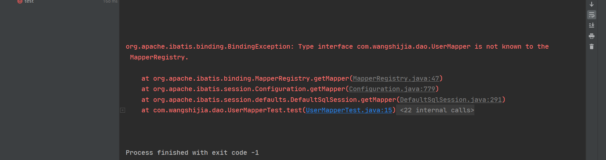
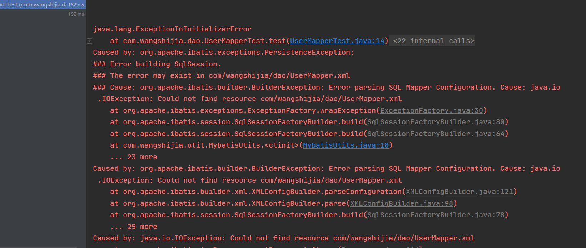

# 一、概述

***

## 1.什么是Mybatis


>MyBatis 是一款优秀的持久层框架，它支持自定义 SQL、存储过程以及高级映射。MyBatis 免除了几乎所有的 JDBC 代码以及设置参数和获取结果集的工作。MyBatis 可以通过简单的 XML 或注解来配置和映射原始类型、接口和 Java POJO（Plain Old Java Objects，普通老式 Java 对象）为数据库中的记录。


>MyBatis 本是apache的一个[开源项目](https://baike.baidu.com/item/开源项目/3406069)iBatis, 2010年这个[项目](https://baike.baidu.com/item/项目/477803)由apache software foundation 迁移到了[google code](https://baike.baidu.com/item/google code/2346604)，并且改名为MyBatis 。2013年11月迁移到[Github](https://baike.baidu.com/item/Github/10145341)。
>
>iBATIS一词来源于“internet”和“abatis”的组合，是一个基于Java的[持久层](https://baike.baidu.com/item/持久层/3584971)框架。iBATIS提供的持久层框架包括SQL Maps和Data Access Objects（DAOs）
>
>当前，最新版本是MyBatis 3.5.7 ，其发布时间是2021年4月21日。


持久化就是将数据在瞬时状态和持久状态相互转化的过程

瞬时化: 内存(断电即失)

持久化: 硬盘 (断电不会失去)

为什么要持久化?

有些数据不能丢失,且内存的成本较高

持久层 :完成持久化工作的代码模块

为什么需要使用mybatis

传统的jdbc代码太复杂,为了简化mybatis的框架

什么是框架?

帮你把框架搭好了,按要求往里填东西就可以了,类似于表格而不是给你白纸

mybatis的特点

- 简单易学：本身就很小且简单。没有任何第三方依赖，最简单安装只要两个jar文件+配置几个sql映射文件易于学习，易于使用，通过文档和源代码，可以比较完全的掌握它的设计思路和实现。
- 灵活：mybatis不会对应用程序或者数据库的现有设计强加任何影响。 sql写在xml里，便于统一管理和优化。通过sql语句可以满足操作数据库的所有需求。
- 解除sql与程序代码的耦合：通过提供DAO层，将业务逻辑和数据访问逻辑分离，使系统的设计更清晰，更易维护，更易单元测试。sql和代码的分离，提高了可维护性。
- 提供映射标签，支持对象与数据库的orm字段关系映射
- 提供对象关系映射标签，支持对象关系组建维护
- 提供xml标签，支持编写动态sql。 
- 使用的人多


## 2.为什么要使用Mybatis 

## 3.其他

[Mybatis 官网 (mybatis.org)]( https://mybatis.org/mybatis-3/zh/getting-started.html)

[MyBatis_百度百科 (baidu.com)](https://baike.baidu.com/item/MyBatis/2824918?fr=aladdin)

[MyBatis_代码库 (github.com)](https://github.com/mybatis/mybatis-3)

# 二、 Mybatis 的使用

搭建环境 -> 导入依赖 -> 编写代码 -> 测试

搭建环境 

1. 准备好数据库和表
2. 搭建基本的项目

导入依赖

```xml
<dependency>
    <groupId>org.mybatis</groupId>
    <artifactId>mybatis</artifactId>
    <version>3.5.2</version>
</dependency>
<dependency>
    <groupId>mysql</groupId>
    <artifactId>mysql-connector-java</artifactId>
    <version>5.1.47</version>
</dependency>
<dependency>
    <groupId>junit</groupId>
    <artifactId>junit</artifactId>
    <version>4.12</version>
    <scope>test</scope>
</dependency>
```

编写代码

​	1. 编写配置文件

2. 获取myabtis实例

测试

JUNIT






配置文件未被导出