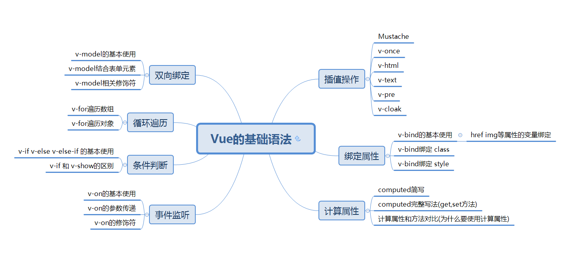

## 一、插值操作

### 1.Mustache( 双大括号  或者 胡子符号) 

```html
<body>
  <div id="app">
    <h1>Mustache:</h1><br>
    <div>*基本输出:{{message}}</div>
    <div>*长度输出:{{message.length}}</div>
    <div>*字符拼接:{{message+' 123'}}</div>
    <div>*三元表达式:{{message.length<10?true:false}}</div>
    <div>*过滤器:{{message | toUpper }} <b>//一般用于数据格式化</b></div>
  </div>

  <script src="../js/vue.js"></script>
  <script>
    const app = new Vue({
      el: '#app',
      data: {
        message: 'hello ,vueJS'
      },
      filters: {//过滤器
        toUpper: function (value) {
          return value.toUpperCase()
        }
      }
    })
  </script>

</body>
```

### 2.v-once

```html
 <!--
1.该指令后面不需要跟任何表达式
2.该指令表示元素和组件只渲染一次，不会随着数据的改变而改变。
-->
<body>
<div id="app">
  <h2>{{message}}</h2>
  <h2 v-once>{{message}}</h2>
</div>

<script src="../js/vue.js"></script>
<script>
  const app = new Vue({
    el: '#app',
    data: {
      message: '你好啊'
    }
  })
</script>
```

### 3.v-html

```html
<body>

<div id="app">
  <h2>{{url}}</h2>
  <h2 v-html="url"></h2> <!--添加了v-html后 该数据将以html格式被解析而不是字符串-->
</div>

<script src="../js/vue.js"></script>
<script>
  const app = new Vue({
    el: '#app',
    data: {
      message: '你好啊',
      url: '<a href="http://www.baidu.com">百度一下</a>'
    }
  })
</script>
```

### 4.v-text

```html
<body>

<div id="app">
  <h2>{{message}}, 李银河!</h2>
  <h2 v-text="message">, 李银河!</h2> <!--添加了v-text后 该数据将以字符串格式被解析-->
</div>

<script src="../js/vue.js"></script>
<script>
  const app = new Vue({
    el: '#app',
    data: {
      message: '你好啊'
    }
  })
</script>

</body>
```

### 5. v-pre

```html
<body>

<div id="app">
  <h2>{{message}}</h2>
  <h2 v-pre>{{message}}</h2><!--添加了v-pre后 该数据将不会被vue解析 ,直接输出一个{{message}}-->
</div>

<script src="../js/vue.js"></script>
<script>
  const app = new Vue({
    el: '#app',
    data: {
      message: '你好啊'
    }
  })
</script>

</body>
```

### 6.v-cloak

```html
<body>

<div id="app" v-cloak>  <!--添加了v-cloak后 该区域内的内容将会被隐藏-->
  <h2>{{message}}</h2>
</div>

<script src="../js/vue.js"></script>
<script>
  // 在vue解析之后, vue会去除v-cloak属性,该区域内的数据得以显示
  setTimeout(function () {
    const app = new Vue({
      el: '#app',
      data: {
        message: '你好啊'
      }
    })
  }, 1000)
</script>

</body>
```

## 属性绑定

### 1.v-bind的基本使用

```html
<body>

<div id="app">
  <!-- 使用v-bind指令将一个属性和一个变量绑定,实现属性的动态响应 -->
  
  <a v-bind:href="aHref">百度一下</a>
  <!--语法糖的写法-->
  
  <a :href="aHref">百度一下</a>
</div>

<script src="../js/vue.js"></script>
<script>
  const app = new Vue({
    el: '#app',
    data: {
      message: '你好啊',
      imgURL: 'https://img11.360buyimg.com/mobilecms/s350x250_jfs/t1/20559/1/1424/73138/5c125595E3cbaa3c8/74fc2f84e53a9c23.jpg!q90!cc_350x250.webp',
      aHref: 'http://www.baidu.com'
    }
  })
</script>

</body>
```


### 2.v-bind绑定 class

```html
<body>

<div id="app">
  <!--用法一: 变量绑定(一般不这样用)-->
  <h2 :class="active">{{message}}</h2>
    
  <!--用法二: 对象语法-->
  <!--<h2 v-bind:class="{key1: value1, key2: value2}">{{message}}</h2>-->
  <!--<h2 v-bind:class="{类名1: true, 类名2: boolean}">{{message}}</h2>-->
  <h2 class="title" v-bind:class="{active: isActive, line: isLine}">{{message}}</h2><!--直接写json对象-->
  <h2 class="title" v-bind:class="getClasses()">{{message}}</h2><!--通过方法或计算属性返回json对象-->
  <button v-on:click="btnClick">按钮</button>
    
   <!--用法三: 数组语法(一般不这样用)-->
  <h2 class="title" :class="[active, line]">{{message}}</h2><!--直接写json对象-->
  <h2 class="title" :class="getClasses()">{{message}}</h2><!--通过方法或计算属性返回json对象-->
    
   <!--注意:和普通的类同时存在，并不冲突-->
  <h2 class="title" :class="['active', 'line']">Hello World</h2>  
</div>

<script src="../js/vue.js"></script>
<script>
  const app = new Vue({
    el: '#app',
    data: {
      message: '你好啊',
      isActive: true,
      isLine: true
    },
    methods: {
      btnClick: function () {
        this.isActive = !this.isActive
      },
      getClasses: function () {
        return {active: this.isActive, line: this.isLine}
      }
    }
  })
</script>
```


### 3.v-bind绑定 style

```html
<body>

<div id="app">
  <!--<h2 :style="{key(属性名): value(属性值)}">{{message}}</h2>-->

  <!--用法一:对象语法-->
  <h2 :style="{fontSize: finalSize + 'px', backgroundColor: finalColor}">{{message}}</h2>
  <h2 :style="getStyles()">{{message}}</h2><!--通过方法或计算属性返回变量-->
    
  <!--用法二:对象语法--> 
  <h2 :style="[baseStyle, baseStyle1]">{{message}}</h2>
</div>
    
<script src="../js/vue.js"></script>
<script>
  const app = new Vue({
    el: '#app',
    data: {
      message: '你好啊',
      finalSize: 100,
      finalColor: 'red',
      baseStyle: {backgroundColor: 'red'},
      baseStyle1: {fontSize: '100px'}
    },
    methods: {
      getStyles: function () {
        return {fontSize: this.finalSize + 'px', backgroundColor: this.finalColor}
      }
    }
  })
</script>

</body>
```


## 计算属性

```html
<body>

<div id="app">
  <!-- 方式一: -->
  <h2>{{firstName + ' ' + lastName}}</h2> <!--字符串拼接 过于繁琐 不推荐-->
  <!-- 方式二: -->
  <h2>{{getFullName()}}</h2> <!--方法返回值 方法无法缓存,如果该属性多次调用性能不好 不推荐-->
  <!-- 方式三: -->
  <h2>{{fullName}}</h2> <!--计算属性 在计算属性不改变的情况下回进行缓存 性能最优 推荐-->
</div>

<script src="../js/vue.js"></script>
<script>
  const app = new Vue({
    el: '#app',
    data: {
      firstName: 'Lebron',
      lastName: 'James'
    },
    // computed: 计算属性()
    computed: {    //简写形式,相当于只有get方法的fullName属性 最常用
      fullName: function () {
        return this.firstName + ' ' + this.lastName
      }
    },
 //完整写法 ,本质上是一个属性,所以使用时不加括号
 // fullName: { 
 //   set: function(newValue) {
 //     // console.log('-----', newValue);
 //     const names = newValue.split(' ');
 //     this.firstName = names[0];
 //     this.lastName = names[1];
 //   },
 //   get: function () {
 //     return this.firstName + ' ' + this.lastName
 //   }
 // },
    methods: {
      getFullName() {
        return this.firstName + ' ' + this.lastName
      }
    }
  })
</script>

</body>
```

## 事件监听

### 1.基本使用

```html
<body>

<div id="app">
  <h2>{{counter}}</h2>
]
  <!--<button v-on:click="counter++">+</button>-->
  <!--<button v-on:click="counter--">-</button>-->
  <!--<button v-on:click="increment">+</button>-->
  <!--<button v-on:click="decrement">-</button>-->
  <button @click="increment">+</button>
  <button @click="decrement">-</button>
</div>

<script src="../js/vue.js"></script>
<script>
  const app = new Vue({
    el: '#app',
    data: {
      counter: 0
    },
    methods: {
      increment() {
        this.counter++
      },
      decrement() {
        this.counter--
      }
    }
  })
</script>

</body>
```

### 2.参数传递

```html
<div id="app"> 
  <!--1.事件调用的方法没有参数,()可以省略-->
  <button @click="btn1Click()">按钮1</button>
  <button @click="btn1Click">按钮1</button>

  <!--2.在事件定义时, 写方法时省略了小括号, 但是方法本身是需要一个参数的, 这个时候, 
	如果不省略() 却不提供参数 会显示undefinded
	如果省略() Vue会默认将浏览器生产的event事件对象作为参数传入到方法-->  
  <button @click="btn2Click">按钮2</button>

  <!--3.方法定义时, 我们需要event对象, 同时又需要其他参数-->
  <button @click="btn3Click(abc, $event)">按钮3</button> <!-- 在调用方式, 通过$event 手动获取event对象-->
</div>

<script src="../js/vue.js"></script>
<script>
  const app = new Vue({
    el: '#app',
    data: {
      message: '你好啊',
      abc: 123
    },
    methods: {
      btn1Click() {
        console.log("btn1Click");
      },
      btn2Click(event) {
        console.log('--------', event);
      },
      btn3Click(abc, event) {
        console.log('++++++++', abc, event);
      }
    }
  })
</script>

</body>
```

### 3.修饰符

```html
<body>

<div id="app">
  <!--1. .stop修饰符的使用 : 解决事件冒泡的问题-->
  <div @click="divClick">
    aaaaaaa
    <button @click.stop="btnClick">按钮</button>
  </div>

  <!--2. .prevent修饰符的使用 : 阻止原本的事件,启用自己编写的事件-->
  <br>
  <form action="baidu">
    <input type="submit" value="提交" @click.prevent="submitClick">
  </form>

  <!--3. .监听某个键盘的键帽-->
  <input type="text" @keyup.enter="keyUp">

  <!--4. .once修饰符的使用 : 事件只可以被触发一次-->
  <button @click.once="btn2Click">按钮2</button>
</div>

<script src="../js/vue.js"></script>
<script>
  const app = new Vue({
    el: '#app',
    data: {
      message: '你好啊'
    },
    methods: {
      btnClick() {
        console.log("btnClick");
      },
      divClick() {
        console.log("divClick");
      },
      submitClick() {
        console.log('submitClick');
      },
      keyUp() {
        console.log('keyUp');
      },
      btn2Click() {
        console.log('btn2Click');
      }
    }
  })
</script>
</body>
```

## 条件判断

### 1.v-if v-else v-else-if 的基本使用

```html
<body>

<div id="app">
  <h2 v-if="score>=90">优秀</h2>
  <h2 v-else-if="score>=80">良好</h2>
  <h2 v-else-if="score>=60">及格</h2>
  <h2 v-else>不及格</h2>
  <h1>{{result}}</h1>
</div>

<script src="../js/vue.js"></script>
<script>
  const app = new Vue({
    el: '#app',
    data: {
      score: 99
    },
    computed: {
      result() {
        let showMessage = '';
        if (this.score >= 90) {
          showMessage = '优秀'
        } else if (this.score >= 80) {
          showMessage = '良好'
        }
        // ...
        return showMessage
      }
    }
  })
</script>

</body>
```

### 2.v-if 和 v-show

```html
<body>

<div id="app">
  <!--v-if: 当条件为false时, 包含v-if指令的元素, 根本就不会存在dom中-->
  <h2 v-if="isShow" id="aaa">{{message}}</h2>

  <!--v-show: 当条件为false时, v-show只是给我们的元素添加一个行内样式: display: none-->
  <h2 v-show="isShow" id="bbb">{{message}}</h2>
</div>

<script src="../js/vue.js"></script>
<script>
  const app = new Vue({
    el: '#app',
    data: {
      message: '你好啊',
      isShow: true
    }
  })
</script>

</body>
```

## 循环遍历

### 1.v-for遍历数组

```html
<body>

<div id="app">
  <!--1.在遍历的过程中,没有使用索引值(下标值)-->
  <ul>
    <li v-for="item in names">{{item}}</li>
  </ul>

  <!--2.在遍历的过程中, 获取索引值-->
  <ul>
    <li v-for="(item, index) in names">
      {{index+1}}.{{item}}
    </li>
  </ul>
</div>

<script src="../js/vue.js"></script>
<script>
  const app = new Vue({
    el: '#app',
    data: {
      names: ['why', 'kobe', 'james', 'curry']
    }
  })
</script>

</body>
```

### 2.v-for遍历对象

```html
<body>

<div id="app">
  <!--1.在遍历对象的过程中, 如果只是获取一个值, 那么获取到的是value-->
  <ul>
    <li v-for="item in info">{{item}}</li>
  </ul>


  <!--2.获取key和value 格式: (value, key) -->
  <ul>
    <li v-for="(value, key) in info">{{value}}-{{key}}</li>
  </ul>


  <!--3.获取key和value和index 格式: (value, key, index) -->
  <ul>
    <li v-for="(value, key, index) in info">{{value}}-{{key}}-{{index}}</li>
  </ul>
</div>

<script src="../js/vue.js"></script>
<script>
  const app = new Vue({
    el: '#app',
    data: {
      info: {
        name: 'why',
        age: 18,
        height: 1.88
      }
    }
  })
</script>

</body>
```

## 双向绑定

### 1.v-model的基本使用

```html
<body>

<div id="app">
  <input type="text" v-model="message">
  {{message}}
</div>

<script src="../js/vue.js"></script>
<script>
  const app = new Vue({
    el: '#app',
    data: {
      message: '你好啊'
    }
  })
</script>

</body>
```


### 2.v-model结合Radio

```html
<body>

<div id="app">
  <label for="male">
    <input type="radio" id="male" value="男" v-model="sex">男
  </label>
  <label for="female">
    <input type="radio" id="female" value="女" v-model="sex">女
  </label>
  <h2>您选择的性别是: {{sex}}</h2>
</div>

<script src="../js/vue.js"></script>
<script>
  const app = new Vue({
    el: '#app',
    data: {
      message: '你好啊',
      sex: '女'
    }
  })
</script>

</body>
```

### 3.v-model结合CheckBox

```html
<body>

<div id="app">
  <!--1.checkbox单选框-->
  <!--<label for="agree">-->
    <!--<input type="checkbox" id="agree" v-model="isAgree">同意协议-->
  <!--</label>-->
  <!--<h2>您选择的是: {{isAgree}}</h2>-->
  <!--<button :disabled="!isAgree">下一步</button>-->

  <!--2.checkbox多选框-->
  <input type="checkbox" value="篮球" v-model="hobbies">篮球
  <input type="checkbox" value="足球" v-model="hobbies">足球
  <input type="checkbox" value="乒乓球" v-model="hobbies">乒乓球
  <input type="checkbox" value="羽毛球" v-model="hobbies">羽毛球
  <h2>您的爱好是: {{hobbies}}</h2>

  <label v-for="item in originHobbies" :for="item">
    <input type="checkbox" :value="item" :id="item" v-model="hobbies">{{item}}
  </label>
</div>

<script src="../js/vue.js"></script>
<script>
  const app = new Vue({
    el: '#app',
    data: {
      message: '你好啊',
      isAgree: false, // 单选框
      hobbies: [], // 多选框,
      originHobbies: ['篮球', '足球', '乒乓球', '羽毛球', '台球', '高尔夫球']
    }
  })
</script>

</body>
```

### 4.v-model结合Select

```html
<body>

<div id="app">
  <!--1.选择一个-->
  <select name="abc" v-model="fruit">
    <option value="苹果">苹果</option>
    <option value="香蕉">香蕉</option>
    <option value="榴莲">榴莲</option>
    <option value="葡萄">葡萄</option>
  </select>
  <h2>您选择的水果是: {{fruit}}</h2>

  <!--2.选择多个-->
  <select name="abc" v-model="fruits" multiple>
    <option value="苹果">苹果</option>
    <option value="香蕉">香蕉</option>
    <option value="榴莲">榴莲</option>
    <option value="葡萄">葡萄</option>
  </select>
  <h2>您选择的水果是: {{fruits}}</h2>
</div>

<script src="../js/vue.js"></script>
<script>
  const app = new Vue({
    el: '#app',
    data: {
      message: '你好啊',
      fruit: '香蕉',
      fruits: []
    }
  })
</script>

</body>
```

### 5.v-model相关修饰符

```html
<body>

<div id="app">
  <!--1.修饰符: lazy-->
  <input type="text" v-model.lazy="message">
  <h2>{{message}}</h2>


  <!--2.修饰符: number-->
  <input type="number" v-model.number="age">
  <h2>{{age}}-{{typeof age}}</h2>

  <!--3.修饰符: trim-->
  <input type="text" v-model.trim="name">
  <h2>您输入的名字:{{name}}</h2>
</div>

<script src="../js/vue.js"></script>
<script>
  const app = new Vue({
    el: '#app',
    data: {
      message: '你好啊',
      age: 0,
      name: ''
    }
  })

  var age = 0
  age = '1111'
  age = '222'
</script>

</body>
```

