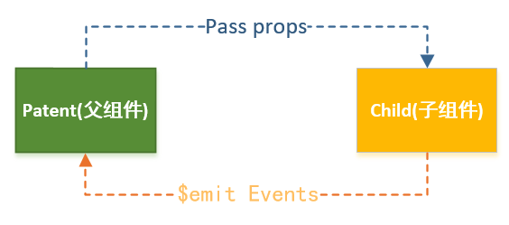

# 一、概述

***

>将一个页面拆分成一个个小的功能块，每个功能块完成属于自己这部分独立的功能，从而简化整个页面的管理和维护,提高项目的扩展性,这样的流程称作组件化

# 二、基础篇

***

## 1.基本使用

```html
<body>

<div id="app">
  <!--step3.使用组件-->
  <my-cpn></my-cpn>
</div>

<script src="../js/vue.js"></script>
<script>
  
/* 
完整写法:
// step1.构建组件
const cpnC = Vue.extend({
    template: `              
      <div>
        <h2>我是标题</h2>
        <p>我是内容, 哈哈哈哈</p>
        <p>我是内容, 呵呵呵呵</p>
      </div>`   
  }) 
  // step2.注册组件
  Vue.component('my-cpn', cpnC)
*/
    
// 语法糖 
 Vue.component('cpn1', {   
    template: `
      <div>
        <h2>我是标题1</h2>
        <p>我是内容, 哈哈哈哈</p>
      </div> 
    `		//` ` 是es6的语法,和""功能类似,但是可以实现任意的换行,书写更为方便
  })

  //注意:组件的使用前提是该区域要被vue渲染
  const app = new Vue({    
    el: '#app',
    data: {
      message: '你好啊'
    }
  })
</script>

</body>
```

## 2.模板抽离

```html
<body>

<div id="app">
  <cpn></cpn>
</div>

<!--1.script标签, 注意:类型必须是text/x-template-->
<script type="text/x-template" id="cpn">
<div>
<h2>我是标题</h2>
<p>我是内容,哈哈哈</p>
</div>
</script>

<!--2.template标签(推荐)-->
<template id="cpn">
  <div>
    <h2>我是标题</h2>
    <p>我是内容,呵呵呵</p>
  </div>
</template>

<script src="../js/vue.js"></script>
<script>

  // 1.注册一个全局组件
  Vue.component('cpn', {
    template: '#cpn'  //这里用一个#号绑定对象模板
  })

  const app = new Vue({
    el: '#app',
    data: {
      message: '你好啊'
    }
  })
</script>

</body>
```

## 3.全局组件和局部组件

```html
<body>

<div id="app">
  <cpn1></cpn1>
  <cpn2></cpn2>
</div>

<div id="app2">
  <cpn1></cpn1>
  <cpn2></cpn2>
</div>

<script src="../js/vue.js"></script>
<script>
  // 构造组件
  const cpn1 = Vue.extend({
    template: `
      <div>
        <h2>我是cpn1</h2>
      </div>
    `
  })

  // 构造组件
  const cpn2 = Vue.extend({
    template: `
      <div>
        <h2>我是cpn2</h2>
      </div>
    `
  })

  // 注册全局组件(全局组件, 意味着可以在多个Vue的实例下面使用)
  Vue.component('cpn1', cpn1)


  const app = new Vue({
    el: '#app',
    data: {
      message: '你好啊'
    },
    components: {
      // cpn使用组件时的标签名
      cpn2: cpn2
    }
  })

  const app2 = new Vue({
    el: '#app2'
  })
</script>
```

## 4.父组件和子组件

```html
<body>

<div id="app">
  <father></father>
</div>

<script src="../js/vue.js"></script>
<script>
  const son = Vue.extend({
    template: `
      <div>
        <h2>我是son</h2>
      </div>
    `
  })

  Vue.component('father', {
    template: `
      <div>
        <h2>father</h2>
        <p>我是father</p>
        <son></son>
      </div>
    `,
    components: {
      son: son
    }
  })

  // root组件(最外层的Vue实例也可以理解为一个父节点)
  const app = new Vue({
    el: '#app'
  })
</script>

</body>
```

## 5.组件中的数据存储

```html
<body>

<div id="app">
  <cpn></cpn>
</div>

<template id="cpn">
  <div>
    <h2>{{title}}</h2>
  </div>
</template>

<script src="../js/vue.js"></script>
<script>
  // 1.注册一个全局组件
  Vue.component('cpn', {
    template: '#cpn',
      // 组件中也可以定义data对象,该对象以函数的形式存在,每个组件只可以访问自己的data数据,同一组件多次使用数据不共享
    data() {  
      return {
        title: 'abc' 
      }
    }
  })

  const app = new Vue({
    el: '#app',
    data: {
      message: '你好啊',
      title: 'Root'
    }
  })
</script>

</body>
```

# 三、高级篇

***

## 1.组件通信



### 1.1  父传子 (props)

>父传子基本原理 :借助props 传递数据

```html
<body>

<div id="app">
    <son :param1="param1" :param2="param2" :param3="param3"></son>
</div>


<template id="cpn">
    <div>
        <ul>
            <li v-for="item in param2">{{item}}</li>
        </ul>
        <h2>{{param1}}</h2>
        <h2>{{param3.name}}</h2>
    </div>
</template>

<script src="../js/vue.js"></script>
<script>
    // 父传子: props
    const son = {
        template: '#cpn',
/*       // 写法1
        props: ['param1', 'param2', 'param3'],
        // 写法2 可以提供类型限制
        props: {
            param1: String,
            param2: Array,
            param3: Object
        },
*/
        // 写法3  可以提供类型限制,默认值,是否必须 注意:型是数组或对象时, 默认值必须是一个函数
        props: {
            param1: {
                type: String,
                default: 'yyyy',
                required: true
            },
            param2: {
                type: Array,
                default() {
                    return []
                }
            },
            param3: {
                type: Object,
                default() {
                    return []
                }
            }
        },
        data() {
            return {}
        },
        methods: {}
    }
    const app = new Vue({
        el: '#app',
        data: {
            param1: 'xxx',
            param2: ['test1', 'test2', 'test3'],
            param3: {name: 'wangshijia', age: 25}
        },
        components: {
            son
        }
    })
</script>

</body>
```

### 1.2  子传父 ($emit 发射)

>子传父基本原理 :子组件中，通过$emit()来发射一个自定义事件。在父组件中，通过v-on来监听子组件事件。

```html
<body>

<!--父组件模板-->
<div id="app">
  <son @item-click="cpnClick"></son>
</div>

<!--子组件模板-->
<template id="son">
  <div>
    <button v-for="item in categories" @click="btnClick(item)">
      {{item.name}}
    </button>
  </div>
</template>

<script src="../js/vue.js"></script>
<script>

  // 1.子组件
  const son = {
    template: '#son',
    data() {
      return {
        categories: [
          {id: 'aaa', name: '热门推荐'},
          {id: 'bbb', name: '手机数码'},
          {id: 'ccc', name: '家用家电'},
          {id: 'ddd', name: '电脑办公'},
        ]
      }
    },
    methods: {
      btnClick(item) {
        // 发射事件: 自定义事件
        this.$emit('item-click', item)
      }
    }
  }

  // 2.父组件
  const app = new Vue({
    el: '#app',
    data: {
      message: '你好啊'
    },
    components: {
      son
    },
    methods: {
      cpnClick(item) {
        console.log('cpnClick', item);
      }
    }
  })
</script>

</body>
```

### 1.3 父子组件之间数值的双向绑定

>解析: 一般情况下,父组件与子组件是单向绑定,即父组件的值改变,子组件中props改变 ,不建议之间修改props去改变父组件的值,这样会导致父子组件之间耦合度过高,可以使用发送自定义事件或的方式实现

#### 1.3.1  点击事件发送自定义事件

```html
<!DOCTYPE html>
<html lang="en">
<head>
    <meta charset="UTF-8">
    <title>Title</title>
</head>
<body>

<div id="app">
    <son :father-to-son1="this.num1" @num1change="num1change"></son>
</div>

<template id="son">
    <div>
        <h2>fatherToSon1 :{{this.fatherToSon1}}</h2>
        <h2>sonToFather1 :{{sonToFather1}}</h2>
        <input type="text" :value="sonToFather1" @input="num1Input">
    </div>
</template>

<script src="../js/vue.js"></script>
<script>

    const son = {
        template: '#son',
        props: {
            fatherToSon1: Number
        },
        data() {
            return {
                sonToFather1: this.fatherToSon1
            }
        },
        methods: {
            num1Input(event) {
                this.sonToFather1 = event.target.value;
                this.$emit('num1change', this.sonToFather1)
            }
        }
    }

    const app = new Vue({
            el: '#app',
            data: {
                num1: 100
            },
            methods: {
                num1change(value) {
                    this.num1 = parseFloat(value)
                }
            },
            components: {son}
        }
    )
</script>

</body>
</html>
```

#### 1.3.2  wacth监听发送自定义事件

```html
<body>

<div id="app">
    <son :father-to-son1="num1" @num1change="num1change"></son>
</div>

<template id="son">
    <div>
        <h2>props:{{fatherToSon1}}</h2>
        <h2>data: {{sonToFather1}}</h2>
        <input type="text" v-model="sonToFather1">
    </div>
</template>

<script src="../js/vue.js"></script>
<script>


    const son = {
        template: '#son',
        props: {
            fatherToSon1: Number
        },
        data() {
            return {
                sonToFather1: this.fatherToSon1
            }
        },
        watch: {
            sonToFather1(newValue) {
                this.$emit('num1change', newValue);
            }
        }
    }


    const app = new Vue({
        el: '#app',
        data: {
            num1: 1
        },
        methods: {
            num1change(value) {
                this.num1 = parseFloat(value)
            }
        },
        components: {son}
    })
</script>

</body>
```


## 2.组件访问

### 2.1 父访问子组件($children 或  $refs)

#### 2.1.1 $children(不推荐)

```html
<!DOCTYPE html>
<html lang="en">
<head>
  <meta charset="UTF-8">
  <title>Title</title>
</head>
<body>

<div id="app">
  <cpn></cpn>
  <cpn></cpn>

  <my-cpn></my-cpn>
  <y-cpn></y-cpn>

  <cpn ref="aaa"></cpn>
  <button @click="btnClick">按钮</button>
</div>

<template id="cpn">
  <div>我是子组件</div>
</template>
<script src="../js/vue.js"></script>
<script>
  const app = new Vue({
    el: '#app',
    data: {
      message: '你好啊'
    },
    methods: {
      btnClick() {
        // 1.$children
        // console.log(this.$children);
        // for (let c of this.$children) {
        //   console.log(c.name);
        //   c.showMessage();
        // }
        // console.log(this.$children[3].name);

        // 2.$refs => 对象类型, 默认是一个空的对象 ref='bbb'
        console.log(this.$refs.aaa.name);
      }
    },
    components: {
      cpn: {
        template: '#cpn',
        data() {
          return {
            name: '我是子组件的name'
          }
        },
        methods: {
          showMessage() {
            console.log('showMessage');
          }
        }
      },
    }
  })
</script>

</body>
</html>
```

#### 2.1.2 $refs(推荐)

### 2.2 子访问父组件($parent)

# 四、插槽 (Slot)

***

## 1. 什么是 Slot 

> Slot  翻译为插槽 , 可以理解为电脑中的USB插槽 或是插排中的电源插槽 ,作用是放在组件中以使得组件拥有更多的扩展性

## 2. Slot 的基本使用

>1.插槽的基本使用 <slot></slot>
>2.插槽的默认值 <slot>button</slot>
>3.如果有多个值, 同时放入到组件进行替换时, 一起作为替换元素

```html
<body>
<div id="app">
  <cpn><i>按钮</i></cpn>
  <cpn></cpn>
</div>

<template id="cpn">
  <div>
    <h2>组件</h2>
    <slot><button>按钮</button></slot>
  </div>
</template>

<script src="../js/vue.js"></script>
<script>
  const app = new Vue({
    el: '#app',
    data: {
      message: '你好啊'
    },
    components: {
      cpn: {
        template: '#cpn'
      }
    }
  })
</script>

</body>
```

## 3. 具名插槽

>当一个组件中存在多个插槽时,需要使用具名插槽加以区分

```html
<body>

<div id="app">
  <cpn><span slot="center">中间</span></cpn>
  <cpn><span slot="left">左边</span></cpn>
  <cpn><span slot="right">右边</span></cpn>
</div>


<template id="cpn">
  <div>
    <slot name="left"></slot>
    |
    <slot name="center"></slot>
    |
    <slot name="right"></slot>
  </div>
</template>

<script src="../js/vue.js"></script>
<script>
  const app = new Vue({
    el: '#app',
    data: {
      message: '你好啊'
    },
    components: {
      cpn: {
        template: '#cpn'
      }
    }
  })
</script>

</body>
```

## 4. 作用域插槽

### 4.1.作用域概念

>Vue 编译准则:父组件模板的所有东西都会在父级作用域内编译；子组件模板的所有东西都会在子级作用域内编译 也就是说父组件给子组件赋值时,只能使用父组件的数据,但有时候我们可以希望插槽中的值由子组件提供,这是就需要使用作用域插槽

### 4.2. 作用域插槽的基本使用

```html
<body>

<div id="app">
  <cpn></cpn>

  <cpn>
    <template slot-scope="cslot">
      <span>{{cslot.cdata.join(' - ')}}</span>
    </template>
  </cpn>

  <cpn>
    <template slot-scope="cslot">
      <span>{{cslot.cdata.join(' * ')}}</span>
    </template>
  </cpn>
</div>

<template id="cpn">
  <div>
    <slot :cdata="pLanguages"></slot>
  </div>
</template>
<script src="../js/vue.js"></script>
<script>
  const app = new Vue({
    el: '#app',
    data: {
      message: '你好啊'
    },
    components: {
      cpn: {
        template: '#cpn',
        data() {
          return {
            pLanguages: ['JavaScript', 'C++', 'Java', 'C#', 'Python', 'Go', 'Swift']
          }
        }
      }
    }
  })
</script>
</body>
```

