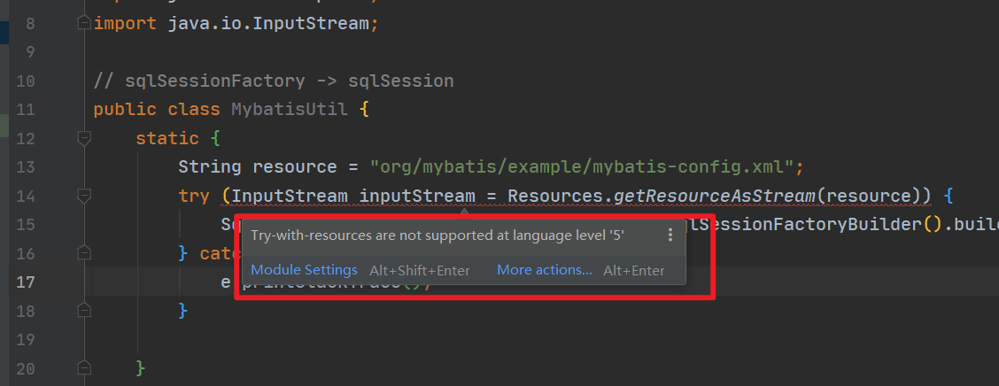

# 1.内存溢出时为什么结果是最小值

2.

确认了依然是：Try-with-resources are not supported at language level '5’错误。

后来更改pom.xml 中添加以下配置就好了：

    <build>
        <plugins>
            <plugin>
                <groupId>org.apache.maven.plugins</groupId>
                <artifactId>maven-compiler-plugin</artifactId>
                <configuration>
                    <source>8</source>
                    <target>8</target>
                </configuration>
            </plugin>
        </plugins>
    </build>

出现该错误的原因是我的maven没有指定jdk版本，在pom.xml中指定上就好。
